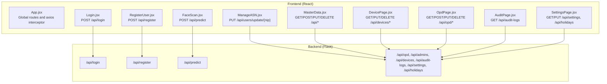
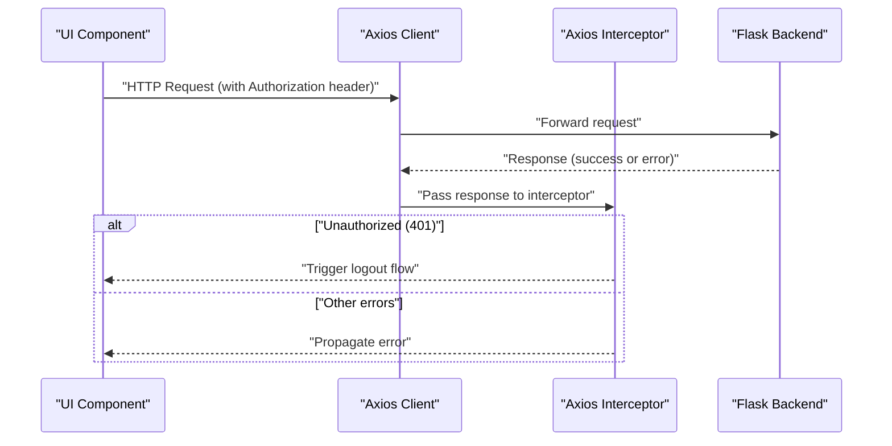
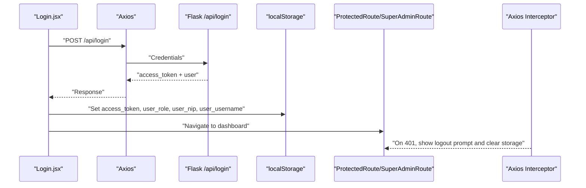
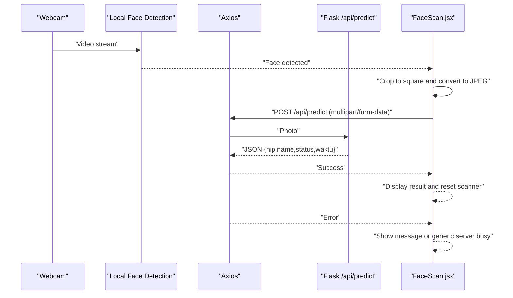
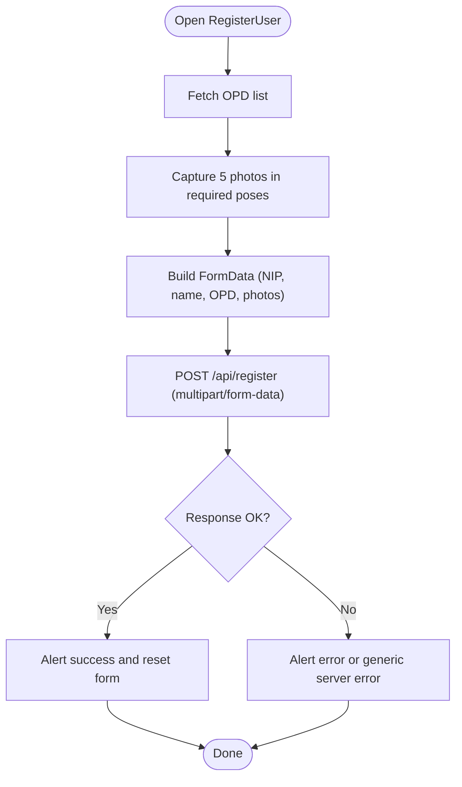
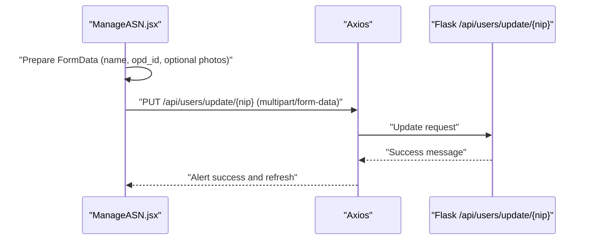
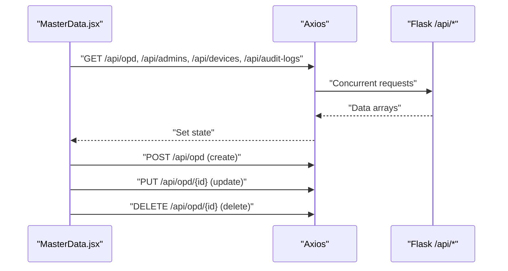
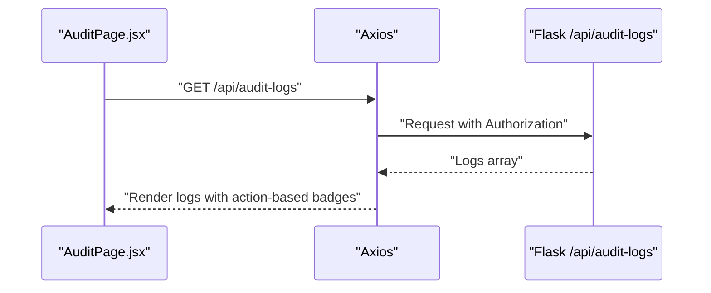
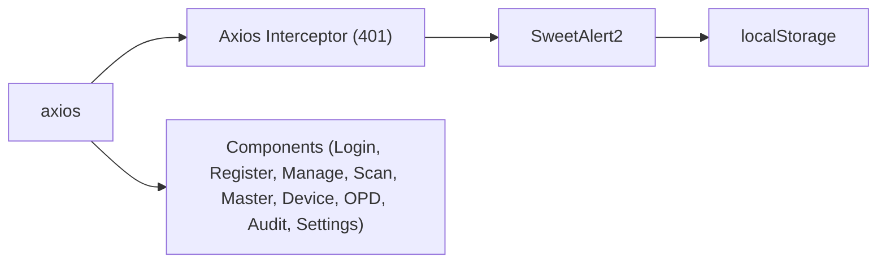

# API Integration

<cite>
**Referenced Files in This Document**
- [package.json](file://package.json)
- [README.md](file://README.md)
- [src/App.jsx](file://src/App.jsx)
- [src/hooks/useAutoLogout.js](file://src/hooks/useAutoLogout.js)
- [src/pages/FaceScan.jsx](file://src/pages/FaceScan.jsx)
- [src/pages/Login.jsx](file://src/pages/Login.jsx)
- [src/pages/RegisterUser.jsx](file://src/pages/RegisterUser.jsx)
- [src/pages/ManageASN.jsx](file://src/pages/ManageASN.jsx)
- [src/pages/MasterData.jsx](file://src/pages/MasterData.jsx)
- [src/pages/DevicePage.jsx](file://src/pages/DevicePage.jsx)
- [src/pages/OpdPage.jsx](file://src/pages/OpdPage.jsx)
- [src/pages/AuditPage.jsx](file://src/pages/AuditPage.jsx)
- [src/pages/SettingsPage.jsx](file://src/pages/SettingsPage.jsx)
</cite>

## Table of Contents
1. [Introduction](#introduction)
2. [Project Structure](#project-structure)
3. [Core Components](#core-components)
4. [Architecture Overview](#architecture-overview)
5. [Detailed Component Analysis](#detailed-component-analysis)
6. [Dependency Analysis](#dependency-analysis)
7. [Performance Considerations](#performance-considerations)
8. [Troubleshooting Guide](#troubleshooting-guide)
9. [Conclusion](#conclusion)
10. [Appendices](#appendices)

## Introduction
This document describes the frontend API integration patterns used by the React application. It covers HTTP client configuration with axios, endpoint specifications for user registration, attendance processing, and data management. It explains authentication headers, request/response handling, error strategies, and retry mechanisms. It also documents integration patterns for face recognition data upload, user management operations, and administrative queries. Guidance is included for API versioning, rate limiting considerations, error response codes, network connectivity, timeouts, offline scenarios, debugging techniques, and integration testing approaches.

## Project Structure
The frontend is a React application built with Vite. It communicates with a Python/Flask backend via RESTful HTTP endpoints. Authentication is handled via JWT tokens stored in local storage. Global axios interceptors manage unauthorized responses centrally.

**Diagram sources**
- [src/App.jsx:46-70](file://src/App.jsx#L46-L70)
- [src/pages/Login.jsx:69-100](file://src/pages/Login.jsx#L69-L100)
- [src/pages/RegisterUser.jsx:99-121](file://src/pages/RegisterUser.jsx#L99-L121)
- [src/pages/ManageASN.jsx:47-58](file://src/pages/ManageASN.jsx#L47-L58)
- [src/pages/FaceScan.jsx:39-85](file://src/pages/FaceScan.jsx#L39-L85)
- [src/pages/MasterData.jsx:24-39](file://src/pages/MasterData.jsx#L24-L39)
- [src/pages/DevicePage.jsx:28-75](file://src/pages/DevicePage.jsx#L28-L75)
- [src/pages/OpdPage.jsx:24-69](file://src/pages/OpdPage.jsx#L24-L69)
- [src/pages/AuditPage.jsx:13-21](file://src/pages/AuditPage.jsx#L13-L21)
- [src/pages/SettingsPage.jsx:34-66](file://src/pages/SettingsPage.jsx#L34-L66)

**Section sources**
- [README.md:11-34](file://README.md#L11-L34)
- [package.json:12-21](file://package.json#L12-L21)

## Core Components
- Axios client configured globally with an interceptor for unauthorized responses.
- Authentication via JWT bearer tokens stored in local storage.
- Centralized protected route wrappers enforcing token presence and role checks.
- Face recognition pipeline integrating local AI detection and server-side prediction.

Key integration patterns:
- Authentication header injection for protected endpoints.
- Form submission with multipart/form-data for photo uploads.
- Batch requests for master data consolidation.
- Error handling with user-friendly alerts and fallback messages.

**Section sources**
- [src/App.jsx:18-31](file://src/App.jsx#L18-L31)
- [src/App.jsx:46-70](file://src/App.jsx#L46-L70)
- [src/pages/Login.jsx:74-99](file://src/pages/Login.jsx#L74-L99)
- [src/pages/RegisterUser.jsx:99-121](file://src/pages/RegisterUser.jsx#L99-L121)
- [src/pages/ManageASN.jsx:47-58](file://src/pages/ManageASN.jsx#L47-L58)
- [src/pages/FaceScan.jsx:39-85](file://src/pages/FaceScan.jsx#L39-L85)
- [src/pages/MasterData.jsx:24-39](file://src/pages/MasterData.jsx#L24-L39)

## Architecture Overview
The frontend interacts with a Flask backend through REST endpoints. Authentication is mandatory for protected routes. The global axios interceptor centralizes unauthorized session handling.

**Diagram sources**
- [src/App.jsx:46-70](file://src/App.jsx#L46-L70)

**Section sources**
- [src/App.jsx:46-70](file://src/App.jsx#L46-L70)

## Detailed Component Analysis

### Authentication and Session Management
- Login flow posts credentials to the backend and stores the JWT access token and user metadata in local storage.
- ProtectedRoute enforces token presence; SuperAdminRoute additionally validates role.
- Axios interceptor listens for 401 responses and triggers a logout confirmation dialog, clearing local storage and redirecting to login.

**Diagram sources**
- [src/pages/Login.jsx:69-100](file://src/pages/Login.jsx#L69-L100)
- [src/App.jsx:18-31](file://src/App.jsx#L18-L31)
- [src/App.jsx:46-70](file://src/App.jsx#L46-L70)

**Section sources**
- [src/pages/Login.jsx:69-100](file://src/pages/Login.jsx#L69-L100)
- [src/App.jsx:18-31](file://src/App.jsx#L18-L31)
- [src/App.jsx:46-70](file://src/App.jsx#L46-L70)

### Attendance Processing Pipeline
- Local AI detects faces and crops images to square format suitable for the backend.
- Cropped image is sent as multipart/form-data to the prediction endpoint.
- On success, the response is parsed for NIP/name/status/waktu; on failure, error messages are extracted from the response or shown as generic server busy.

**Diagram sources**
- [src/pages/FaceScan.jsx:39-85](file://src/pages/FaceScan.jsx#L39-L85)

**Section sources**
- [src/pages/FaceScan.jsx:39-85](file://src/pages/FaceScan.jsx#L39-L85)

### User Registration (Face Biometrics)
- Collects NIP, name, OPD selection, and captures 5 photos in guided poses.
- Submits multipart/form-data to the registration endpoint with Authorization header.
- Handles success and error responses with user feedback.

**Diagram sources**
- [src/pages/RegisterUser.jsx:99-121](file://src/pages/RegisterUser.jsx#L99-L121)

**Section sources**
- [src/pages/RegisterUser.jsx:99-121](file://src/pages/RegisterUser.jsx#L99-L121)

### User Management Operations
- Updates user profile and optionally re-registers face biometrics by sending new photos.
- Uses PUT with multipart/form-data for updates and Authorization header.

**Diagram sources**
- [src/pages/ManageASN.jsx:47-58](file://src/pages/ManageASN.jsx#L47-L58)

**Section sources**
- [src/pages/ManageASN.jsx:47-58](file://src/pages/ManageASN.jsx#L47-L58)

### Administrative Queries and Data Management
- Master data page performs concurrent GET requests for OPD, admins, devices, and audit logs.
- CRUD operations for OPD and devices use Authorization headers; delete operations confirm before sending requests.
- Settings page manages working hours and holidays via PUT and POST respectively.

**Diagram sources**
- [src/pages/MasterData.jsx:24-39](file://src/pages/MasterData.jsx#L24-L39)
- [src/pages/OpdPage.jsx:33-69](file://src/pages/OpdPage.jsx#L33-L69)
- [src/pages/DevicePage.jsx:41-75](file://src/pages/DevicePage.jsx#L41-L75)
- [src/pages/SettingsPage.jsx:34-66](file://src/pages/SettingsPage.jsx#L34-L66)

**Section sources**
- [src/pages/MasterData.jsx:24-39](file://src/pages/MasterData.jsx#L24-L39)
- [src/pages/OpdPage.jsx:33-69](file://src/pages/OpdPage.jsx#L33-L69)
- [src/pages/DevicePage.jsx:41-75](file://src/pages/DevicePage.jsx#L41-L75)
- [src/pages/SettingsPage.jsx:34-66](file://src/pages/SettingsPage.jsx#L34-L66)

### Audit Trail and Read-Only Logs
- Fetches audit logs with Authorization header and displays badges based on action type.

**Diagram sources**
- [src/pages/AuditPage.jsx:13-21](file://src/pages/AuditPage.jsx#L13-L21)

**Section sources**
- [src/pages/AuditPage.jsx:13-21](file://src/pages/AuditPage.jsx#L13-L21)

## Dependency Analysis
- Axios is used for HTTP requests across components.
- SweetAlert2 is used for user prompts during logout and error notifications.
- Local storage holds JWT and user metadata for session persistence.
- Global axios interceptor centralizes 401 handling.

**Diagram sources**
- [src/App.jsx:46-70](file://src/App.jsx#L46-L70)
- [src/pages/Login.jsx:74-99](file://src/pages/Login.jsx#L74-L99)

**Section sources**
- [package.json:12-21](file://package.json#L12-L21)
- [src/App.jsx:46-70](file://src/App.jsx#L46-L70)

## Performance Considerations
- Concurrent requests for master data reduce total latency.
- Local face cropping ensures backend receives appropriately sized images, minimizing processing overhead.
- Avoid unnecessary re-renders by using memoization and controlled state updates.

[No sources needed since this section provides general guidance]

## Troubleshooting Guide
Common issues and remedies:
- Network connectivity failures: Inspect network tab; verify backend availability and CORS configuration.
- Authentication errors: Confirm token presence and validity; check interceptor behavior on 401.
- Multipart upload errors: Ensure Content-Type is multipart/form-data and FormData is constructed correctly.
- Unexpected server errors: Parse error.response.data.error or message for actionable feedback.

Debugging techniques:
- Enable browser devtools network panel to inspect request/response headers and bodies.
- Add console logging around axios calls to capture raw errors.
- Validate Authorization header construction and token expiration using the auto-logout hook.

**Section sources**
- [src/App.jsx:46-70](file://src/App.jsx#L46-L70)
- [src/pages/Login.jsx:91-99](file://src/pages/Login.jsx#L91-L99)
- [src/pages/RegisterUser.jsx:116-121](file://src/pages/RegisterUser.jsx#L116-L121)
- [src/pages/ManageASN.jsx:54-58](file://src/pages/ManageASN.jsx#L54-L58)
- [src/pages/FaceScan.jsx:67-85](file://src/pages/FaceScan.jsx#L67-L85)

## Conclusion
The frontend integrates with a Flask backend using standardized REST patterns, centralized authentication via JWT, and robust error handling. Components consistently apply Authorization headers, support multipart uploads for biometric data, and leverage concurrent requests for efficient data loading. The global axios interceptor streamlines unauthorized session handling, while local storage persists tokens and user metadata. The documented patterns provide a solid foundation for extending API integrations, adding retry logic, and implementing rate limiting strategies.

[No sources needed since this section summarizes without analyzing specific files]

## Appendices

### Endpoint Catalog
- Authentication
  - POST /api/login
- Attendance
  - POST /api/predict
- Registration
  - POST /api/register
- User Management
  - PUT /api/users/update/{nip}
- Master Data
  - GET/POST/PUT/DELETE /api/opd/*
  - GET/POST/PUT/DELETE /api/admins/*
  - GET/PUT/DELETE /api/devices/*
  - GET /api/audit-logs
- Settings
  - GET/PUT /api/settings
  - POST /api/holidays

**Section sources**
- [src/pages/Login.jsx:74-78](file://src/pages/Login.jsx#L74-L78)
- [src/pages/FaceScan.jsx:47-49](file://src/pages/FaceScan.jsx#L47-L49)
- [src/pages/RegisterUser.jsx:107-112](file://src/pages/RegisterUser.jsx#L107-L112)
- [src/pages/ManageASN.jsx:54](file://src/pages/ManageASN.jsx#L54)
- [src/pages/MasterData.jsx:24-39](file://src/pages/MasterData.jsx#L24-L39)
- [src/pages/DevicePage.jsx:41-75](file://src/pages/DevicePage.jsx#L41-L75)
- [src/pages/OpdPage.jsx:33-69](file://src/pages/OpdPage.jsx#L33-L69)
- [src/pages/AuditPage.jsx:16](file://src/pages/AuditPage.jsx#L16)
- [src/pages/SettingsPage.jsx:36-66](file://src/pages/SettingsPage.jsx#L36-L66)

### Authentication Headers
- Authorization: Bearer <access_token>
- Content-Type: application/json for JSON payloads; multipart/form-data for photo uploads

**Section sources**
- [src/pages/MasterData.jsx:21-22](file://src/pages/MasterData.jsx#L21-L22)
- [src/pages/ManageASN.jsx:54](file://src/pages/ManageASN.jsx#L54)
- [src/pages/SettingsPage.jsx:47](file://src/pages/SettingsPage.jsx#L47)

### Error Handling Strategies
- Centralized 401 handling via axios interceptor triggers logout and clears session.
- Component-level try/catch blocks surface user-friendly messages from error.response.data.error or message.
- Generic fallback messages for network failures.

**Section sources**
- [src/App.jsx:46-70](file://src/App.jsx#L46-L70)
- [src/pages/Login.jsx:91-99](file://src/pages/Login.jsx#L91-L99)
- [src/pages/MasterData.jsx:92-94](file://src/pages/MasterData.jsx#L92-L94)
- [src/pages/DevicePage.jsx:48-50](file://src/pages/DevicePage.jsx#L48-L50)
- [src/pages/OpdPage.jsx:42-44](file://src/pages/OpdPage.jsx#L42-L44)
- [src/pages/SettingsPage.jsx:50-52](file://src/pages/SettingsPage.jsx#L50-L52)

### Retry Mechanisms
- No explicit retry logic is implemented in the current codebase. Consider adding exponential backoff and configurable retry attempts for transient failures.

[No sources needed since this section provides general guidance]

### API Versioning and Rate Limiting
- No explicit versioning or rate limiting headers are observed in the current codebase. Implement versioning via path/version or header scheme and enforce rate limits server-side with appropriate headers and status codes.

[No sources needed since this section provides general guidance]

### Offline Scenarios
- Local storage persists tokens and user metadata. Implement offline-first strategies by caching frequently accessed data and deferring writes until connectivity is restored.

[No sources needed since this section provides general guidance]

### Integration Testing Approaches
- Mock axios interceptors and endpoints to simulate success and error responses.
- Test multipart uploads with synthetic blobs and verify FormData composition.
- Validate protected routes and role-based access controls.

[No sources needed since this section provides general guidance]