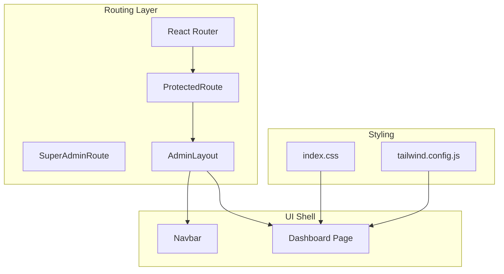
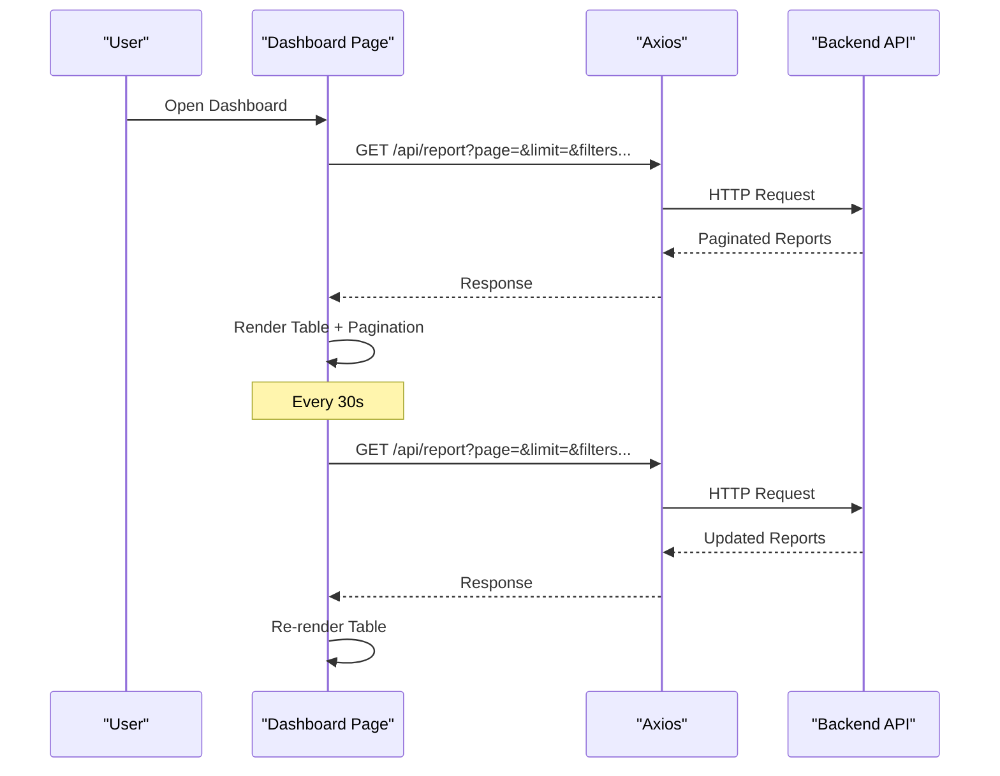
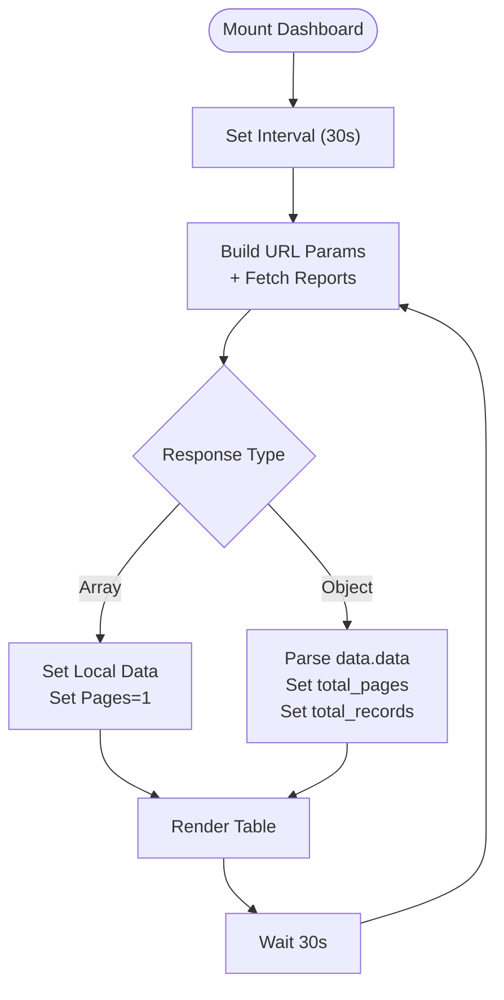
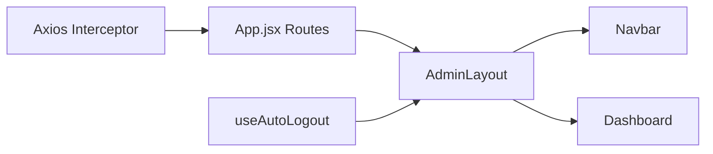
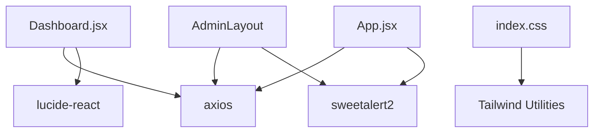

# Admin Dashboard

<cite>
**Referenced Files in This Document**
- [Dashboard.jsx](file://src/pages/Dashboard.jsx)
- [App.jsx](file://src/App.jsx)
- [Navbar.jsx](file://src/components/Navbar.jsx)
- [ManageASN.jsx](file://src/pages/ManageASN.jsx)
- [index.css](file://src/index.css)
- [tailwind.config.js](file://tailwind.config.js)
- [package.json](file://package.json)
- [index.html](file://index.html)
- [useAutoLogout.js](file://src/hooks/useAutoLogout.js)
</cite>

## Table of Contents
1. [Introduction](#introduction)
2. [Project Structure](#project-structure)
3. [Core Components](#core-components)
4. [Architecture Overview](#architecture-overview)
5. [Detailed Component Analysis](#detailed-component-analysis)
6. [Dependency Analysis](#dependency-analysis)
7. [Performance Considerations](#performance-considerations)
8. [Troubleshooting Guide](#troubleshooting-guide)
9. [Conclusion](#conclusion)

## Introduction
This document describes the Admin Dashboard interface and its surrounding ecosystem. The dashboard presents attendance report data with filtering, pagination, and export capabilities. It integrates with backend APIs for report retrieval and supports automatic data refresh. The document covers layout, navigation, responsiveness, real-time-like updates, and operational controls such as export and filters.

## Project Structure
The dashboard is part of a React application with routing and protected layouts. The main dashboard page is rendered inside an admin layout that includes a persistent sidebar navigation. Global interceptors handle session expiration, and Tailwind CSS provides responsive styling.

**Diagram sources**
- [App.jsx:72-99](file://src/App.jsx#L72-L99)
- [Navbar.jsx:46-155](file://src/components/Navbar.jsx#L46-L155)
- [Dashboard.jsx:113-312](file://src/pages/Dashboard.jsx#L113-L312)
- [index.css:1-12](file://src/index.css#L1-L12)
- [tailwind.config.js:1-17](file://tailwind.config.js#L1-L17)

**Section sources**
- [App.jsx:18-44](file://src/App.jsx#L18-L44)
- [index.css:1-12](file://src/index.css#L1-L12)
- [tailwind.config.js:1-17](file://tailwind.config.js#L1-L17)

## Core Components
- Dashboard page: Renders the report table, controls, pagination, and export functionality. Implements live refresh via periodic polling and client-side filtering.
- Admin layout: Wraps pages with a fixed sidebar and handles auto-logout and global HTTP interceptor for session management.
- Navbar: Provides navigation links and role-aware visibility of master data sections.

Key responsibilities:
- Data fetching and caching with URL parameters for pagination and filters
- Export to CSV leveraging backend endpoint with bypassed pagination
- Real-time-like refresh every 30 seconds
- Responsive layout using Tailwind utilities

**Section sources**
- [Dashboard.jsx:18-48](file://src/pages/Dashboard.jsx#L18-L48)
- [Dashboard.jsx:54-87](file://src/pages/Dashboard.jsx#L54-L87)
- [Dashboard.jsx:89-103](file://src/pages/Dashboard.jsx#L89-L103)
- [Dashboard.jsx:105-109](file://src/pages/Dashboard.jsx#L105-L109)
- [App.jsx:33-44](file://src/App.jsx#L33-L44)
- [Navbar.jsx:25-43](file://src/components/Navbar.jsx#L25-L43)

## Architecture Overview
The dashboard communicates with a backend service to retrieve attendance reports. The frontend applies filters and pagination locally while requesting paginated data from the backend. Periodic polling keeps the data fresh. Export triggers a bulk fetch bypassing pagination to produce a CSV.

**Diagram sources**
- [Dashboard.jsx:18-42](file://src/pages/Dashboard.jsx#L18-L42)
- [Dashboard.jsx:44-48](file://src/pages/Dashboard.jsx#L44-L48)

## Detailed Component Analysis

### Dashboard Page
The dashboard page orchestrates:
- State for reports, pagination metadata, loading, and filters
- Periodic polling to refresh data every 30 seconds
- Filtering by search term, date range, and status
- Export to CSV by fetching all filtered records and generating a downloadable file
- Pagination rendering with ellipsis for large page sets
- Formatting helpers for dates and status badges

**Diagram sources**
- [Dashboard.jsx:18-42](file://src/pages/Dashboard.jsx#L18-L42)
- [Dashboard.jsx:44-48](file://src/pages/Dashboard.jsx#L44-L48)

Key behaviors:
- Filters reset page to 1 when changed
- Export requests a large limit to bypass pagination for full dataset
- Pagination numbers adapt to current page and total pages

**Section sources**
- [Dashboard.jsx:6-16](file://src/pages/Dashboard.jsx#L6-L16)
- [Dashboard.jsx:18-42](file://src/pages/Dashboard.jsx#L18-L42)
- [Dashboard.jsx:54-87](file://src/pages/Dashboard.jsx#L54-L87)
- [Dashboard.jsx:89-103](file://src/pages/Dashboard.jsx#L89-L103)
- [Dashboard.jsx:105-109](file://src/pages/Dashboard.jsx#L105-L109)

### Navigation and Layout
The admin layout wraps the dashboard with:
- Fixed-width sidebar (navigation)
- Auto-logout hook based on JWT expiry
- Global Axios interceptor for unauthorized responses

**Diagram sources**
- [App.jsx:72-99](file://src/App.jsx#L72-L99)
- [App.jsx:33-44](file://src/App.jsx#L33-L44)
- [Navbar.jsx:46-155](file://src/components/Navbar.jsx#L46-L155)
- [useAutoLogout.js:19-64](file://src/hooks/useAutoLogout.js#L19-L64)

**Section sources**
- [App.jsx:33-44](file://src/App.jsx#L33-L44)
- [useAutoLogout.js:19-64](file://src/hooks/useAutoLogout.js#L19-L64)

### Related Pages and Widgets
While the dashboard focuses on reports, related pages demonstrate complementary widgets and layouts:
- Manage ASN page includes summary cards for totals and statuses
- These illustrate potential dashboard widgets for system statistics

**Section sources**
- [ManageASN.jsx:183-188](file://src/pages/ManageASN.jsx#L183-L188)

## Dependency Analysis
External libraries and integrations:
- Axios for HTTP requests
- Lucide icons for UI affordances
- SweetAlert2 for modal prompts
- Tailwind CSS for responsive styling
- Vite for build tooling

**Diagram sources**
- [Dashboard.jsx:1-3](file://src/pages/Dashboard.jsx#L1-L3)
- [App.jsx:14-16](file://src/App.jsx#L14-L16)
- [index.css:1-3](file://src/index.css#L1-L3)
- [package.json:12-21](file://package.json#L12-L21)

**Section sources**
- [package.json:12-21](file://package.json#L12-L21)

## Performance Considerations
- Polling interval: 30 seconds balances freshness with network usage
- Export bypasses pagination by requesting a large limit; ensure backend enforces safe limits
- Client-side filtering reduces server load but may increase DOM rendering for large datasets
- Consider virtualizing large tables if datasets grow substantially

## Troubleshooting Guide
Common issues and remedies:
- Session expiration: Global interceptor detects 401 and clears local storage, redirecting to login
- Auto-logout: Uses JWT expiry decoding to schedule logout prompts
- No data shown: Verify token presence and backend connectivity; check console for errors
- Export fails: Confirm filters are applied and backend returns data; inspect error messages

**Section sources**
- [App.jsx:46-70](file://src/App.jsx#L46-L70)
- [useAutoLogout.js:5-17](file://src/hooks/useAutoLogout.js#L5-L17)
- [useAutoLogout.js:45-64](file://src/hooks/useAutoLogout.js#L45-L64)

## Conclusion
The Admin Dashboard provides a practical, real-time-like view of attendance reports with robust filtering, pagination, and export capabilities. Its layout and navigation integrate seamlessly with the broader admin ecosystem, while responsive design and global session management ensure usability and security.