# Administrative Features

<cite>
**Referenced Files in This Document**
- [App.jsx](file://src/App.jsx)
- [Navbar.jsx](file://src/components/Navbar.jsx)
- [Dashboard.jsx](file://src/pages/Dashboard.jsx)
- [ManageASN.jsx](file://src/pages/ManageASN.jsx)
- [RegisterUser.jsx](file://src/pages/RegisterUser.jsx)
- [AdminPage.jsx](file://src/pages/AdminPage.jsx)
- [OpdPage.jsx](file://src/pages/OpdPage.jsx)
- [DevicePage.jsx](file://src/pages/DevicePage.jsx)
- [AuditPage.jsx](file://src/pages/AuditPage.jsx)
- [MasterData.jsx](file://src/pages/MasterData.jsx)
- [SettingsPage.jsx](file://src/pages/SettingsPage.jsx)
</cite>

## Table of Contents
1. [Introduction](#introduction)
2. [Project Structure](#project-structure)
3. [Core Components](#core-components)
4. [Architecture Overview](#architecture-overview)
5. [Detailed Component Analysis](#detailed-component-analysis)
6. [Dependency Analysis](#dependency-analysis)
7. [Performance Considerations](#performance-considerations)
8. [Troubleshooting Guide](#troubleshooting-guide)
9. [Conclusion](#conclusion)
10. [Appendices](#appendices)

## Introduction
This document describes the administrative features of the Smart Presence system, focusing on the management interfaces and dashboard functionality. It covers:
- Admin dashboard overview and reporting
- Device management for fingerprint scanners and kiosks
- OPD administration for organizational units
- Audit trail management
- System settings configuration
- Master data management for OPDs, employees, and devices
- Reporting capabilities, search and filtering, CSV export, and data visualization
- Navigation patterns, role-based access controls, and administrative workflows
- Bulk operations, data import/export processes, and system maintenance features
- Best practices and troubleshooting guidance

## Project Structure
The application is a React single-page application protected by route guards and role-based navigation. Administrative routes are restricted to Super Admin users, while Admin OPD users can access dashboards and basic management screens.

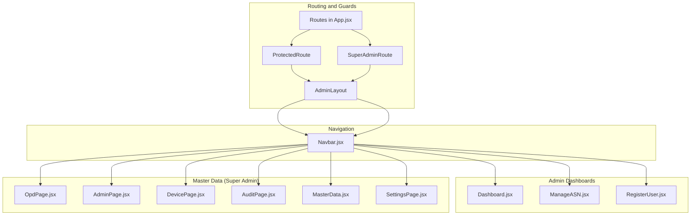

**Diagram sources**
- [App.jsx:72-99](file://src/App.jsx#L72-L99)
- [Navbar.jsx:46-155](file://src/components/Navbar.jsx#L46-L155)

**Section sources**
- [App.jsx:18-31](file://src/App.jsx#L18-L31)
- [App.jsx:72-99](file://src/App.jsx#L72-L99)
- [Navbar.jsx:25-44](file://src/components/Navbar.jsx#L25-L44)

## Core Components
- Role-based navigation and access control:
  - Super Admin sees Master Data and Settings menus; Admin OPD sees operational dashboards and user management.
  - Route guards enforce token presence and role checks.
- Dashboard:
  - Real-time report table with search, date filters, status filters, pagination, and CSV export.
- Employee management:
  - View and manage ASN profiles, revoke cross-OPD access, and re-register face biometrics.
- Registration:
  - Multi-pose face capture and registration pipeline integrated with face detection models.
- OPD administration:
  - CRUD for organizational units with search and filtering.
- Admin management:
  - Create, edit, delete admin accounts with optional password updates.
- Device management:
  - View, edit, unbind, and delete devices; toggle anti-spoofing settings.
- Audit trail:
  - Read-only listing of recent system actions.
- Settings:
  - Configure working hours and custom holidays.

**Section sources**
- [Navbar.jsx:25-44](file://src/components/Navbar.jsx#L25-L44)
- [App.jsx:18-31](file://src/App.jsx#L18-L31)
- [Dashboard.jsx:18-48](file://src/pages/Dashboard.jsx#L18-L48)
- [ManageASN.jsx:111-160](file://src/pages/ManageASN.jsx#L111-L160)
- [RegisterUser.jsx:7-56](file://src/pages/RegisterUser.jsx#L7-L56)
- [OpdPage.jsx:24-31](file://src/pages/OpdPage.jsx#L24-L31)
- [AdminPage.jsx:31-42](file://src/pages/AdminPage.jsx#L31-L42)
- [DevicePage.jsx:28-39](file://src/pages/DevicePage.jsx#L28-L39)
- [AuditPage.jsx:13-21](file://src/pages/AuditPage.jsx#L13-L21)
- [SettingsPage.jsx:24-41](file://src/pages/SettingsPage.jsx#L24-L41)

## Architecture Overview
Administrative features rely on:
- Protected routes and role checks
- Centralized navigation with dynamic submenus
- RESTful API integration for all CRUD and reporting operations
- Local storage for session and identity tokens

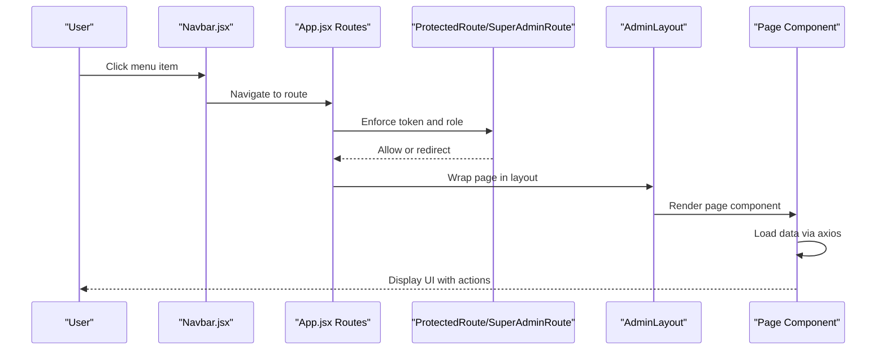

**Diagram sources**
- [App.jsx:72-99](file://src/App.jsx#L72-L99)
- [Navbar.jsx:46-155](file://src/components/Navbar.jsx#L46-L155)

## Detailed Component Analysis

### Admin Dashboard Overview and Reporting
- Real-time report table with pagination and live refresh.
- Filters: search by name/NIP, date range, and status (On time/Late/Absent).
- Export to CSV with full dataset export bypassing pagination.
- Data visualization badges for status and location.

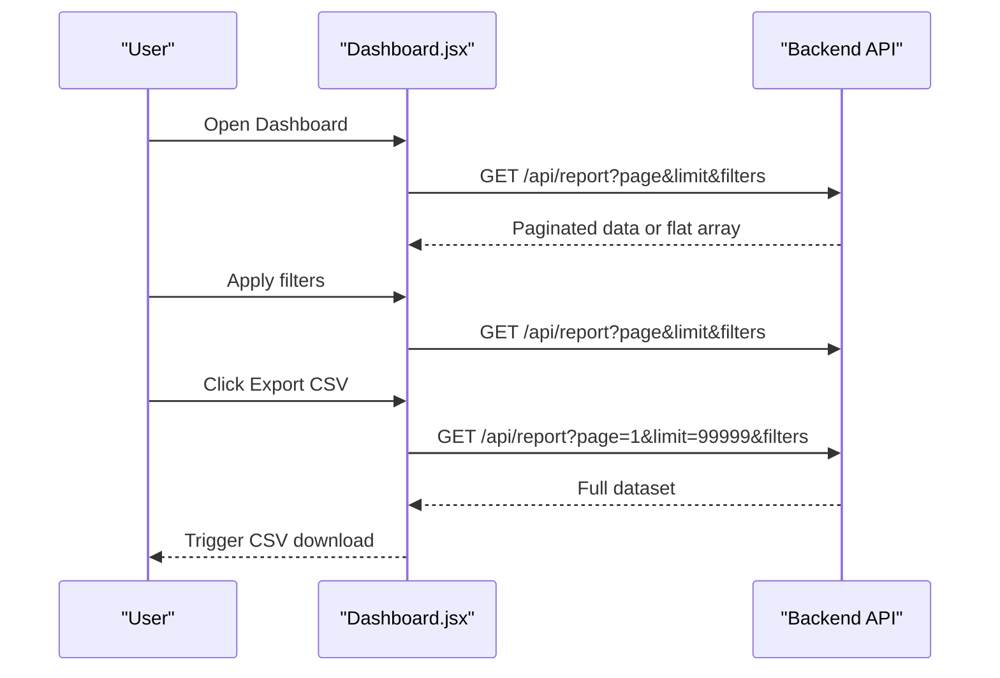

**Diagram sources**
- [Dashboard.jsx:18-48](file://src/pages/Dashboard.jsx#L18-L48)
- [Dashboard.jsx:54-87](file://src/pages/Dashboard.jsx#L54-L87)

**Section sources**
- [Dashboard.jsx:18-48](file://src/pages/Dashboard.jsx#L18-L48)
- [Dashboard.jsx:54-87](file://src/pages/Dashboard.jsx#L54-L87)
- [Dashboard.jsx:89-103](file://src/pages/Dashboard.jsx#L89-L103)

### Employee Management (ASN)
- View ASN list with summary cards and daily status.
- Search by name/NIP.
- Edit profile (name, OPD), revoke cross-OPD access, and re-register face biometrics with pose capture.
- Face registration uses Tiny Face Detector model and multi-angle photos.

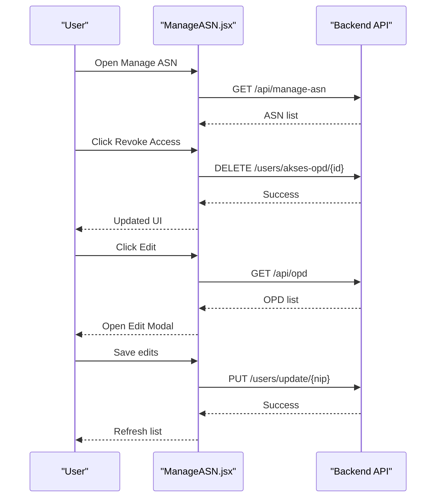

**Diagram sources**
- [ManageASN.jsx:111-160](file://src/pages/ManageASN.jsx#L111-L160)
- [ManageASN.jsx:16-106](file://src/pages/ManageASN.jsx#L16-L106)

**Section sources**
- [ManageASN.jsx:111-160](file://src/pages/ManageASN.jsx#L111-L160)
- [ManageASN.jsx:16-106](file://src/pages/ManageASN.jsx#L16-L106)

### Face Registration Workflow
- Select OPD, enter NIP and name.
- Capture five poses with camera overlay guidance.
- Submit multipart form with photos and metadata.

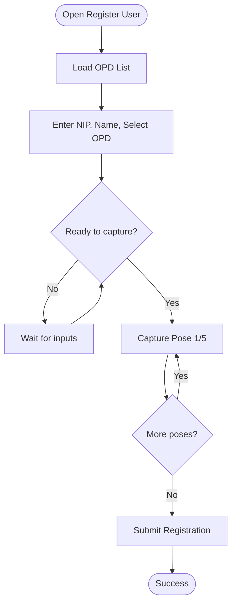

**Diagram sources**
- [RegisterUser.jsx:24-56](file://src/pages/RegisterUser.jsx#L24-L56)
- [RegisterUser.jsx:59-121](file://src/pages/RegisterUser.jsx#L59-L121)

**Section sources**
- [RegisterUser.jsx:24-56](file://src/pages/RegisterUser.jsx#L24-L56)
- [RegisterUser.jsx:59-121](file://src/pages/RegisterUser.jsx#L59-L121)

### OPD Administration
- Create, update, delete OPDs with search/filter.
- Uses centralized API endpoints for OPD CRUD.

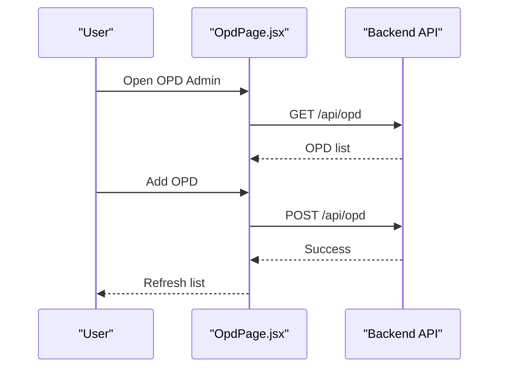

**Diagram sources**
- [OpdPage.jsx:24-31](file://src/pages/OpdPage.jsx#L24-L31)
- [OpdPage.jsx:33-45](file://src/pages/OpdPage.jsx#L33-L45)

**Section sources**
- [OpdPage.jsx:24-31](file://src/pages/OpdPage.jsx#L24-L31)
- [OpdPage.jsx:33-45](file://src/pages/OpdPage.jsx#L33-L45)

### Admin Management (OPD Admin Accounts)
- Create new admin with NIP, username, full name, password, and OPD assignment.
- Edit existing admin (name, OPD, optional password change).
- Delete admin with confirmation.

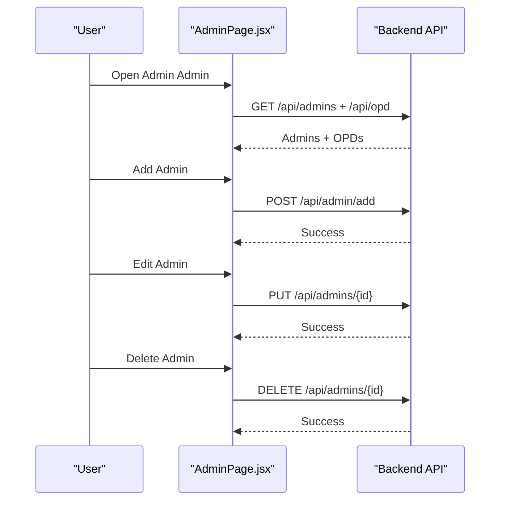

**Diagram sources**
- [AdminPage.jsx:31-42](file://src/pages/AdminPage.jsx#L31-L42)
- [AdminPage.jsx:44-84](file://src/pages/AdminPage.jsx#L44-L84)

**Section sources**
- [AdminPage.jsx:31-42](file://src/pages/AdminPage.jsx#L31-L42)
- [AdminPage.jsx:44-84](file://src/pages/AdminPage.jsx#L44-L84)

### Device Management (Scanners/Kiosks)
- View devices with verification status, OPD binding, last activity, and anti-spoofing status.
- Edit device details (name, location, OPD, verified flag).
- Unbind device from OPD (logout from kiosk).
- Delete device permanently.

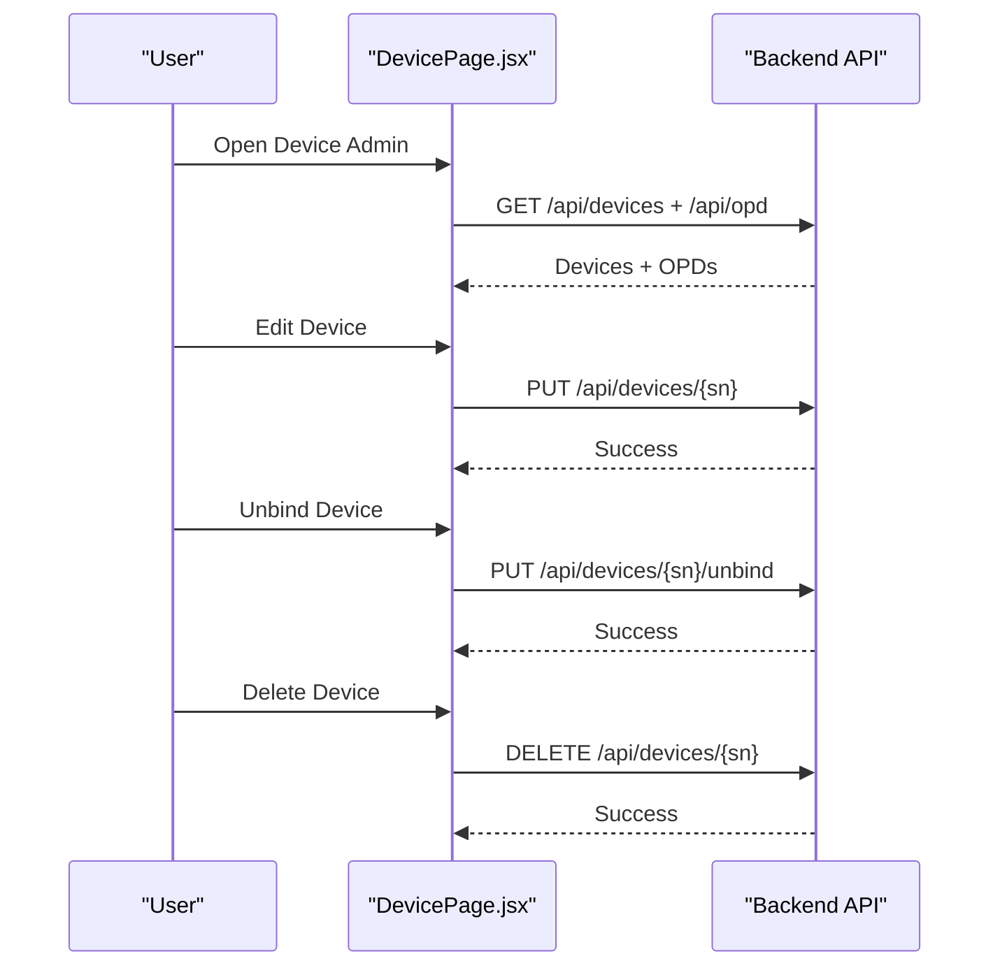

**Diagram sources**
- [DevicePage.jsx:28-39](file://src/pages/DevicePage.jsx#L28-L39)
- [DevicePage.jsx:41-75](file://src/pages/DevicePage.jsx#L41-L75)

**Section sources**
- [DevicePage.jsx:28-39](file://src/pages/DevicePage.jsx#L28-L39)
- [DevicePage.jsx:41-75](file://src/pages/DevicePage.jsx#L41-L75)

### Audit Trail Management
- Read-only listing of recent system actions with color-coded action badges.
- Displays target table and detailed description.

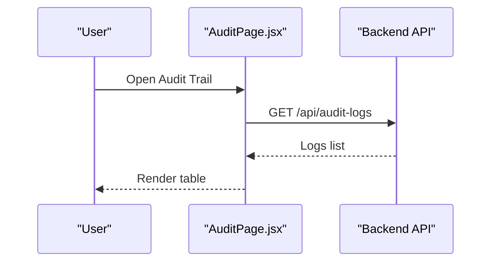

**Diagram sources**
- [AuditPage.jsx:13-21](file://src/pages/AuditPage.jsx#L13-L21)

**Section sources**
- [AuditPage.jsx:13-21](file://src/pages/AuditPage.jsx#L13-L21)

### System Settings Configuration
- Working hours: start-in, late threshold, end-in, start-out, end-out.
- Custom holidays: add/delete with modal and validation.
- Settings saved via PUT to backend.

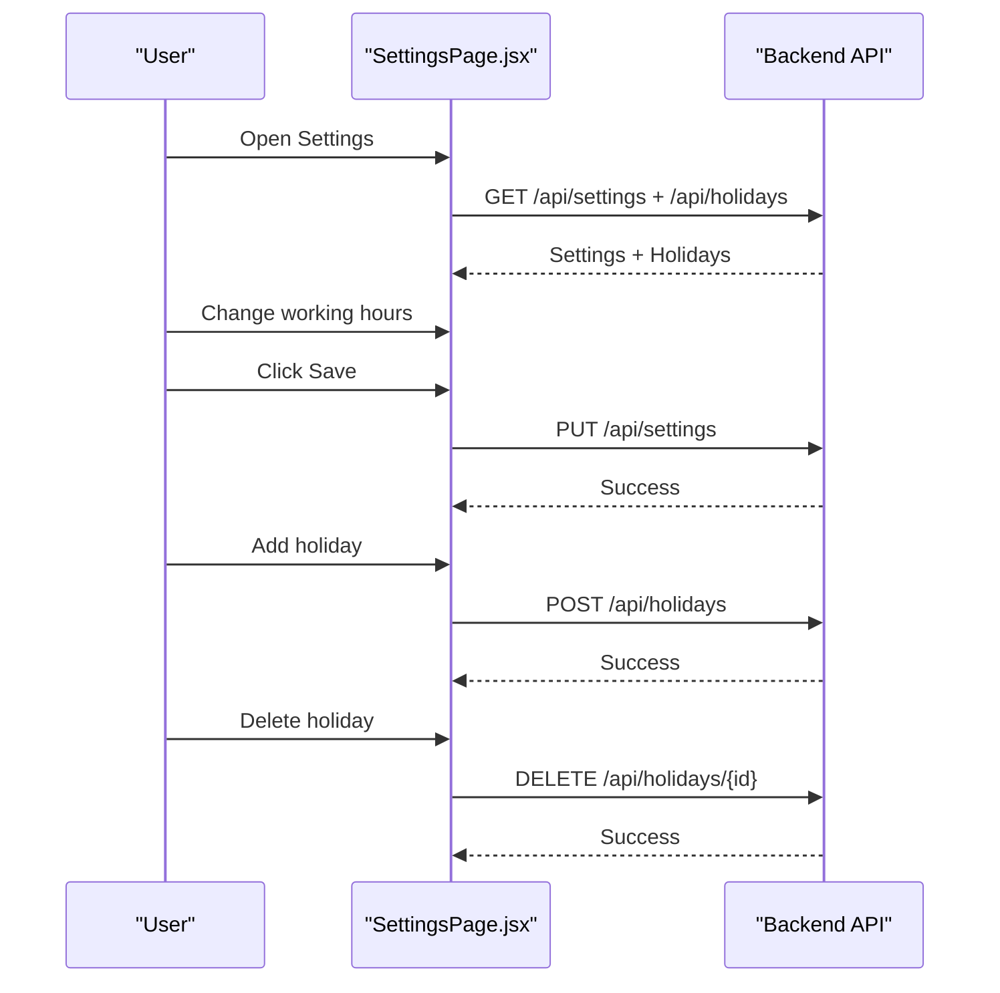

**Diagram sources**
- [SettingsPage.jsx:24-41](file://src/pages/SettingsPage.jsx#L24-L41)
- [SettingsPage.jsx:44-75](file://src/pages/SettingsPage.jsx#L44-L75)

**Section sources**
- [SettingsPage.jsx:24-41](file://src/pages/SettingsPage.jsx#L24-L41)
- [SettingsPage.jsx:44-75](file://src/pages/SettingsPage.jsx#L44-L75)

### Master Data Center (Centralized Management)
- Tabbed interface for OPD, Admin, Devices, and Audit.
- Centralized create/edit/delete handlers and modal dialogs.
- Devices can only be registered via mobile kiosk activation.

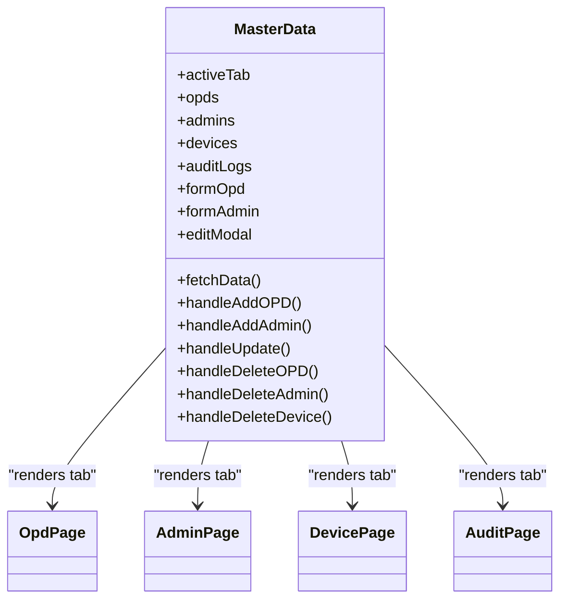

**Diagram sources**
- [MasterData.jsx:5-440](file://src/pages/MasterData.jsx#L5-L440)
- [OpdPage.jsx:1-173](file://src/pages/OpdPage.jsx#L1-L173)
- [AdminPage.jsx:1-258](file://src/pages/AdminPage.jsx#L1-L258)
- [DevicePage.jsx:1-241](file://src/pages/DevicePage.jsx#L1-L241)
- [AuditPage.jsx:1-76](file://src/pages/AuditPage.jsx#L1-L76)

**Section sources**
- [MasterData.jsx:5-440](file://src/pages/MasterData.jsx#L5-L440)

## Dependency Analysis
- Routing and guards:
  - ProtectedRoute ensures token presence; SuperAdminRoute enforces role.
  - AdminLayout injects Navbar and applies auto-logout hook.
- Navigation:
  - Navbar dynamically renders menus based on user role and highlights active routes.
- Pages depend on axios for API calls and local storage for tokens and identity.
- Some pages share common UI patterns (search, modals, forms).

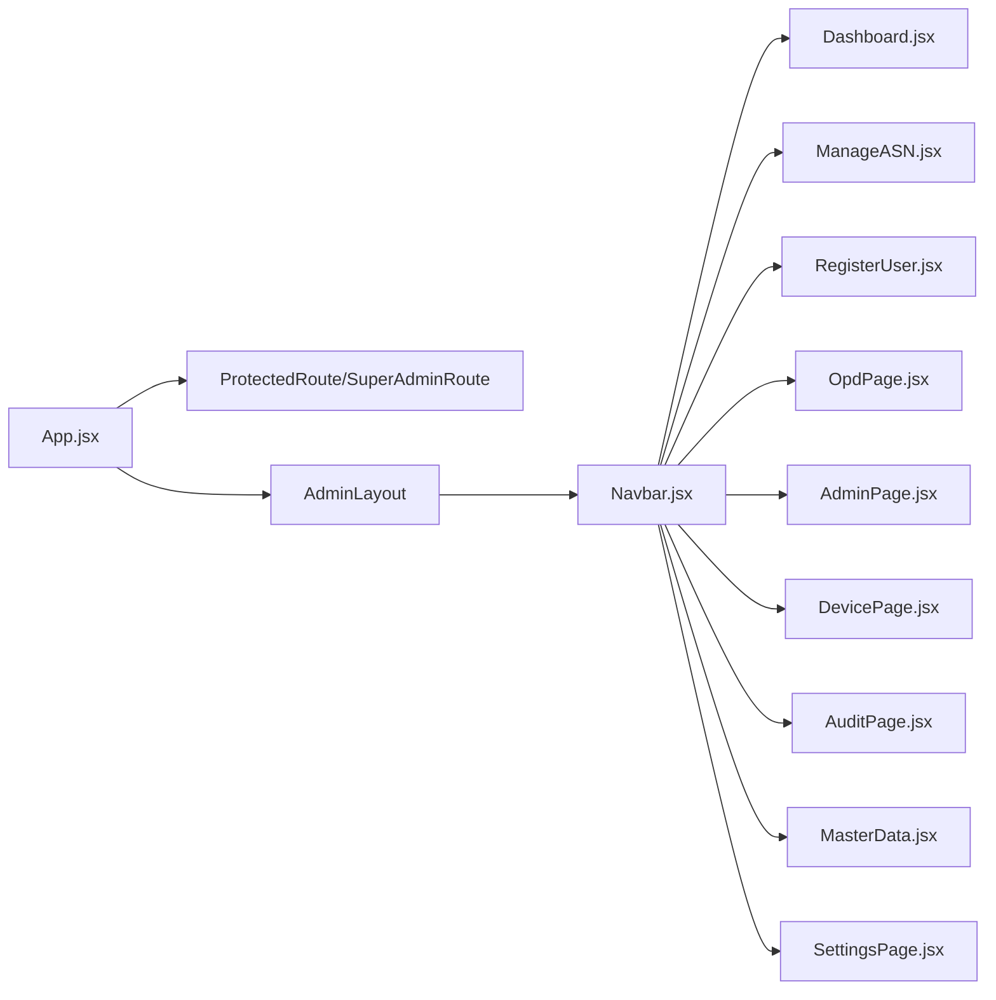

**Diagram sources**
- [App.jsx:72-99](file://src/App.jsx#L72-L99)
- [Navbar.jsx:46-155](file://src/components/Navbar.jsx#L46-L155)

**Section sources**
- [App.jsx:18-31](file://src/App.jsx#L18-L31)
- [App.jsx:72-99](file://src/App.jsx#L72-L99)
- [Navbar.jsx:25-44](file://src/components/Navbar.jsx#L25-L44)

## Performance Considerations
- Dashboard uses client-side filtering for small datasets; for larger datasets, prefer server-side filtering and pagination.
- CSV export requests a large limit; ensure backend supports efficient bulk retrieval.
- Face registration captures images client-side; ensure model loading completes before capturing.
- Auto-refresh intervals are used for live-like updates; consider throttling or debouncing filters to reduce API calls.

## Troubleshooting Guide
- Session expired:
  - Global axios interceptor detects 401 and prompts login; clear local storage and redirect.
- Unauthorized access:
  - SuperAdminRoute redirects non-super-admin users to dashboard.
- No data shown:
  - Verify token presence and role; check network errors in browser devtools.
- Device unbind failed:
  - Confirm device is bound and verified; retry after kiosk logout.
- CSV export empty:
  - Ensure filters are cleared or adjusted; backend requires a valid page/limit combination.
- Face registration model not loaded:
  - Confirm model files are served under the expected path and network allows loading.

**Section sources**
- [App.jsx:46-70](file://src/App.jsx#L46-L70)
- [App.jsx:24-31](file://src/App.jsx#L24-L31)
- [DevicePage.jsx:41-51](file://src/pages/DevicePage.jsx#L41-L51)
- [Dashboard.jsx:54-87](file://src/pages/Dashboard.jsx#L54-L87)
- [RegisterUser.jsx:43-56](file://src/pages/RegisterUser.jsx#L43-L56)

## Conclusion
The administrative suite provides a comprehensive set of tools for managing users, devices, organizational units, and system behavior. Role-based routing and navigation ensure appropriate access, while robust APIs enable efficient CRUD operations, reporting, and maintenance tasks. Following the best practices outlined here will help maintain a secure, responsive, and scalable administrative experience.

## Appendices

### Navigation Patterns and Role-Based Access
- Super Admin:
  - Views Master Data submenu (OPD, Admin, Devices) and Settings.
- Admin OPD:
  - Views operational dashboards (Dashboard, Manage ASN, Register User) and schedules.

**Section sources**
- [Navbar.jsx:25-44](file://src/components/Navbar.jsx#L25-L44)
- [App.jsx:86-96](file://src/App.jsx#L86-L96)

### Administrative Workflows Checklist
- Dashboard
  - Apply filters, review statuses, export CSV when needed.
- Manage ASN
  - Verify daily status, revoke cross-OPD access, re-register faces when necessary.
- Register User
  - Complete all five poses, ensure model readiness, submit form.
- OPD Admin
  - Create/edit/delete OPDs, verify data accuracy.
- Admin OPD
  - Create/edit/delete admin accounts, assign OPD, manage passwords.
- Device Admin
  - Bind/unbind devices, adjust anti-spoofing, monitor verification status.
- Audit
  - Review recent actions for compliance and troubleshooting.
- Settings
  - Adjust working hours and custom holidays carefully; test with a few scans.

### Best Practices
- Use filters to narrow down report views before exporting.
- Keep anti-spoofing enabled unless lighting conditions warrant disabling it temporarily.
- Regularly review audit logs for suspicious activities.
- Rotate admin passwords and limit admin creation to trusted individuals.
- Back up settings and holiday calendars periodically.