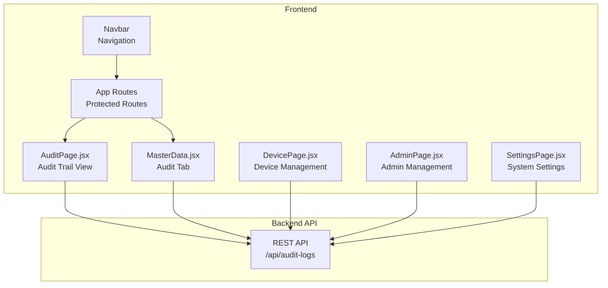
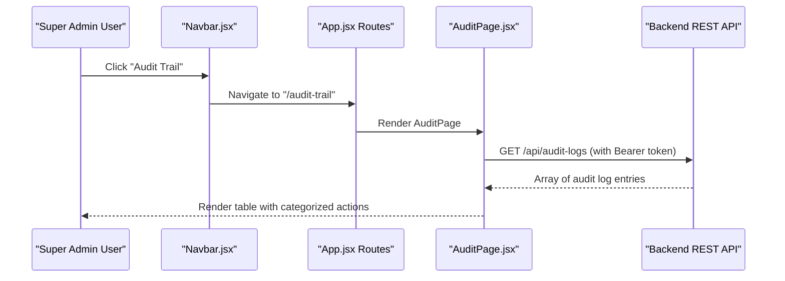
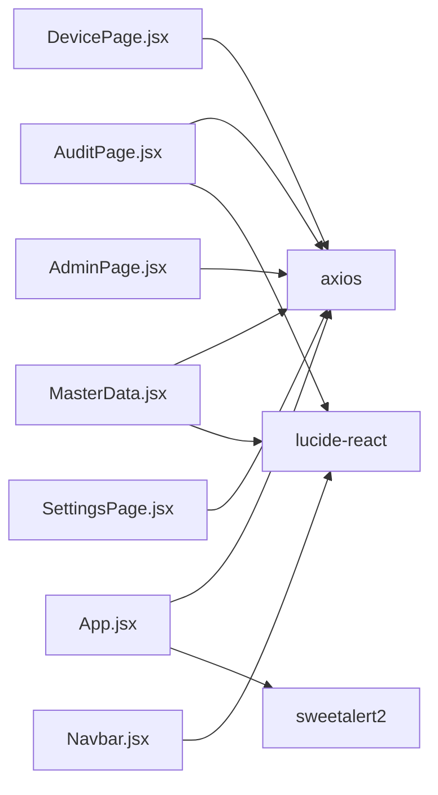

# Audit Trail Management

<cite>
**Referenced Files in This Document**
- [AuditPage.jsx](file://src/pages/AuditPage.jsx)
- [MasterData.jsx](file://src/pages/MasterData.jsx)
- [App.jsx](file://src/App.jsx)
- [Navbar.jsx](file://src/components/Navbar.jsx)
- [DevicePage.jsx](file://src/pages/DevicePage.jsx)
- [AdminPage.jsx](file://src/pages/AdminPage.jsx)
- [SettingsPage.jsx](file://src/pages/SettingsPage.jsx)
- [README.md](file://README.md)
- [package.json](file://package.json)
</cite>

## Table of Contents
1. [Introduction](#introduction)
2. [Project Structure](#project-structure)
3. [Core Components](#core-components)
4. [Architecture Overview](#architecture-overview)
5. [Detailed Component Analysis](#detailed-component-analysis)
6. [Dependency Analysis](#dependency-analysis)
7. [Performance Considerations](#performance-considerations)
8. [Troubleshooting Guide](#troubleshooting-guide)
9. [Conclusion](#conclusion)
10. [Appendices](#appendices)

## Introduction
This document describes the audit trail system for the Smart Presence application. It covers activity logging, user actions tracking, compliance monitoring, and the integration with user management, device activities, and system maintenance logs. It also documents the audit log interface, filter and search capabilities, activity timeline visualization, event categorization, and the current state of data retention and export functionality.

The system follows a React frontend with route protection and integrates with a backend REST API for retrieving audit logs and managing system resources. The audit trail is presented as read-only tables with color-coded actions and target tables for quick compliance review.

## Project Structure
The audit trail is primarily exposed through two locations:
- A dedicated Audit Trail page for Super Admins
- A read-only tab within the Master Data control panel

Both views consume the same REST endpoint for audit logs and share similar presentation patterns.

**Diagram sources**
- [App.jsx:92-93](file://src/App.jsx#L92-L93)
- [App.jsx:93](file://src/App.jsx#L93)
- [MasterData.jsx:30](file://src/pages/MasterData.jsx#L30)
- [AuditPage.jsx:16](file://src/pages/AuditPage.jsx#L16)

**Section sources**
- [App.jsx:92-93](file://src/App.jsx#L92-L93)
- [App.jsx:93](file://src/App.jsx#L93)
- [MasterData.jsx:30](file://src/pages/MasterData.jsx#L30)
- [AuditPage.jsx:16](file://src/pages/AuditPage.jsx#L16)

## Core Components
- AuditPage: Dedicated read-only view for audit logs with action categorization and basic table layout.
- MasterData Audit Tab: Integrated read-only audit logs within the Master Data control panel.
- Route Protection: Only Super Admins can access audit-related routes.
- Navigation: Audit Trail appears under the Master Data menu for Super Admins.

Key behaviors:
- Fetches audit logs from the backend endpoint on mount.
- Renders logs in a responsive table with color-coded action badges.
- Provides read-only presentation suitable for compliance review.

**Section sources**
- [AuditPage.jsx:7-73](file://src/pages/AuditPage.jsx#L7-L73)
- [MasterData.jsx:302-339](file://src/pages/MasterData.jsx#L302-L339)
- [App.jsx:92-93](file://src/App.jsx#L92-L93)
- [Navbar.jsx:38](file://src/components/Navbar.jsx#L38)

## Architecture Overview
The audit trail system is a client-side view of backend audit records. The frontend enforces role-based access and presents the data in a standardized format.

**Diagram sources**
- [App.jsx:92-93](file://src/App.jsx#L92-L93)
- [AuditPage.jsx:10-21](file://src/pages/AuditPage.jsx#L10-L21)
- [AuditPage.jsx:16](file://src/pages/AuditPage.jsx#L16)

## Detailed Component Analysis

### AuditPage Component
Responsibilities:
- Fetch audit logs from the backend on initial load.
- Display logs in a responsive table with:
  - Timestamps
  - Action categories (color-coded badges)
  - Target table identifiers
  - Detailed descriptions
- Enforce read-only presentation.

Action categorization logic:
- DELETE actions → red badge
- UPDATE or RE_REGISTER → yellow badge
- ADD, REGISTER, BIND → green badge
- APPROVE → emerald badge
- REJECT → orange badge
- Other actions → gray badge

Filter and search:
- No client-side filtering/search is implemented in this component.
- The parent MasterData tab includes a read-only audit table but does not expose search/filter controls.

Activity timeline visualization:
- Logs are rendered in a chronological table; no dedicated timeline chart is present.

Compliance monitoring:
- Read-only presentation suitable for compliance review.
- No built-in export functionality in this component.

Integration points:
- Uses bearer token from local storage for protected API access.
- Consumes the same audit endpoint used by the Master Data tab.

**Section sources**
- [AuditPage.jsx:7-73](file://src/pages/AuditPage.jsx#L7-L73)
- [AuditPage.jsx:23-30](file://src/pages/AuditPage.jsx#L23-L30)
- [AuditPage.jsx:10-21](file://src/pages/AuditPage.jsx#L10-L21)

### MasterData Audit Tab
Responsibilities:
- Presents audit logs as a read-only table within the Master Data control panel.
- Shares the same backend endpoint and rendering pattern as the dedicated AuditPage.
- Includes a lock icon indicator emphasizing read-only nature.

Filter and search:
- No explicit search/filter controls are provided for the audit tab in this component.

Compliance monitoring:
- Read-only presentation supports compliance review.
- No export functionality is implemented in this component.

**Section sources**
- [MasterData.jsx:302-339](file://src/pages/MasterData.jsx#L302-L339)
- [MasterData.jsx:306-308](file://src/pages/MasterData.jsx#L306-L308)

### Route Protection and Navigation
Access control:
- Audit Trail route is guarded for Super Admins only.
- Navbar exposes "Audit Trail" under the Master Data menu for Super Admins.

**Section sources**
- [App.jsx:92-93](file://src/App.jsx#L92-L93)
- [Navbar.jsx:38](file://src/components/Navbar.jsx#L38)

### Integration with User Management
- Admin management page displays associated device bindings and face registration indicators.
- While not a direct audit log, these UI elements help contextualize administrative actions and device associations.

**Section sources**
- [AdminPage.jsx:126-144](file://src/pages/AdminPage.jsx#L126-L144)

### Integration with Device Activities
- Device management page shows last activity timestamps and verification status.
- These fields complement audit logs by providing device lifecycle context.

**Section sources**
- [DevicePage.jsx:129](file://src/pages/DevicePage.jsx#L129)

### Integration with System Maintenance Logs
- System settings page manages working hours and holidays, which influence presence processing.
- These settings are not currently logged in the audit trail within the analyzed components.

**Section sources**
- [SettingsPage.jsx:84-90](file://src/pages/SettingsPage.jsx#L84-L90)

## Dependency Analysis
External libraries and integrations:
- Axios for HTTP requests to the backend API.
- Lucide icons for UI affordances.
- SweetAlert2 for session expiration prompts.
- Local storage for JWT tokens and user metadata.

**Diagram sources**
- [package.json:12-21](file://package.json#L12-L21)
- [AuditPage.jsx:1-3](file://src/pages/AuditPage.jsx#L1-L3)
- [MasterData.jsx:1-3](file://src/pages/MasterData.jsx#L1-L3)
- [DevicePage.jsx:1-3](file://src/pages/DevicePage.jsx#L1-L3)
- [AdminPage.jsx:1-3](file://src/pages/AdminPage.jsx#L1-L3)
- [SettingsPage.jsx:1-3](file://src/pages/SettingsPage.jsx#L1-L3)
- [App.jsx:14-16](file://src/App.jsx#L14-L16)

**Section sources**
- [package.json:12-21](file://package.json#L12-L21)
- [AuditPage.jsx:1-3](file://src/pages/AuditPage.jsx#L1-L3)
- [MasterData.jsx:1-3](file://src/pages/MasterData.jsx#L1-L3)
- [DevicePage.jsx:1-3](file://src/pages/DevicePage.jsx#L1-L3)
- [AdminPage.jsx:1-3](file://src/pages/AdminPage.jsx#L1-L3)
- [SettingsPage.jsx:1-3](file://src/pages/SettingsPage.jsx#L1-L3)
- [App.jsx:14-16](file://src/App.jsx#L14-L16)

## Performance Considerations
- Current implementation loads the entire audit log collection on page load. For large datasets, consider pagination or server-side filtering.
- No client-side caching is implemented; repeated navigation re-fetches data.
- Rendering performance depends on the number of rows; virtualized lists could improve UX for long histories.

## Troubleshooting Guide
Common issues and remedies:
- Unauthorized access to audit routes: Ensure the user role is Super Admin and the JWT token is present in local storage.
- Empty audit table: Verify backend connectivity and that audit events are being recorded.
- Session expiration prompts: The global interceptor handles 401 responses and redirects to login.

**Section sources**
- [App.jsx:25-31](file://src/App.jsx#L25-L31)
- [App.jsx:47-70](file://src/App.jsx#L47-L70)

## Conclusion
The audit trail system provides a focused, read-only view of administrative actions for Super Admins. It offers color-coded action categorization and a straightforward table layout suitable for compliance monitoring. While the current implementation lacks advanced filtering, search, and export features, it establishes a solid foundation for compliance reporting. Future enhancements should consider pagination, client-side filters, and export capabilities to support broader audit and regulatory needs.

## Appendices

### Audit Event Categorization Reference
- DELETE → red badge
- UPDATE, RE_REGISTER → yellow badge
- ADD, REGISTER, BIND → green badge
- APPROVE → emerald badge
- REJECT → orange badge
- Other → gray badge

**Section sources**
- [AuditPage.jsx:23-30](file://src/pages/AuditPage.jsx#L23-L30)
- [MasterData.jsx:324-329](file://src/pages/MasterData.jsx#L324-L329)

### Compliance Monitoring Notes
- Read-only presentation ensures logs cannot be altered.
- Color-coded actions aid quick identification of sensitive operations.
- No built-in export functionality; consider adding CSV export for formal reports.

**Section sources**
- [AuditPage.jsx:39-41](file://src/pages/AuditPage.jsx#L39-L41)
- [MasterData.jsx:307](file://src/pages/MasterData.jsx#L307)