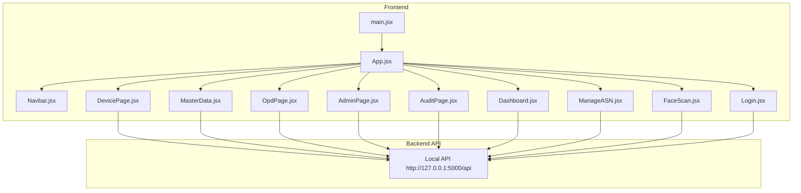
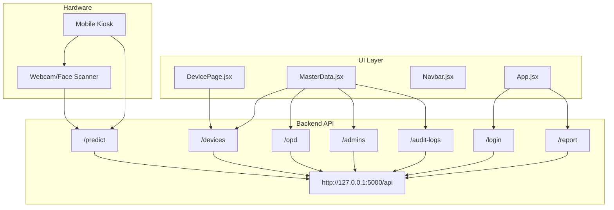
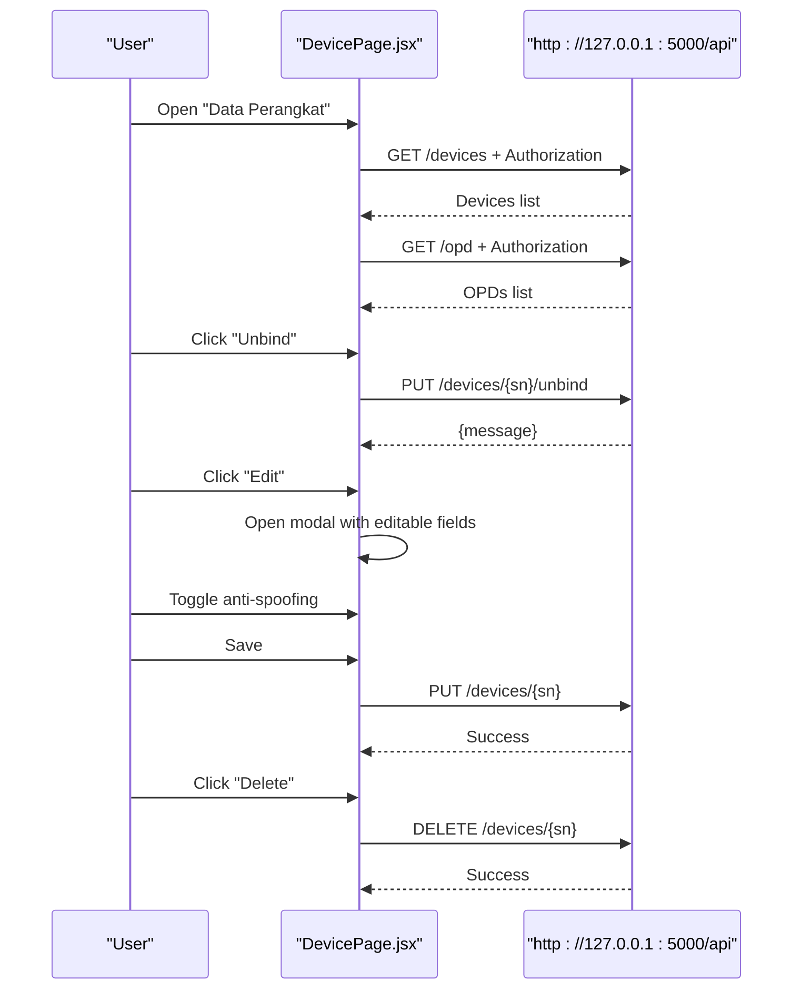
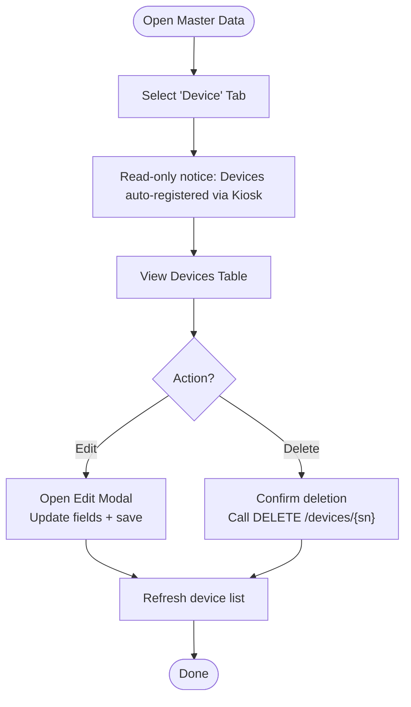
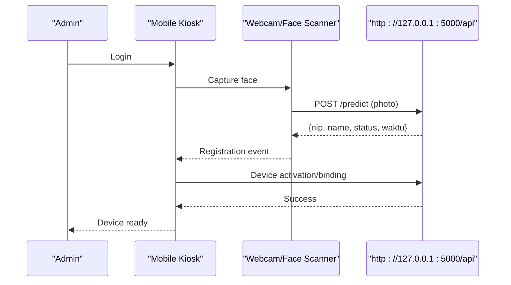
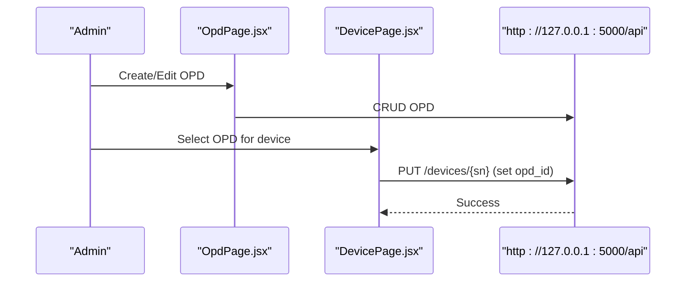
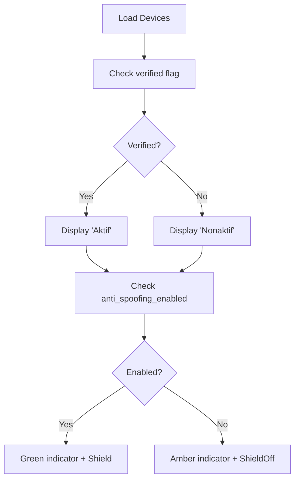
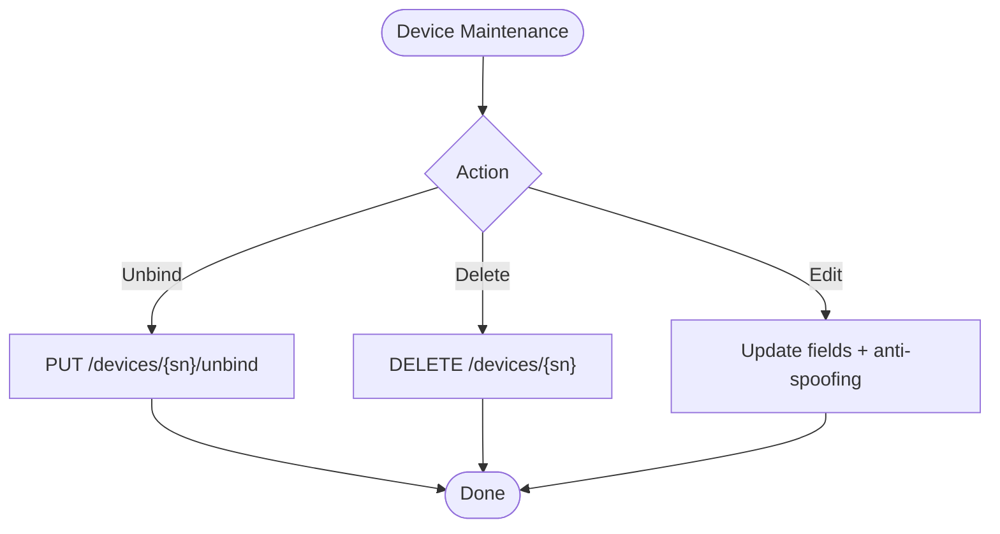
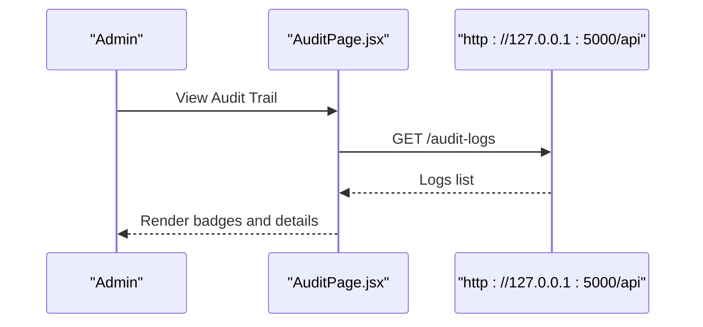
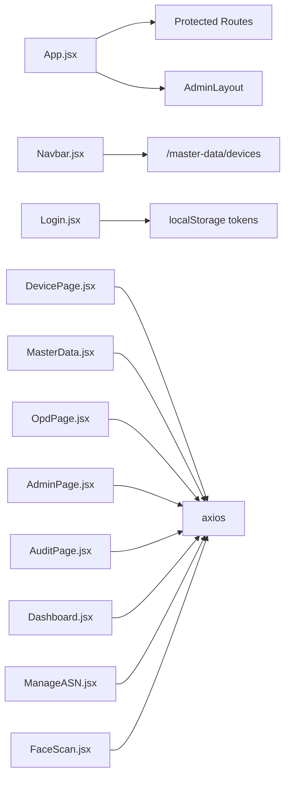

# Device Management

<cite>
**Referenced Files in This Document**
- [DevicePage.jsx](file://src/pages/DevicePage.jsx)
- [MasterData.jsx](file://src/pages/MasterData.jsx)
- [App.jsx](file://src/App.jsx)
- [Navbar.jsx](file://src/components/Navbar.jsx)
- [OpdPage.jsx](file://src/pages/OpdPage.jsx)
- [AdminPage.jsx](file://src/pages/AdminPage.jsx)
- [AuditPage.jsx](file://src/pages/AuditPage.jsx)
- [Dashboard.jsx](file://src/pages/Dashboard.jsx)
- [ManageASN.jsx](file://src/pages/ManageASN.jsx)
- [FaceScan.jsx](file://src/pages/FaceScan.jsx)
- [Login.jsx](file://src/pages/Login.jsx)
- [main.jsx](file://src/main.jsx)
- [package.json](file://package.json)
</cite>

## Table of Contents
1. [Introduction](#introduction)
2. [Project Structure](#project-structure)
3. [Core Components](#core-components)
4. [Architecture Overview](#architecture-overview)
5. [Detailed Component Analysis](#detailed-component-analysis)
6. [Dependency Analysis](#dependency-analysis)
7. [Performance Considerations](#performance-considerations)
8. [Troubleshooting Guide](#troubleshooting-guide)
9. [Conclusion](#conclusion)
10. [Appendices](#appendices)

## Introduction
This document describes the device management system focused on fingerprint scanner configuration and device registration within a facial recognition attendance platform. It covers the device listing interface, serial number management, device binding to OPDs, status monitoring, registration workflow, hardware integration patterns, device health checks, removal procedures, troubleshooting connectivity issues, maintenance, synchronization with the central system, firmware updates, and device-specific configuration options.

## Project Structure
The frontend is a React application configured with routing and protected routes. Device management is exposed via dedicated pages and navigation. The application communicates with a backend API hosted locally for device, OPD, admin, report, and audit operations.

**Diagram sources**
- [main.jsx:1-11](file://src/main.jsx#L1-L11)
- [App.jsx:1-102](file://src/App.jsx#L1-L102)
- [DevicePage.jsx:1-241](file://src/pages/DevicePage.jsx#L1-L241)
- [MasterData.jsx:1-440](file://src/pages/MasterData.jsx#L1-L440)
- [OpdPage.jsx:1-173](file://src/pages/OpdPage.jsx#L1-L173)
- [AdminPage.jsx:1-258](file://src/pages/AdminPage.jsx#L1-L258)
- [AuditPage.jsx:1-76](file://src/pages/AuditPage.jsx#L1-L76)
- [Dashboard.jsx:1-314](file://src/pages/Dashboard.jsx#L1-L314)
- [ManageASN.jsx:1-296](file://src/pages/ManageASN.jsx#L1-L296)
- [FaceScan.jsx:1-204](file://src/pages/FaceScan.jsx#L1-L204)
- [Login.jsx:1-553](file://src/pages/Login.jsx#L1-L553)

**Section sources**
- [main.jsx:1-11](file://src/main.jsx#L1-L11)
- [App.jsx:1-102](file://src/App.jsx#L1-L102)
- [DevicePage.jsx:1-241](file://src/pages/DevicePage.jsx#L1-L241)
- [MasterData.jsx:1-440](file://src/pages/MasterData.jsx#L1-L440)
- [OpdPage.jsx:1-173](file://src/pages/OpdPage.jsx#L1-L173)
- [AdminPage.jsx:1-258](file://src/pages/AdminPage.jsx#L1-L258)
- [AuditPage.jsx:1-76](file://src/pages/AuditPage.jsx#L1-L76)
- [Dashboard.jsx:1-314](file://src/pages/Dashboard.jsx#L1-L314)
- [ManageASN.jsx:1-296](file://src/pages/ManageASN.jsx#L1-L296)
- [FaceScan.jsx:1-204](file://src/pages/FaceScan.jsx#L1-L204)
- [Login.jsx:1-553](file://src/pages/Login.jsx#L1-L553)

## Core Components
- Device listing and management page: displays devices with filtering, verification status, OPD association, location, last activity, and anti-spoofing status; supports unbind, edit, and delete actions.
- Master data page: central hub for OPD, admin, device, and audit logs; device tab emphasizes activation via mobile kiosk.
- Navigation: routes and menu items for device management, including “Data Perangkat” under Master Data for Super Admin.
- Authentication and protection: protected routes enforce token-based access; unauthorized responses trigger global interceptor for auto-logout and prompt.

Key capabilities:
- Device listing with searchable fields (serial number, location, device name, OPD).
- Device binding/unbinding to OPDs and status toggles.
- Anti-spoofing configuration per device.
- Audit trail for device-related actions.
- Integration with facial recognition pipeline and dashboard reporting.

**Section sources**
- [DevicePage.jsx:1-241](file://src/pages/DevicePage.jsx#L1-L241)
- [MasterData.jsx:1-440](file://src/pages/MasterData.jsx#L1-L440)
- [Navbar.jsx:1-158](file://src/components/Navbar.jsx#L1-L158)
- [App.jsx:18-102](file://src/App.jsx#L18-L102)

## Architecture Overview
The device management UI integrates with a local backend API. Device registration occurs during mobile kiosk activation and is reflected in the device listing. Admins can manage device attributes, unbind devices from OPDs, and configure anti-spoofing. Audit logs track device lifecycle events.

**Diagram sources**
- [DevicePage.jsx:1-241](file://src/pages/DevicePage.jsx#L1-L241)
- [MasterData.jsx:1-440](file://src/pages/MasterData.jsx#L1-L440)
- [App.jsx:1-102](file://src/App.jsx#L1-L102)
- [FaceScan.jsx:1-204](file://src/pages/FaceScan.jsx#L1-L204)

## Detailed Component Analysis

### Device Listing and Management (DevicePage)
Responsibilities:
- Fetch devices and OPDs concurrently.
- Filter devices by serial number, location, device name, or OPD.
- Display verification status, OPD association, location, last activity, and anti-spoofing status.
- Actions: unbind device, edit device metadata, delete device permanently.
- Anti-spoofing toggle with contextual messaging.

**Diagram sources**
- [DevicePage.jsx:28-75](file://src/pages/DevicePage.jsx#L28-L75)

**Section sources**
- [DevicePage.jsx:1-241](file://src/pages/DevicePage.jsx#L1-L241)

### Master Data Hub (MasterData)
Responsibilities:
- Centralized management of OPD, admin, device, and audit logs.
- Device tab highlights that devices are registered via mobile kiosk activation.
- Edit device fields include name, device name, IP/MAC/platform, location, OPD association, and verification flag.
- Delete device action triggers backend deletion.

**Diagram sources**
- [MasterData.jsx:228-437](file://src/pages/MasterData.jsx#L228-L437)

**Section sources**
- [MasterData.jsx:1-440](file://src/pages/MasterData.jsx#L1-L440)

### Device Registration Workflow (Mobile Kiosk Activation)
Registration occurs automatically when an admin logs into a kiosk device. The device becomes bound to the OPD and appears in the device listing.

**Diagram sources**
- [FaceScan.jsx:38-85](file://src/pages/FaceScan.jsx#L38-L85)
- [DevicePage.jsx:86-90](file://src/pages/DevicePage.jsx#L86-L90)

**Section sources**
- [FaceScan.jsx:1-204](file://src/pages/FaceScan.jsx#L1-L204)
- [DevicePage.jsx:86-90](file://src/pages/DevicePage.jsx#L86-L90)

### Device Binding to OPDs
- Devices are associated with OPDs upon successful kiosk activation.
- OPD management page allows creation and editing of organizational units.
- Device listing shows OPD association and allows unbinding when verified and bound.

**Diagram sources**
- [OpdPage.jsx:24-69](file://src/pages/OpdPage.jsx#L24-L69)
- [DevicePage.jsx:53-64](file://src/pages/DevicePage.jsx#L53-L64)

**Section sources**
- [OpdPage.jsx:1-173](file://src/pages/OpdPage.jsx#L1-L173)
- [DevicePage.jsx:1-241](file://src/pages/DevicePage.jsx#L1-L241)

### Status Monitoring and Health Checks
- Verification status indicates whether a device is active/verified.
- Last activity timestamps help assess device health.
- Anti-spoofing status toggles liveness detection; UI reflects current state and warnings.

**Diagram sources**
- [DevicePage.jsx:123-134](file://src/pages/DevicePage.jsx#L123-L134)

**Section sources**
- [DevicePage.jsx:1-241](file://src/pages/DevicePage.jsx#L1-L241)

### Device Removal and Maintenance
- Unbind removes device association from OPD; device is logged out from kiosk.
- Delete permanently removes device and related presence data.
- Maintenance includes toggling anti-spoofing for problematic lighting conditions.

**Diagram sources**
- [DevicePage.jsx:41-75](file://src/pages/DevicePage.jsx#L41-L75)

**Section sources**
- [DevicePage.jsx:1-241](file://src/pages/DevicePage.jsx#L1-L241)

### Audit Trail and Reporting
- Audit logs record device-related actions (register/bind, update, delete).
- Dashboard aggregates presence data and includes device identifiers for location tracking.

**Diagram sources**
- [AuditPage.jsx:13-21](file://src/pages/AuditPage.jsx#L13-L21)

**Section sources**
- [AuditPage.jsx:1-76](file://src/pages/AuditPage.jsx#L1-L76)
- [Dashboard.jsx:257-263](file://src/pages/Dashboard.jsx#L257-L263)

## Dependency Analysis
- Routing and layout: App.jsx defines protected routes and admin layout wrappers.
- Navigation: Navbar.jsx exposes “Data Perangkat” under Master Data for Super Admin.
- Authentication: Login.jsx posts credentials to backend and stores tokens; App.jsx intercepts 401 responses to auto-logout.
- Device management: DevicePage.jsx and MasterData.jsx depend on axios for API calls and local storage for tokens.

**Diagram sources**
- [App.jsx:18-102](file://src/App.jsx#L18-L102)
- [Navbar.jsx:25-114](file://src/components/Navbar.jsx#L25-L114)
- [Login.jsx:69-100](file://src/pages/Login.jsx#L69-L100)
- [DevicePage.jsx:25-37](file://src/pages/DevicePage.jsx#L25-L37)
- [MasterData.jsx:21-39](file://src/pages/MasterData.jsx#L21-L39)
- [OpdPage.jsx:21-29](file://src/pages/OpdPage.jsx#L21-L29)
- [AdminPage.jsx:28-40](file://src/pages/AdminPage.jsx#L28-L40)
- [AuditPage.jsx:10-21](file://src/pages/AuditPage.jsx#L10-L21)
- [Dashboard.jsx:18-42](file://src/pages/Dashboard.jsx#L18-L42)
- [ManageASN.jsx:120-131](file://src/pages/ManageASN.jsx#L120-L131)
- [FaceScan.jsx:38-85](file://src/pages/FaceScan.jsx#L38-L85)

**Section sources**
- [App.jsx:1-102](file://src/App.jsx#L1-L102)
- [Navbar.jsx:1-158](file://src/components/Navbar.jsx#L1-L158)
- [Login.jsx:1-553](file://src/pages/Login.jsx#L1-L553)
- [DevicePage.jsx:1-241](file://src/pages/DevicePage.jsx#L1-L241)
- [MasterData.jsx:1-440](file://src/pages/MasterData.jsx#L1-L440)
- [OpdPage.jsx:1-173](file://src/pages/OpdPage.jsx#L1-L173)
- [AdminPage.jsx:1-258](file://src/pages/AdminPage.jsx#L1-L258)
- [AuditPage.jsx:1-76](file://src/pages/AuditPage.jsx#L1-L76)
- [Dashboard.jsx:1-314](file://src/pages/Dashboard.jsx#L1-L314)
- [ManageASN.jsx:1-296](file://src/pages/ManageASN.jsx#L1-L296)
- [FaceScan.jsx:1-204](file://src/pages/FaceScan.jsx#L1-L204)

## Performance Considerations
- Concurrent fetching: DevicePage.jsx fetches devices and OPDs in parallel to reduce latency.
- Memoization: DevicePage.jsx uses useMemo for client-side filtering to avoid unnecessary re-renders.
- Debouncing: Consider debouncing search queries for large datasets to minimize API churn.
- Pagination: Dashboard.jsx supports pagination and bulk export; apply similar patterns for device lists if data grows large.

## Troubleshooting Guide
Common issues and resolutions:
- Device not appearing after kiosk login:
  - Verify kiosk camera and face detection are functional; check FaceScan.jsx status messages.
  - Confirm backend predict endpoint responds and returns a recognized NIP.
- Device shows “Nonaktif”:
  - Ensure device is verified and bound; check verification flag in device listing.
  - Review audit logs for recent bind/register events.
- Connectivity problems:
  - Check network reachability to http://127.0.0.1:5000/api.
  - Validate token presence in localStorage; App.jsx interceptor handles expired sessions.
- Anti-spoofing failures:
  - Temporarily disable anti-spoofing in device edit modal for poor lighting; re-enable when conditions improve.
- Device removal:
  - Use unbind to sever OPD association; use delete to remove device permanently.

**Section sources**
- [DevicePage.jsx:41-75](file://src/pages/DevicePage.jsx#L41-L75)
- [FaceScan.jsx:67-84](file://src/pages/FaceScan.jsx#L67-L84)
- [App.jsx:46-70](file://src/App.jsx#L46-L70)
- [AuditPage.jsx:13-21](file://src/pages/AuditPage.jsx#L13-L21)

## Conclusion
The device management system provides a comprehensive interface for registering, configuring, and maintaining kiosk devices integrated with facial recognition. It supports OPD binding, status monitoring, anti-spoofing controls, audit logging, and centralized administration for Super Admins. The design leverages React patterns for efficient UI updates and secure access via token-based authentication.

## Appendices
- Backend API surface used by the UI:
  - GET /api/devices, GET /api/opd, GET /api/admins, GET /api/audit-logs
  - PUT /api/devices/{sn}, PUT /api/devices/{sn}/unbind
  - DELETE /api/devices/{sn}
  - GET /api/report, POST /api/login, POST /api/predict

**Section sources**
- [DevicePage.jsx:28-37](file://src/pages/DevicePage.jsx#L28-L37)
- [MasterData.jsx:24-39](file://src/pages/MasterData.jsx#L24-L39)
- [Dashboard.jsx:18-42](file://src/pages/Dashboard.jsx#L18-L42)
- [Login.jsx:74-100](file://src/pages/Login.jsx#L74-L100)
- [FaceScan.jsx:46-85](file://src/pages/FaceScan.jsx#L46-L85)