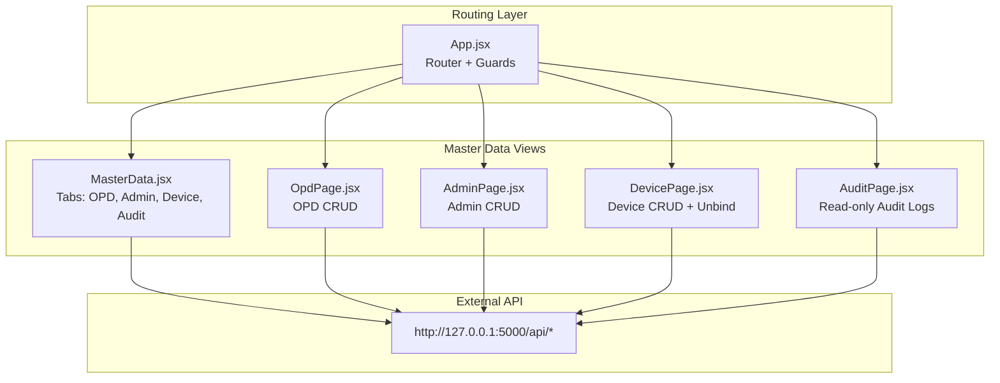
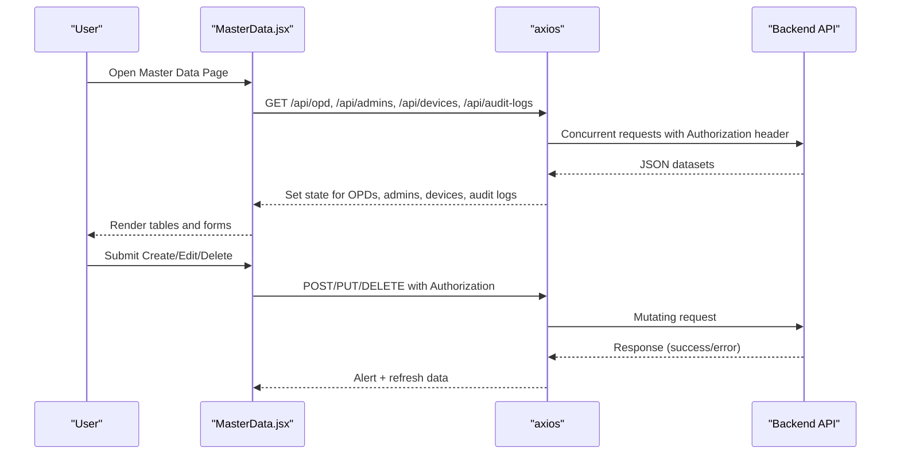
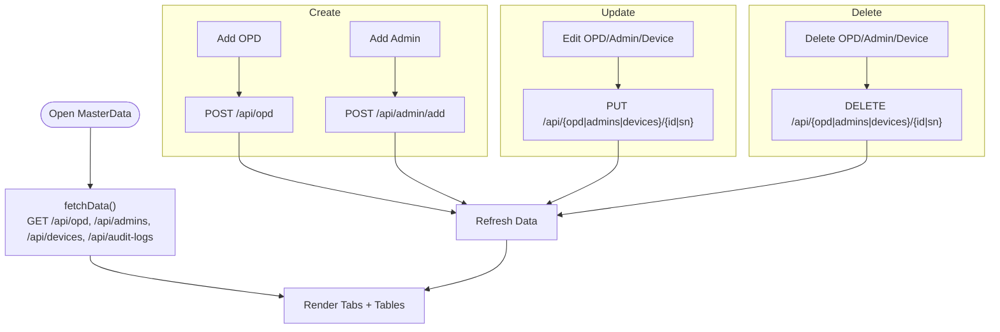
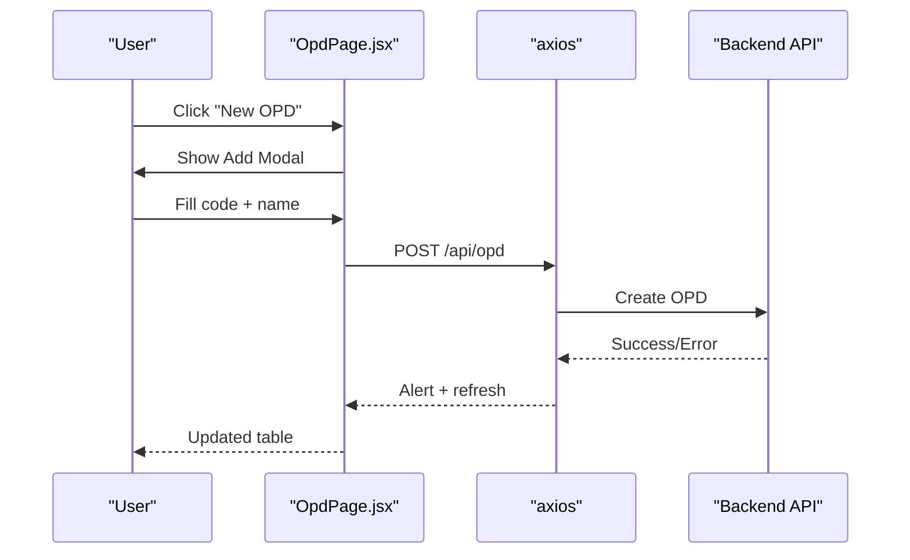
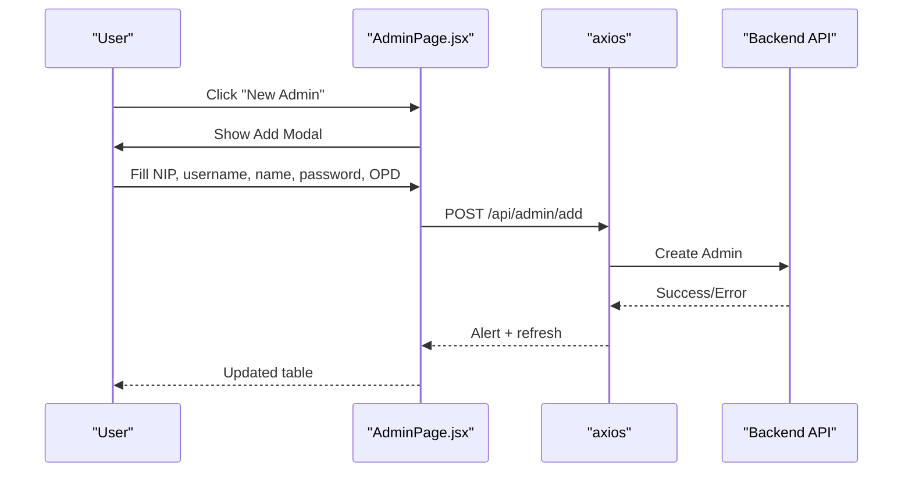
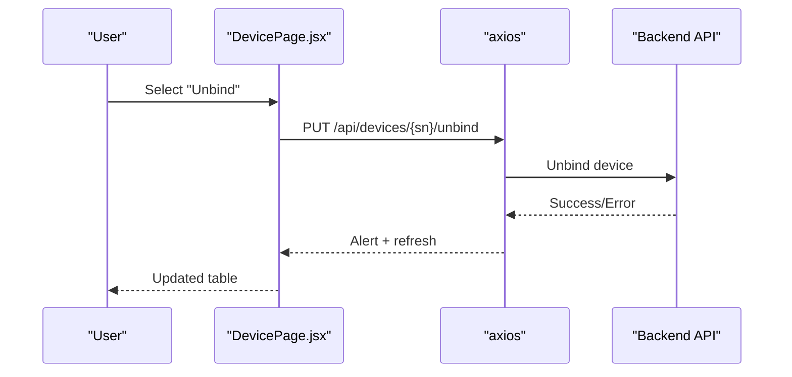
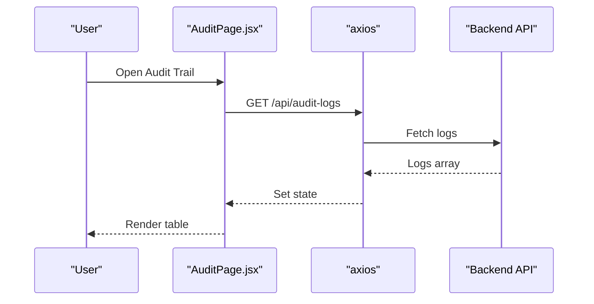
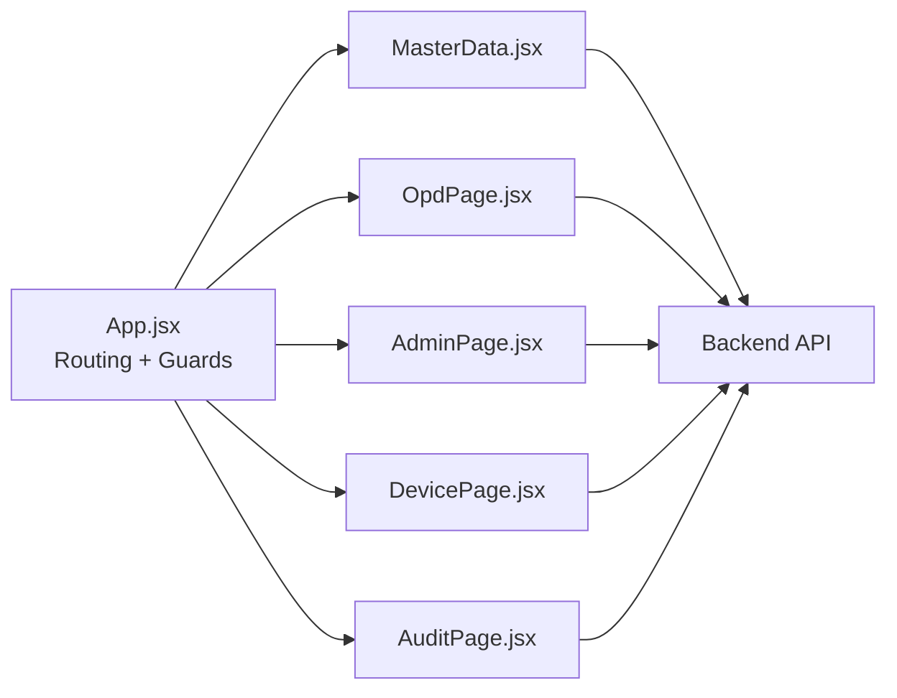

# Master Data Management

<cite>
**Referenced Files in This Document**
- [MasterData.jsx](file://src/pages/MasterData.jsx)
- [App.jsx](file://src/App.jsx)
- [OpdPage.jsx](file://src/pages/OpdPage.jsx)
- [AdminPage.jsx](file://src/pages/AdminPage.jsx)
- [DevicePage.jsx](file://src/pages/DevicePage.jsx)
- [AuditPage.jsx](file://src/pages/AuditPage.jsx)
- [Dashboard.jsx](file://src/pages/Dashboard.jsx)
</cite>

## Table of Contents
1. [Introduction](#introduction)
2. [Project Structure](#project-structure)
3. [Core Components](#core-components)
4. [Architecture Overview](#architecture-overview)
5. [Detailed Component Analysis](#detailed-component-analysis)
6. [Dependency Analysis](#dependency-analysis)
7. [Performance Considerations](#performance-considerations)
8. [Troubleshooting Guide](#troubleshooting-guide)
9. [Conclusion](#conclusion)

## Introduction
This document describes the master data management capabilities implemented in the frontend application. It covers reference data (OPD/instansi), static configurations (admin accounts, device settings), and system-wide datasets (audit trail). The documentation explains data entry interfaces, validation rules enforced by the frontend, import/export functionality, bulk operations, data integrity checks, reference data maintenance workflows, lookup table management, dependency resolution, and synchronization considerations with dependent systems.

## Project Structure
The master data management spans several React pages routed under super admin privileges:
- Master data hub page aggregates OPD, admin, device, and audit views
- Dedicated pages for OPD, admin, device, and audit provide focused interfaces
- Routing enforces authentication and role-based access control

**Diagram sources**
- [App.jsx:72-99](file://src/App.jsx#L72-L99)
- [MasterData.jsx:5-440](file://src/pages/MasterData.jsx#L5-L440)
- [OpdPage.jsx:1-173](file://src/pages/OpdPage.jsx#L1-L173)
- [AdminPage.jsx:1-258](file://src/pages/AdminPage.jsx#L1-L258)
- [DevicePage.jsx:1-241](file://src/pages/DevicePage.jsx#L1-L241)
- [AuditPage.jsx:1-76](file://src/pages/AuditPage.jsx#L1-L76)

**Section sources**
- [App.jsx:72-99](file://src/App.jsx#L72-L99)
- [MasterData.jsx:5-440](file://src/pages/MasterData.jsx#L5-L440)

## Core Components
- MasterData hub: central interface with tabs for OPD, admin, device, and audit; loads all datasets concurrently and supports inline editing and deletion
- OPD management: create, update, delete OPD entries; searchable table with filtering
- Admin management: create, update, delete admin accounts; searchable table with filtering; optional password updates
- Device management: view registered devices; unbind devices; update device metadata and anti-spoofing toggle; delete devices
- Audit trail: read-only listing of recent system activities

Key data categories:
- Reference data: OPD (instansi/organization)
- Static configurations: admin account credentials and placement, device metadata and verification flags
- System-wide datasets: audit logs

**Section sources**
- [MasterData.jsx:24-39](file://src/pages/MasterData.jsx#L24-L39)
- [OpdPage.jsx:24-31](file://src/pages/OpdPage.jsx#L24-L31)
- [AdminPage.jsx:31-42](file://src/pages/AdminPage.jsx#L31-L42)
- [DevicePage.jsx:28-39](file://src/pages/DevicePage.jsx#L28-L39)
- [AuditPage.jsx:13-21](file://src/pages/AuditPage.jsx#L13-L21)

## Architecture Overview
The frontend interacts with a backend API at http://127.0.0.1:5000/api. Authentication is enforced via bearer tokens stored in local storage. Role-based routing restricts access to super admin only.

**Diagram sources**
- [MasterData.jsx:24-39](file://src/pages/MasterData.jsx#L24-L39)
- [MasterData.jsx:46-129](file://src/pages/MasterData.jsx#L46-L129)
- [App.jsx:18-31](file://src/App.jsx#L18-L31)

## Detailed Component Analysis

### Master Data Hub (MasterData.jsx)
- Tabs: OPD, Admin OPD, Mesin Pemindai (devices), Audit Trail
- Data loading: concurrent GET requests for OPDs, admins, devices, and audit logs
- Validation: client-side required field enforcement in forms; server-side validation errors surfaced via alerts
- Bulk operations: tabbed interface consolidates CRUD actions; no explicit bulk import/export UI here
- Integrity checks: confirmation dialogs for deletions; read-only audit tab prevents tampering
- Lookup tables: OPD list used for admin placement and device binding; rendered as select options
- Dependencies: device lifecycle depends on OPD existence; admin roles restricted by route guards

**Diagram sources**
- [MasterData.jsx:24-129](file://src/pages/MasterData.jsx#L24-L129)

**Section sources**
- [MasterData.jsx:5-440](file://src/pages/MasterData.jsx#L5-L440)

### OPD Management (OpdPage.jsx)
- Purpose: manage organizational units (OPD)
- Features: create, update, delete OPD; search by code or name; modal-based forms
- Validation: required fields enforced in forms; server errors shown via alerts
- Bulk operations: no explicit bulk UI; relies on individual actions

**Diagram sources**
- [OpdPage.jsx:33-45](file://src/pages/OpdPage.jsx#L33-L45)

**Section sources**
- [OpdPage.jsx:1-173](file://src/pages/OpdPage.jsx#L1-L173)

### Admin Management (AdminPage.jsx)
- Purpose: manage operator admin accounts per OPD
- Features: create admin with NIP, username, full name, password, OPD assignment; update admin profile/password; delete admin
- Validation: required fields enforced; password visibility toggle; server error alerts
- Bulk operations: no explicit bulk UI; relies on individual actions

**Diagram sources**
- [AdminPage.jsx:44-57](file://src/pages/AdminPage.jsx#L44-L57)

**Section sources**
- [AdminPage.jsx:1-258](file://src/pages/AdminPage.jsx#L1-L258)

### Device Management (DevicePage.jsx)
- Purpose: manage registered scanning devices; supports unbinding and deletion
- Features: search by serial number, location, or device name; unbind device from OPD; update device metadata; toggle anti-spoofing; delete device
- Validation: checkbox/toggle controls; server error alerts
- Bulk operations: no explicit bulk UI; relies on individual actions

**Diagram sources**
- [DevicePage.jsx:41-51](file://src/pages/DevicePage.jsx#L41-L51)

**Section sources**
- [DevicePage.jsx:1-241](file://src/pages/DevicePage.jsx#L1-L241)

### Audit Trail (AuditPage.jsx)
- Purpose: display read-only system activity logs
- Features: displays recent events with action badges and target tables
- Integrity: read-only view prevents modification

**Diagram sources**
- [AuditPage.jsx:13-21](file://src/pages/AuditPage.jsx#L13-L21)

**Section sources**
- [AuditPage.jsx:1-76](file://src/pages/AuditPage.jsx#L1-L76)

### Data Import/Export and Bulk Operations
- Export capability exists in the reporting dashboard for attendance reports (CSV export), but no explicit master data import/export UI is present in the master data pages reviewed.
- Bulk operations are not exposed as dedicated UI in the master data components; operations are performed individually per record.

**Section sources**
- [Dashboard.jsx:54-87](file://src/pages/Dashboard.jsx#L54-L87)
- [MasterData.jsx:46-129](file://src/pages/MasterData.jsx#L46-L129)

### Data Validation Rules
- OPD creation: requires code and name
- Admin creation: requires NIP, username, full name, password, OPD assignment
- Admin update: allows updating name, OPD, and optional password
- Device update: allows updating name, location, OPD, verification flag, and anti-spoofing setting
- Deletion: confirmation dialogs invoked before destructive actions

**Section sources**
- [OpdPage.jsx:33-45](file://src/pages/OpdPage.jsx#L33-L45)
- [AdminPage.jsx:44-73](file://src/pages/AdminPage.jsx#L44-L73)
- [DevicePage.jsx:53-75](file://src/pages/DevicePage.jsx#L53-L75)
- [MasterData.jsx:46-129](file://src/pages/MasterData.jsx#L46-L129)

### Reference Data Maintenance Workflows
- OPD lifecycle: create → update → delete
- Admin lifecycle: create → update → delete
- Device lifecycle: register automatically via kiosk activation → update metadata → unbind → delete
- Audit trail: read-only historical view of changes

**Section sources**
- [OpdPage.jsx:33-69](file://src/pages/OpdPage.jsx#L33-L69)
- [AdminPage.jsx:44-84](file://src/pages/AdminPage.jsx#L44-L84)
- [DevicePage.jsx:41-75](file://src/pages/DevicePage.jsx#L41-L75)
- [AuditPage.jsx:13-21](file://src/pages/AuditPage.jsx#L13-L21)

### Lookup Table Management
- OPD list is fetched and used as a dropdown source for admin placement and device binding
- Device table renders OPD names and IDs for cross-referencing

**Section sources**
- [MasterData.jsx:197-199](file://src/pages/MasterData.jsx#L197-L199)
- [AdminPage.jsx:196-201](file://src/pages/AdminPage.jsx#L196-L201)
- [DevicePage.jsx:173-177](file://src/pages/DevicePage.jsx#L173-L177)

### Dependency Resolution
- Device registration is initiated by logging into a kiosk; devices bind to OPD automatically
- Admins are bound to OPDs during creation
- Deleting an OPD triggers cascading effects in dependent systems (not visible in frontend code)

**Section sources**
- [MasterData.jsx:231-238](file://src/pages/MasterData.jsx#L231-L238)
- [AdminPage.jsx:196-201](file://src/pages/AdminPage.jsx#L196-L201)

### Data Versioning, Change Tracking, and Synchronization
- Data versioning: not implemented in the frontend; no explicit version fields observed
- Change tracking: audit logs are available via a dedicated endpoint and rendered in a read-only view
- Synchronization: device unbind operation explicitly synchronizes device state with OPD association

**Section sources**
- [AuditPage.jsx:13-21](file://src/pages/AuditPage.jsx#L13-L21)
- [DevicePage.jsx:41-51](file://src/pages/DevicePage.jsx#L41-L51)

## Dependency Analysis
- Authentication and authorization: global route guards enforce bearer token presence and super admin role
- API dependencies: all master data components depend on the backend API endpoints for data retrieval and mutations
- Cohesion: each page encapsulates its domain (OPD, admin, device, audit), promoting separation of concerns
- Coupling: components share minimal shared state; most interactions are isolated per page

**Diagram sources**
- [App.jsx:72-99](file://src/App.jsx#L72-L99)
- [MasterData.jsx:21-22](file://src/pages/MasterData.jsx#L21-L22)
- [OpdPage.jsx:21-22](file://src/pages/OpdPage.jsx#L21-L22)
- [AdminPage.jsx:28-29](file://src/pages/AdminPage.jsx#L28-L29)
- [DevicePage.jsx:25-26](file://src/pages/DevicePage.jsx#L25-L26)
- [AuditPage.jsx:10-11](file://src/pages/AuditPage.jsx#L10-L11)

**Section sources**
- [App.jsx:18-31](file://src/App.jsx#L18-L31)

## Performance Considerations
- Concurrent data fetching reduces initial load time by parallelizing multiple GET requests
- Client-side filtering improves responsiveness for search-heavy workflows
- Avoid large-scale bulk operations in the current UI; prefer server-side batch APIs if needed

## Troubleshooting Guide
- Authentication failures: global interceptor handles 401 responses by prompting re-login and clearing session storage
- Network errors: alerts surface server-provided error messages for create/update/delete operations
- Data not refreshing: manual refresh after successful operations; confirm network connectivity to backend

**Section sources**
- [App.jsx:46-70](file://src/App.jsx#L46-L70)
- [MasterData.jsx:46-129](file://src/pages/MasterData.jsx#L46-L129)
- [OpdPage.jsx:33-69](file://src/pages/OpdPage.jsx#L33-L69)
- [AdminPage.jsx:44-84](file://src/pages/AdminPage.jsx#L44-L84)
- [DevicePage.jsx:41-75](file://src/pages/DevicePage.jsx#L41-L75)

## Conclusion
The master data management implementation provides a cohesive, role-protected interface for managing OPDs, admin accounts, devices, and audit logs. While explicit import/export and advanced bulk operations are not present in the reviewed frontend components, the system offers robust CRUD workflows, client-side validation, and audit visibility. For enterprise-grade master data governance, consider extending the UI with bulk operations and import/export capabilities, and implementing server-side validation libraries to complement existing client-side checks.