# OPD Administration

<cite>
**Referenced Files in This Document**
- [OpdPage.jsx](file://src/pages/OpdPage.jsx)
- [AdminPage.jsx](file://src/pages/AdminPage.jsx)
- [App.jsx](file://src/App.jsx)
- [Navbar.jsx](file://src/components/Navbar.jsx)
- [DevicePage.jsx](file://src/pages/DevicePage.jsx)
- [AuditPage.jsx](file://src/pages/AuditPage.jsx)
- [SettingsPage.jsx](file://src/pages/SettingsPage.jsx)
- [Dashboard.jsx](file://src/pages/Dashboard.jsx)
- [README.md](file://README.md)
- [package.json](file://package.json)
</cite>

## Table of Contents
1. [Introduction](#introduction)
2. [Project Structure](#project-structure)
3. [Core Components](#core-components)
4. [Architecture Overview](#architecture-overview)
5. [Detailed Component Analysis](#detailed-component-analysis)
6. [Dependency Analysis](#dependency-analysis)
7. [Performance Considerations](#performance-considerations)
8. [Troubleshooting Guide](#troubleshooting-guide)
9. [Conclusion](#conclusion)
10. [Appendices](#appendices)

## Introduction
This document explains the Organizational Unit (OPD) administration functionality within the Smart Presence system. It covers the OPD listing interface, organizational hierarchy management, institutional configuration, creation and modification workflows, department mapping, administrative structure setup, deletion procedures, data migration considerations, integration with user management, OPD-specific settings, reporting configurations, and hierarchical relationships within the organization structure.

The system is a React-based frontend that communicates with a backend REST API to manage OPDs, administrators, devices, audit logs, and system settings. OPD administration is primarily handled by Super Admin users and is exposed under the “Master Data” navigation group.

## Project Structure
The frontend is organized by feature pages and shared components. OPD administration spans several pages and routes:
- OPD listing and CRUD: OpdPage
- Administrator management (including OPD mapping): AdminPage
- Device management (OPD binding): DevicePage
- Audit trail (read-only): AuditPage
- System settings (work hours and holidays): SettingsPage
- Navigation and routing: App.jsx, Navbar.jsx

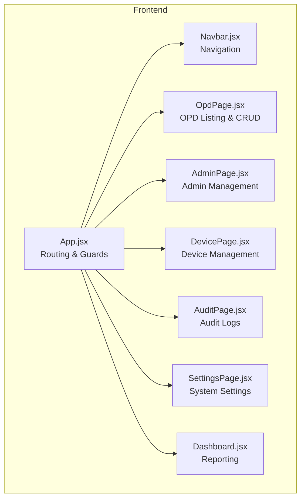

**Diagram sources**
- [App.jsx:72-99](file://src/App.jsx#L72-L99)
- [Navbar.jsx:46-155](file://src/components/Navbar.jsx#L46-L155)
- [OpdPage.jsx:7-173](file://src/pages/OpdPage.jsx#L7-L173)
- [AdminPage.jsx:7-258](file://src/pages/AdminPage.jsx#L7-L258)
- [DevicePage.jsx:7-241](file://src/pages/DevicePage.jsx#L7-L241)
- [AuditPage.jsx:7-76](file://src/pages/AuditPage.jsx#L7-L76)
- [SettingsPage.jsx:7-240](file://src/pages/SettingsPage.jsx#L7-L240)
- [Dashboard.jsx:5-314](file://src/pages/Dashboard.jsx#L5-L314)

**Section sources**
- [App.jsx:72-99](file://src/App.jsx#L72-L99)
- [Navbar.jsx:46-155](file://src/components/Navbar.jsx#L46-L155)

## Core Components
- OPD Listing and CRUD: Provides listing, search, add, edit, and delete operations for OPDs via REST API calls.
- Admin Management: Manages administrators and binds them to OPDs; integrates with OPD data.
- Device Management: Binds devices to OPDs and controls anti-spoofing features.
- Audit Trail: Records administrative actions for compliance and monitoring.
- System Settings: Configures work hours and custom holidays affecting presence processing.
- Reporting: Aggregates presence data across OPDs and devices.

**Section sources**
- [OpdPage.jsx:7-173](file://src/pages/OpdPage.jsx#L7-L173)
- [AdminPage.jsx:7-258](file://src/pages/AdminPage.jsx#L7-L258)
- [DevicePage.jsx:7-241](file://src/pages/DevicePage.jsx#L7-L241)
- [AuditPage.jsx:7-76](file://src/pages/AuditPage.jsx#L7-L76)
- [SettingsPage.jsx:7-240](file://src/pages/SettingsPage.jsx#L7-L240)
- [Dashboard.jsx:5-314](file://src/pages/Dashboard.jsx#L5-L314)

## Architecture Overview
The OPD administration module follows a client-server architecture:
- Frontend (React): Handles UI, routing, guards, and API interactions.
- Backend (REST API): Exposes endpoints for OPD, admin, device, audit logs, and settings.
- Authentication: JWT-based with role-based access control (RBAC).
- Data flow: OPD CRUD operations, admin-OPD mapping, device-OPD binding, audit logging, and reporting aggregation.

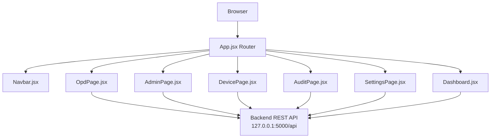

**Diagram sources**
- [App.jsx:72-99](file://src/App.jsx#L72-L99)
- [OpdPage.jsx:24-69](file://src/pages/OpdPage.jsx#L24-L69)
- [AdminPage.jsx:31-84](file://src/pages/AdminPage.jsx#L31-L84)
- [DevicePage.jsx:28-75](file://src/pages/DevicePage.jsx#L28-L75)
- [AuditPage.jsx:13-21](file://src/pages/AuditPage.jsx#L13-L21)
- [SettingsPage.jsx:24-75](file://src/pages/SettingsPage.jsx#L24-L75)
- [Dashboard.jsx:18-48](file://src/pages/Dashboard.jsx#L18-L48)

## Detailed Component Analysis

### OPD Listing Interface
The OPD listing page provides:
- Search by OPD code or name
- Add new OPD with code and name
- Edit existing OPD
- Delete OPD with confirmation
- Loading states and error handling via alerts

Key behaviors:
- Fetches OPD list on mount
- Uses bearer token for protected endpoints
- Filters OPDs client-side based on search query
- Displays empty states when no data or search yields no results

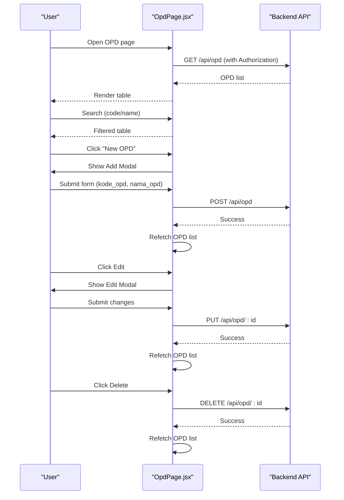

**Diagram sources**
- [OpdPage.jsx:24-69](file://src/pages/OpdPage.jsx#L24-L69)

**Section sources**
- [OpdPage.jsx:7-173](file://src/pages/OpdPage.jsx#L7-L173)

### Organizational Hierarchy Management
Hierarchy is represented by OPDs and their associations with:
- Administrators (AdminPage)
- Devices (DevicePage)
- Reporting (Dashboard)

The system does not expose explicit parent-child OPD relationships in the provided frontend code. Instead, hierarchy is implied by:
- Admins are bound to a single OPD
- Devices are bound to an OPD
- Reports aggregate presence data by OPD and device

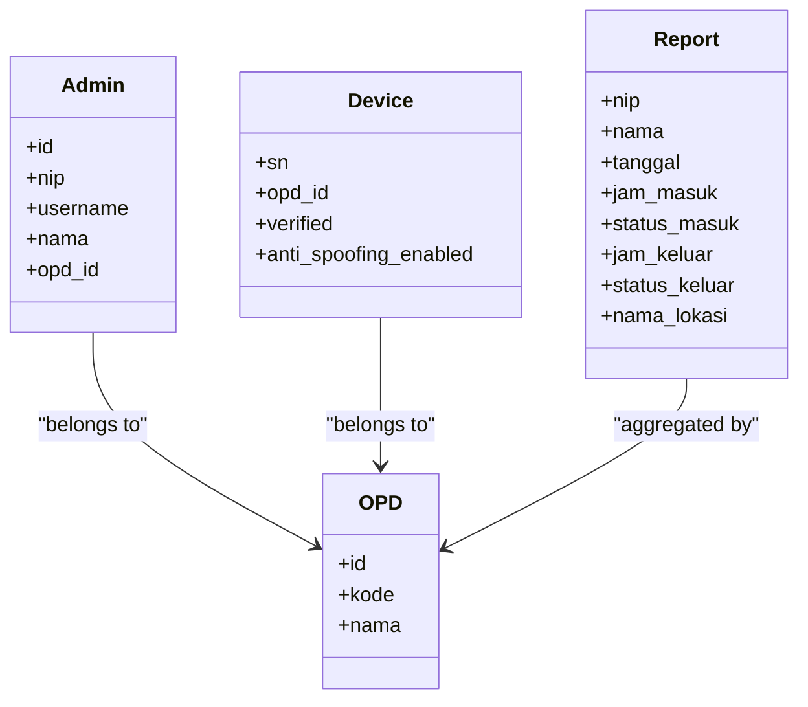

**Diagram sources**
- [AdminPage.jsx:26](file://src/pages/AdminPage.jsx#L26)
- [DevicePage.jsx:104-134](file://src/pages/DevicePage.jsx#L104-L134)
- [Dashboard.jsx:178-277](file://src/pages/Dashboard.jsx#L178-L277)

**Section sources**
- [AdminPage.jsx:26](file://src/pages/AdminPage.jsx#L26)
- [DevicePage.jsx:104-134](file://src/pages/DevicePage.jsx#L104-L134)
- [Dashboard.jsx:178-277](file://src/pages/Dashboard.jsx#L178-L277)

### Institutional Configuration
Institutional configuration is managed via:
- OPD creation and editing (OpdPage)
- Admin assignment to OPDs (AdminPage)
- Device binding to OPDs (DevicePage)
- System settings affecting presence processing (SettingsPage)

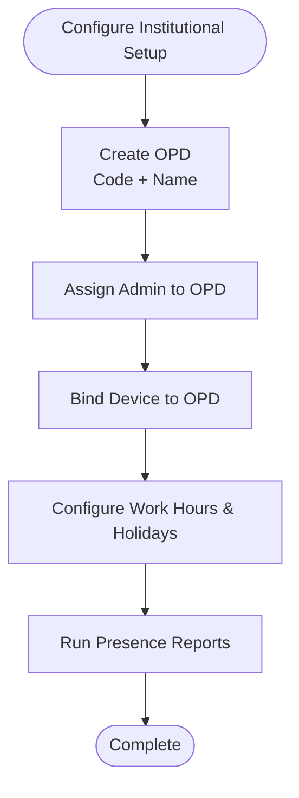

**Diagram sources**
- [OpdPage.jsx:33-58](file://src/pages/OpdPage.jsx#L33-L58)
- [AdminPage.jsx:44-73](file://src/pages/AdminPage.jsx#L44-L73)
- [DevicePage.jsx:53-64](file://src/pages/DevicePage.jsx#L53-L64)
- [SettingsPage.jsx:44-52](file://src/pages/SettingsPage.jsx#L44-L52)

**Section sources**
- [OpdPage.jsx:33-58](file://src/pages/OpdPage.jsx#L33-L58)
- [AdminPage.jsx:44-73](file://src/pages/AdminPage.jsx#L44-L73)
- [DevicePage.jsx:53-64](file://src/pages/DevicePage.jsx#L53-L64)
- [SettingsPage.jsx:44-52](file://src/pages/SettingsPage.jsx#L44-L52)

### OPD Creation and Modification Workflows
- Creation: User submits code and name; frontend posts to backend; success triggers refetch and modal close.
- Modification: User edits code/name; frontend updates backend; success triggers refetch and modal close.
- Validation: Form fields are required; errors surfaced via alerts.

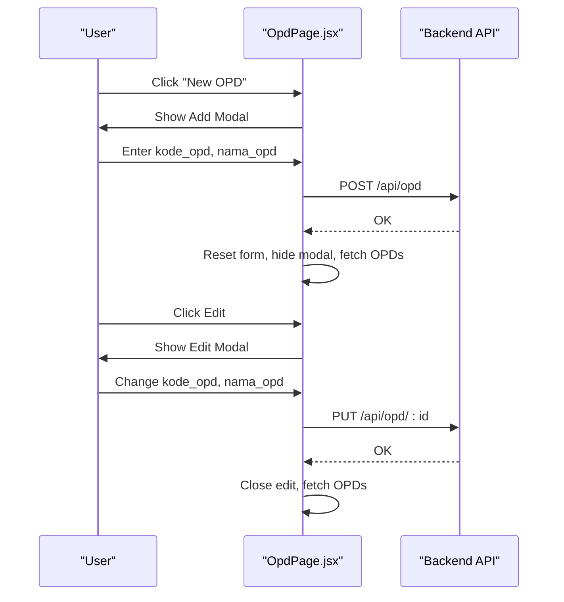

**Diagram sources**
- [OpdPage.jsx:33-58](file://src/pages/OpdPage.jsx#L33-L58)

**Section sources**
- [OpdPage.jsx:33-58](file://src/pages/OpdPage.jsx#L33-L58)

### Department Mapping and Administrative Structure Setup
Department mapping occurs implicitly through:
- Admin creation with OPD selection
- Device binding to OPD
- Reporting aggregations by OPD

Administrative structure:
- Super Admins can access OPD and Admin management
- Admin OPD users can access dashboards and user registration but not OPD management

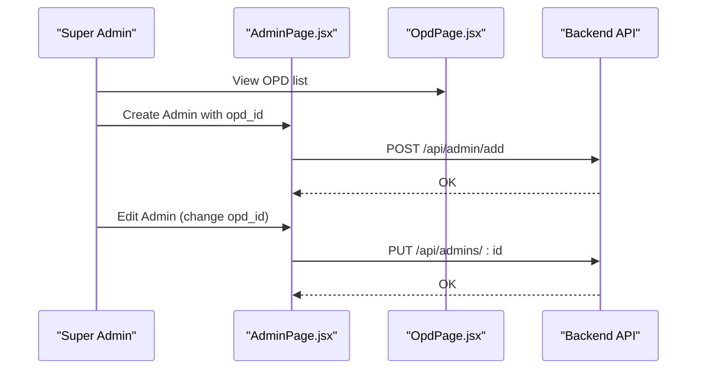

**Diagram sources**
- [AdminPage.jsx:44-73](file://src/pages/AdminPage.jsx#L44-L73)
- [OpdPage.jsx:24-31](file://src/pages/OpdPage.jsx#L24-L31)

**Section sources**
- [AdminPage.jsx:44-73](file://src/pages/AdminPage.jsx#L44-L73)
- [OpdPage.jsx:24-31](file://src/pages/OpdPage.jsx#L24-L31)

### OPD Deletion Procedures and Data Migration Considerations
Deletion flow:
- Confirmation prompt
- DELETE request to backend
- Success triggers refetch and UI update

Data migration considerations:
- Deleting an OPD removes its association in downstream entities (Admins, Devices)
- Reports aggregate by OPD; deleting OPD affects historical reporting
- Backend synchronization script migrates legacy data to the main database

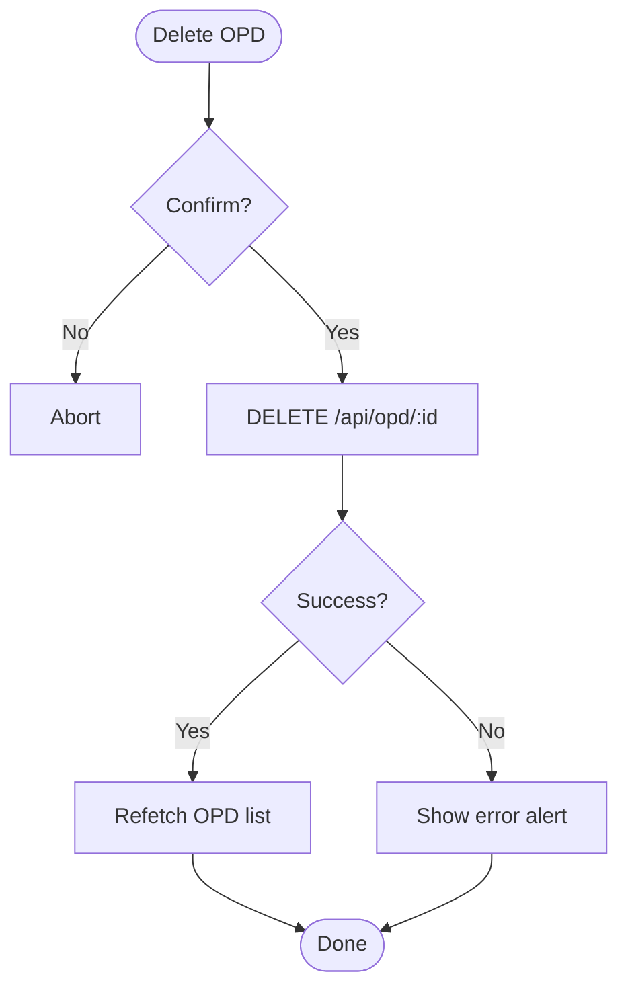

**Diagram sources**
- [OpdPage.jsx:60-69](file://src/pages/OpdPage.jsx#L60-L69)
- [README.md:16](file://README.md#L16)

**Section sources**
- [OpdPage.jsx:60-69](file://src/pages/OpdPage.jsx#L60-L69)
- [README.md:16](file://README.md#L16)

### Integration with User Management
User management integrates with OPD via:
- Admin creation requires selecting an OPD
- Admin editing allows changing OPD assignment
- Device binding associates devices to OPDs
- Reports show OPD-level presence metrics

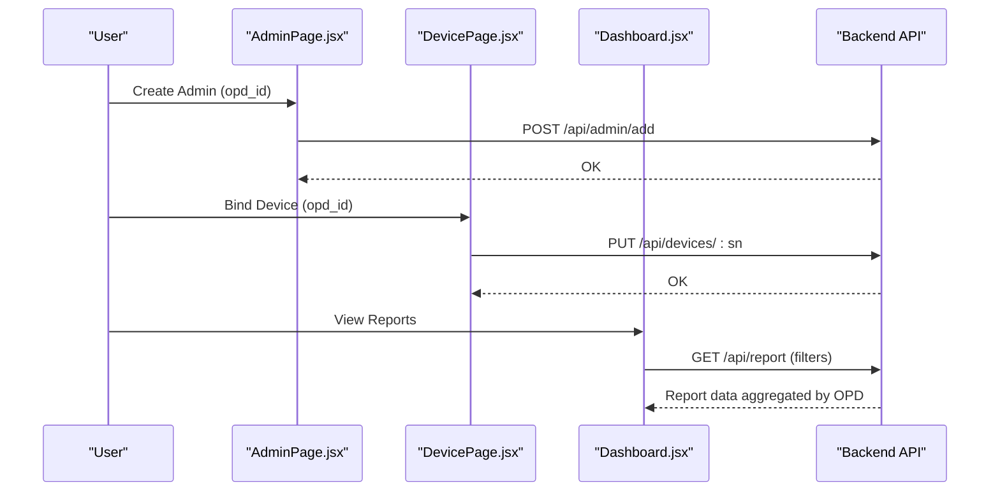

**Diagram sources**
- [AdminPage.jsx:44-73](file://src/pages/AdminPage.jsx#L44-L73)
- [DevicePage.jsx:53-64](file://src/pages/DevicePage.jsx#L53-L64)
- [Dashboard.jsx:18-48](file://src/pages/Dashboard.jsx#L18-L48)

**Section sources**
- [AdminPage.jsx:44-73](file://src/pages/AdminPage.jsx#L44-L73)
- [DevicePage.jsx:53-64](file://src/pages/DevicePage.jsx#L53-L64)
- [Dashboard.jsx:18-48](file://src/pages/Dashboard.jsx#L18-L48)

### OPD-Specific Settings and Reporting Configurations
- OPD-specific settings: None exposed in the frontend; OPD settings are configured via system-wide settings (work hours and holidays).
- Reporting configurations: Dashboard supports filtering by date range, status, and search; exports to CSV; paginated display.

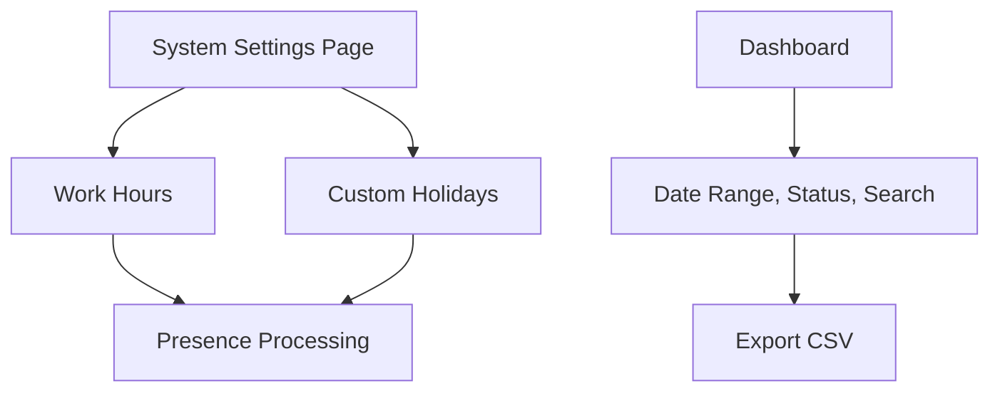

**Diagram sources**
- [SettingsPage.jsx:24-75](file://src/pages/SettingsPage.jsx#L24-L75)
- [Dashboard.jsx:18-48](file://src/pages/Dashboard.jsx#L18-L48)

**Section sources**
- [SettingsPage.jsx:24-75](file://src/pages/SettingsPage.jsx#L24-L75)
- [Dashboard.jsx:18-48](file://src/pages/Dashboard.jsx#L18-L48)

### Hierarchical Relationships Within Organization Structure
- OPD is the primary organizational unit.
- Admins belong to one OPD.
- Devices belong to one OPD.
- Reports aggregate presence data by OPD and device.

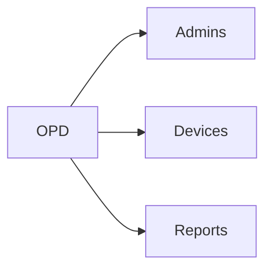

**Diagram sources**
- [AdminPage.jsx:26](file://src/pages/AdminPage.jsx#L26)
- [DevicePage.jsx:104-134](file://src/pages/DevicePage.jsx#L104-L134)
- [Dashboard.jsx:178-277](file://src/pages/Dashboard.jsx#L178-L277)

**Section sources**
- [AdminPage.jsx:26](file://src/pages/AdminPage.jsx#L26)
- [DevicePage.jsx:104-134](file://src/pages/DevicePage.jsx#L104-L134)
- [Dashboard.jsx:178-277](file://src/pages/Dashboard.jsx#L178-L277)

## Dependency Analysis
- Routing and guards: App.jsx defines protected routes and super-admin-only routes.
- Navigation: Navbar.jsx renders menu items and toggles Master Data dropdown for Super Admins.
- OPD management: OpdPage.jsx depends on axios for API calls and local storage for tokens.
- Admin management: AdminPage.jsx fetches OPD list and performs admin CRUD.
- Device management: DevicePage.jsx fetches OPD list and performs device CRUD and unbind.
- Audit and settings: AuditPage.jsx and SettingsPage.jsx provide read-only and configuration capabilities respectively.

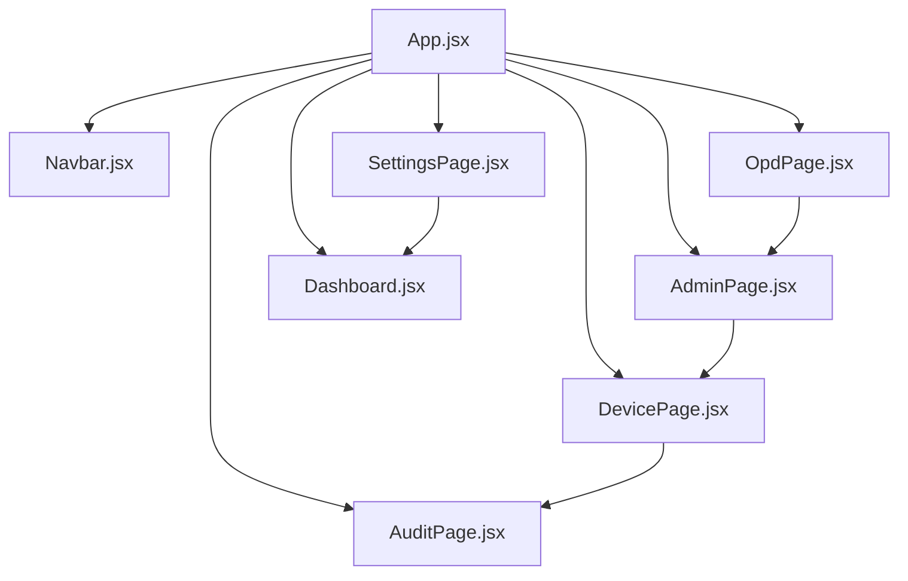

**Diagram sources**
- [App.jsx:72-99](file://src/App.jsx#L72-L99)
- [Navbar.jsx:46-155](file://src/components/Navbar.jsx#L46-L155)
- [OpdPage.jsx:24-69](file://src/pages/OpdPage.jsx#L24-L69)
- [AdminPage.jsx:31-84](file://src/pages/AdminPage.jsx#L31-L84)
- [DevicePage.jsx:28-75](file://src/pages/DevicePage.jsx#L28-L75)
- [AuditPage.jsx:13-21](file://src/pages/AuditPage.jsx#L13-L21)
- [SettingsPage.jsx:24-75](file://src/pages/SettingsPage.jsx#L24-L75)
- [Dashboard.jsx:18-48](file://src/pages/Dashboard.jsx#L18-L48)

**Section sources**
- [App.jsx:72-99](file://src/App.jsx#L72-L99)
- [Navbar.jsx:46-155](file://src/components/Navbar.jsx#L46-L155)
- [OpdPage.jsx:24-69](file://src/pages/OpdPage.jsx#L24-L69)
- [AdminPage.jsx:31-84](file://src/pages/AdminPage.jsx#L31-L84)
- [DevicePage.jsx:28-75](file://src/pages/DevicePage.jsx#L28-L75)
- [AuditPage.jsx:13-21](file://src/pages/AuditPage.jsx#L13-L21)
- [SettingsPage.jsx:24-75](file://src/pages/SettingsPage.jsx#L24-L75)
- [Dashboard.jsx:18-48](file://src/pages/Dashboard.jsx#L18-L48)

## Performance Considerations
- Client-side filtering reduces server load for small datasets.
- Parallel fetching (Promise.all) improves responsiveness when loading Admin and OPD lists.
- Dashboard uses polling and pagination to keep report rendering efficient.
- Anti-spoofing toggle impacts device verification performance; disabling should be justified.

[No sources needed since this section provides general guidance]

## Troubleshooting Guide
Common issues and resolutions:
- Unauthorized access: Global interceptor handles 401 responses by clearing tokens and redirecting to login.
- Network errors: Alerts surface backend error messages for OPD, Admin, Device, Audit, and Settings operations.
- Session timeout: Auto-logout clears local storage and navigates to login.

**Section sources**
- [App.jsx:46-70](file://src/App.jsx#L46-L70)
- [OpdPage.jsx:42-44](file://src/pages/OpdPage.jsx#L42-L44)
- [AdminPage.jsx:54-56](file://src/pages/AdminPage.jsx#L54-L56)
- [DevicePage.jsx:48-50](file://src/pages/DevicePage.jsx#L48-L50)
- [AuditPage.jsx:18-19](file://src/pages/AuditPage.jsx#L18-L19)
- [SettingsPage.jsx:50-51](file://src/pages/SettingsPage.jsx#L50-L51)

## Conclusion
The OPD administration module provides a cohesive set of capabilities for managing organizational units, administrators, devices, audit trails, and system settings. It leverages JWT-based RBAC, REST APIs, and React components to deliver a secure and efficient administrative experience. While explicit parent-child OPD relationships are not exposed in the frontend, the system’s hierarchy is maintained through OPD associations with admins and devices, and reporting aggregates presence data accordingly.

[No sources needed since this section summarizes without analyzing specific files]

## Appendices
- Backend architecture and synchronization: The backend uses Flask, JWT, RBAC, and a synchronization script for legacy data migration.
- Frontend stack: React, Vite, Tailwind CSS, axios, lucide-react, @vladmandic/face-api, sweetalert2.

**Section sources**
- [README.md:11-16](file://README.md#L11-L16)
- [package.json:12-21](file://package.json#L12-L21)