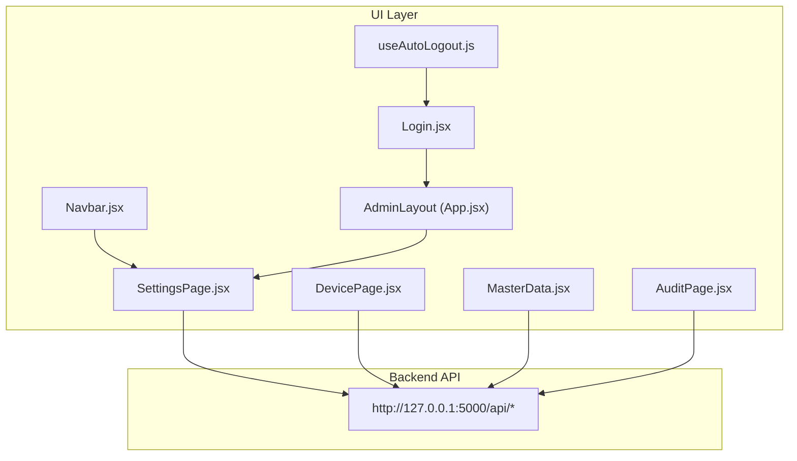
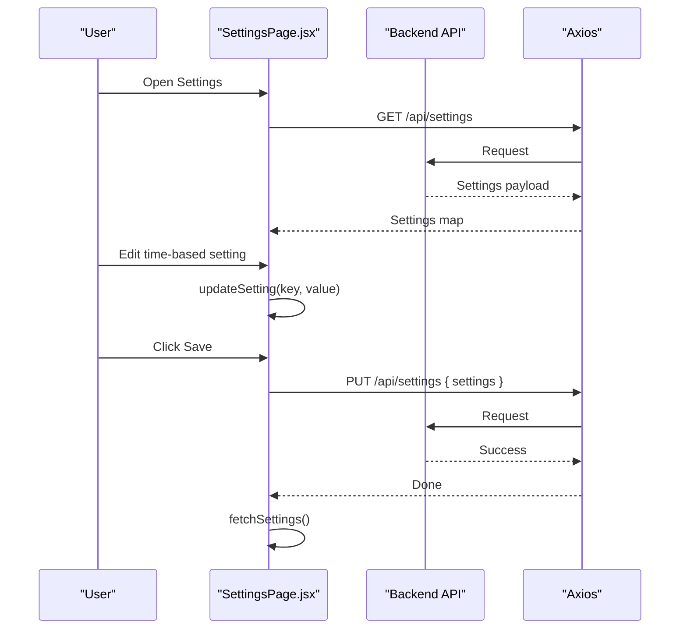
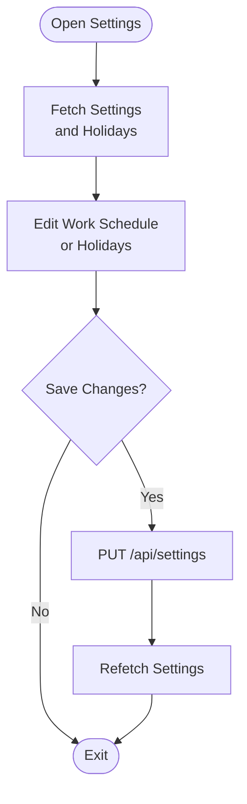
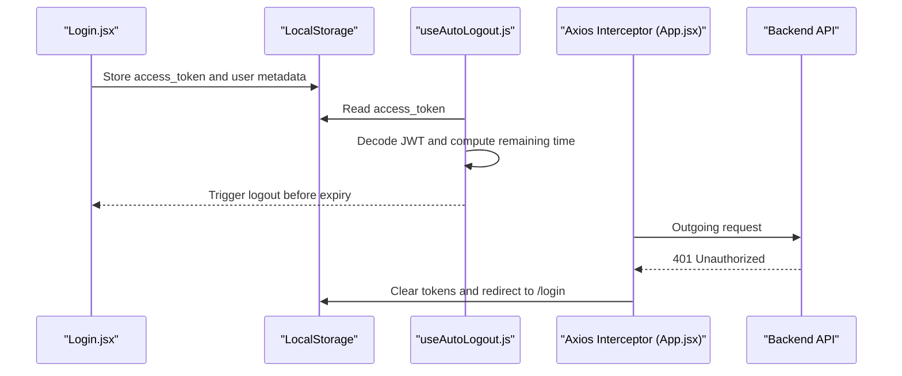
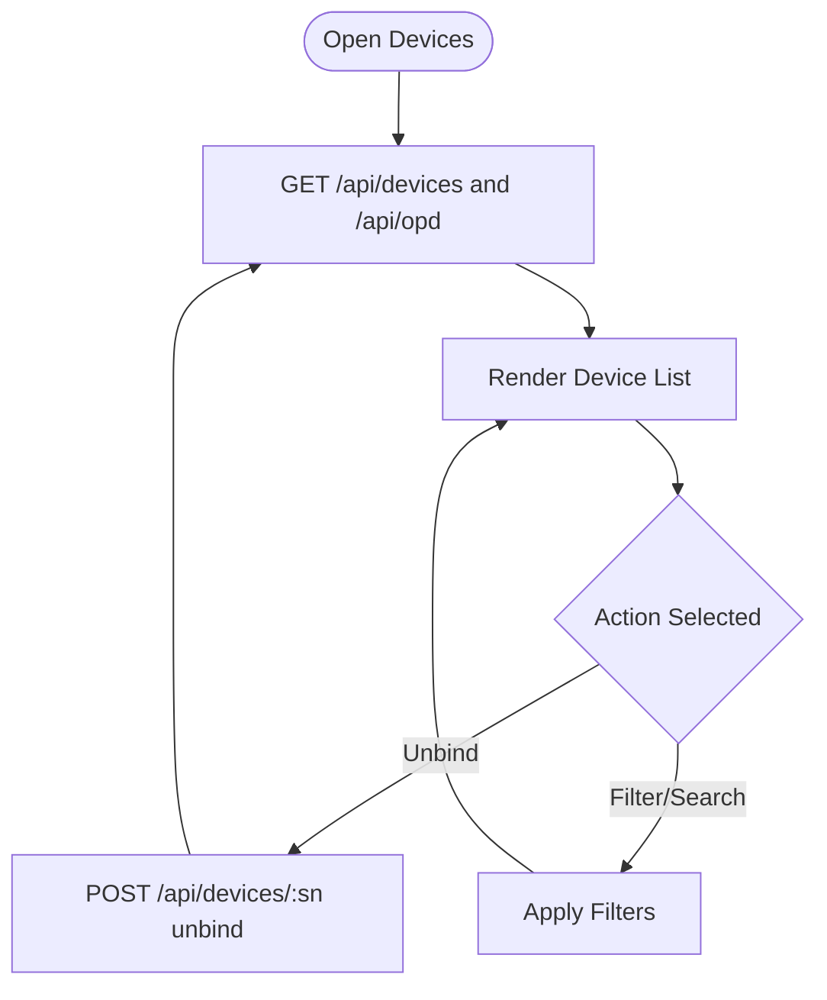
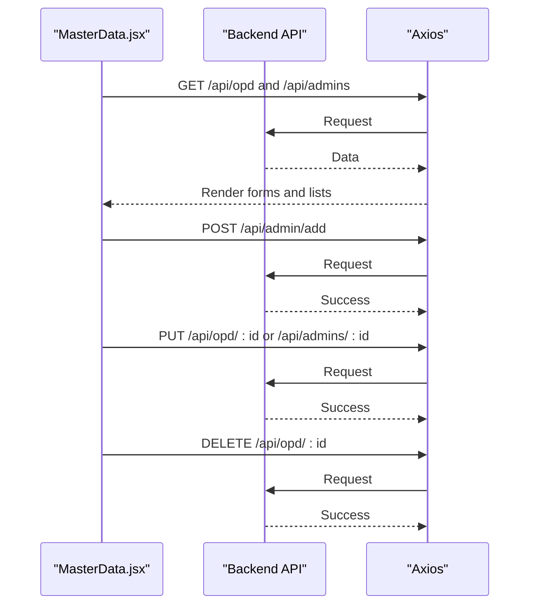
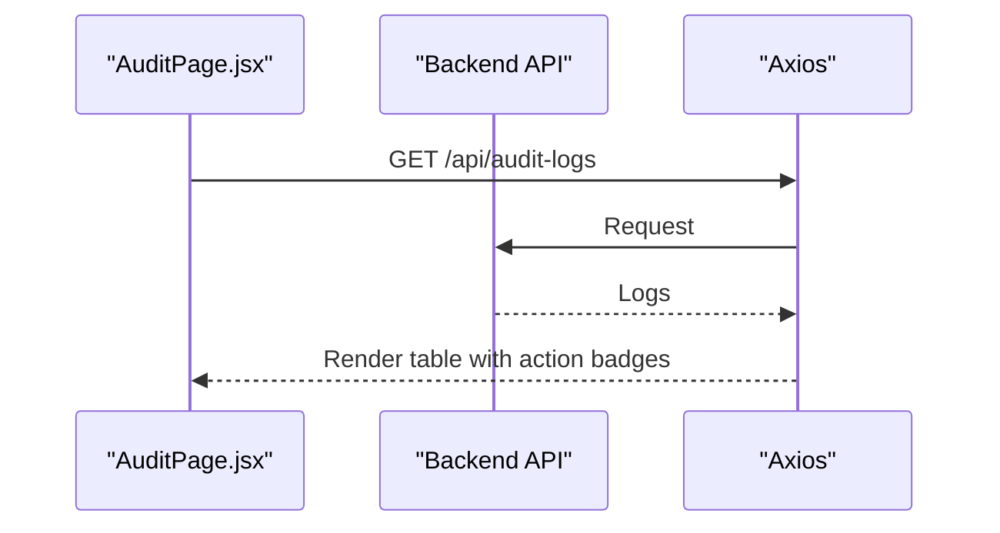
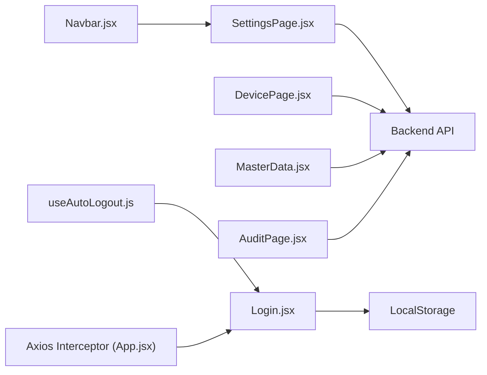

# System Settings

<cite>
**Referenced Files in This Document**
- [SettingsPage.jsx](file://src/pages/SettingsPage.jsx)
- [App.jsx](file://src/App.jsx)
- [Navbar.jsx](file://src/components/Navbar.jsx)
- [Login.jsx](file://src/pages/Login.jsx)
- [useAutoLogout.js](file://src/hooks/useAutoLogout.js)
- [DevicePage.jsx](file://src/pages/DevicePage.jsx)
- [MasterData.jsx](file://src/pages/MasterData.jsx)
- [AuditPage.jsx](file://src/pages/AuditPage.jsx)
</cite>

## Table of Contents
1. [Introduction](#introduction)
2. [Project Structure](#project-structure)
3. [Core Components](#core-components)
4. [Architecture Overview](#architecture-overview)
5. [Detailed Component Analysis](#detailed-component-analysis)
6. [Dependency Analysis](#dependency-analysis)
7. [Performance Considerations](#performance-considerations)
8. [Troubleshooting Guide](#troubleshooting-guide)
9. [Conclusion](#conclusion)

## Introduction
This document describes the system-wide configuration and settings management capabilities exposed by the frontend application. It focuses on the settings categories visible in the Settings page, authentication and session lifecycle, device and master data administration, audit logging, and operational controls such as anti-spoofing. It also outlines the backend integration points and highlights areas where validation, rollback, and impact assessment could be strengthened.

## Project Structure
The settings and configuration surface is primarily implemented in a dedicated Settings page with supporting infrastructure for navigation, authentication, and audit logging. The application integrates with a backend API for retrieving and updating settings, managing holidays, and accessing administrative resources.

**Diagram sources**
- [SettingsPage.jsx:1-239](file://src/pages/SettingsPage.jsx#L1-L239)
- [App.jsx:33-78](file://src/App.jsx#L33-L78)
- [Navbar.jsx:96-128](file://src/components/Navbar.jsx#L96-L128)
- [Login.jsx:61-100](file://src/pages/Login.jsx#L61-L100)
- [useAutoLogout.js:1-67](file://src/hooks/useAutoLogout.js#L1-L67)
- [DevicePage.jsx:1-39](file://src/pages/DevicePage.jsx#L1-L39)
- [MasterData.jsx:1-214](file://src/pages/MasterData.jsx#L1-L214)
- [AuditPage.jsx:1-42](file://src/pages/AuditPage.jsx#L1-L42)

**Section sources**
- [SettingsPage.jsx:1-239](file://src/pages/SettingsPage.jsx#L1-L239)
- [App.jsx:33-78](file://src/App.jsx#L33-L78)
- [Navbar.jsx:96-128](file://src/components/Navbar.jsx#L96-L128)
- [Login.jsx:61-100](file://src/pages/Login.jsx#L61-L100)
- [useAutoLogout.js:1-67](file://src/hooks/useAutoLogout.js#L1-L67)
- [DevicePage.jsx:1-39](file://src/pages/DevicePage.jsx#L1-L39)
- [MasterData.jsx:1-214](file://src/pages/MasterData.jsx#L1-L214)
- [AuditPage.jsx:1-42](file://src/pages/AuditPage.jsx#L1-L42)

## Core Components
- Settings Page: Provides tabs for work schedule settings and holiday management. It fetches current settings and holidays, allows editing time-based settings, and persists updates to the backend. It surfaces a banner indicating immediate effect on subsequent attendance scans.
- Authentication and Session Management: Centralized logout handling via an interceptor and a hook that auto-logs out users when tokens expire. Login stores tokens and user metadata in local storage.
- Device Administration: Lists devices, supports filtering, and displays anti-spoofing status indicators. Includes unbinding actions for verified devices.
- Master Data Administration: Manages OPD and admin accounts, with update and delete operations and audit log entries.
- Audit Logging: Displays recent audit trail records with action categorization.

**Section sources**
- [SettingsPage.jsx:1-239](file://src/pages/SettingsPage.jsx#L1-L239)
- [App.jsx:46-70](file://src/App.jsx#L46-L70)
- [useAutoLogout.js:19-67](file://src/hooks/useAutoLogout.js#L19-L67)
- [Login.jsx:61-100](file://src/pages/Login.jsx#L61-L100)
- [DevicePage.jsx:1-39](file://src/pages/DevicePage.jsx#L1-L39)
- [MasterData.jsx:1-214](file://src/pages/MasterData.jsx#L1-L214)
- [AuditPage.jsx:1-42](file://src/pages/AuditPage.jsx#L1-L42)

## Architecture Overview
The Settings page communicates with the backend API to retrieve and persist configuration values and manage holidays. Authentication is handled centrally with token storage and automatic logout on expiration. Administrative features integrate with device and master data endpoints, while audit logs provide read-only visibility into system activity.

**Diagram sources**
- [SettingsPage.jsx:24-50](file://src/pages/SettingsPage.jsx#L24-L50)

## Detailed Component Analysis

### Settings Page
- Purpose: Central hub for system configuration including work schedule and holidays.
- Data model: Settings are represented as a key-value map fetched from the backend. Time-based settings are edited via time inputs and saved atomically.
- Behavior:
  - Fetches settings and holidays on mount.
  - Updates local state on change and saves to backend on demand.
  - Displays a banner indicating that work schedule changes take effect on the next attendance scan.
- Security and access:
  - Requires a valid bearer token for API requests.
  - Accessible only to super admins via the navigation bar.

**Diagram sources**
- [SettingsPage.jsx:24-50](file://src/pages/SettingsPage.jsx#L24-L50)

**Section sources**
- [SettingsPage.jsx:1-239](file://src/pages/SettingsPage.jsx#L1-L239)
- [Navbar.jsx:116-128](file://src/components/Navbar.jsx#L116-L128)

### Authentication and Session Lifecycle
- Token storage: Access token and user metadata are stored in local storage after successful login.
- Auto-logout: A hook decodes the JWT and schedules an automatic logout when the token expires.
- Global interceptor: On receiving a 401 Unauthorized response, the app prompts the user to log in again and clears local storage.

**Diagram sources**
- [Login.jsx:61-100](file://src/pages/Login.jsx#L61-L100)
- [useAutoLogout.js:19-67](file://src/hooks/useAutoLogout.js#L19-L67)
- [App.jsx:46-70](file://src/App.jsx#L46-L70)

**Section sources**
- [Login.jsx:61-100](file://src/pages/Login.jsx#L61-L100)
- [useAutoLogout.js:19-67](file://src/hooks/useAutoLogout.js#L19-L67)
- [App.jsx:46-70](file://src/App.jsx#L46-L70)

### Device Administration
- Purpose: View and manage devices bound to OPDs, filter by various attributes, and toggle anti-spoofing status indicators.
- Operations: Supports unbinding verified devices when applicable.

**Diagram sources**
- [DevicePage.jsx:28-39](file://src/pages/DevicePage.jsx#L28-L39)

**Section sources**
- [DevicePage.jsx:1-39](file://src/pages/DevicePage.jsx#L1-L39)
- [DevicePage.jsx:127-140](file://src/pages/DevicePage.jsx#L127-L140)

### Master Data Administration
- Purpose: Manage OPDs and admin accounts, with support for adding, updating, and deleting records.
- Audit: Maintains audit logs reflecting add/update/delete actions.

**Diagram sources**
- [MasterData.jsx:59-107](file://src/pages/MasterData.jsx#L59-L107)

**Section sources**
- [MasterData.jsx:1-214](file://src/pages/MasterData.jsx#L1-L214)

### Audit Logging
- Purpose: Display recent audit events with color-coded badges based on action type.
- Read-only: Logs cannot be modified by users.

**Diagram sources**
- [AuditPage.jsx:13-21](file://src/pages/AuditPage.jsx#L13-L21)

**Section sources**
- [AuditPage.jsx:1-42](file://src/pages/AuditPage.jsx#L1-L42)

## Dependency Analysis
- SettingsPage depends on:
  - Local storage for authentication token.
  - Backend endpoints for settings and holidays.
- Navbar restricts access to Settings to super admins.
- DevicePage and MasterData depend on backend endpoints for devices, OPDs, and admin accounts.
- AuditPage depends on backend endpoint for audit logs.
- App-level interceptor centralizes 401 handling and logout flow.

**Diagram sources**
- [SettingsPage.jsx:24-50](file://src/pages/SettingsPage.jsx#L24-L50)
- [Navbar.jsx:116-128](file://src/components/Navbar.jsx#L116-L128)
- [DevicePage.jsx:28-39](file://src/pages/DevicePage.jsx#L28-L39)
- [MasterData.jsx:59-107](file://src/pages/MasterData.jsx#L59-L107)
- [AuditPage.jsx:13-21](file://src/pages/AuditPage.jsx#L13-L21)
- [Login.jsx:61-100](file://src/pages/Login.jsx#L61-L100)
- [useAutoLogout.js:19-67](file://src/hooks/useAutoLogout.js#L19-L67)
- [App.jsx:46-70](file://src/App.jsx#L46-L70)

**Section sources**
- [SettingsPage.jsx:1-239](file://src/pages/SettingsPage.jsx#L1-L239)
- [Navbar.jsx:116-128](file://src/components/Navbar.jsx#L116-L128)
- [DevicePage.jsx:1-39](file://src/pages/DevicePage.jsx#L1-L39)
- [MasterData.jsx:1-214](file://src/pages/MasterData.jsx#L1-L214)
- [AuditPage.jsx:1-42](file://src/pages/AuditPage.jsx#L1-L42)
- [Login.jsx:61-100](file://src/pages/Login.jsx#L61-L100)
- [useAutoLogout.js:19-67](file://src/hooks/useAutoLogout.js#L19-L67)
- [App.jsx:46-70](file://src/App.jsx#L46-L70)

## Performance Considerations
- Network calls: Settings, holidays, devices, and audit logs are fetched on mount. Consider caching and debouncing for frequent updates.
- UI responsiveness: Large datasets (e.g., audit logs) benefit from pagination or virtualization.
- Token handling: Avoid unnecessary re-renders by deriving token and role from local storage efficiently.

## Troubleshooting Guide
- Settings not saving:
  - Verify network connectivity and backend reachability.
  - Confirm the presence of a valid bearer token in local storage.
  - Check for error messages returned by the backend on save attempts.
- Unauthorized access to Settings:
  - Ensure the logged-in user has the super admin role.
- Session expired:
  - The auto-logout hook and global interceptor will clear tokens and redirect to the login page automatically.
- Device anti-spoofing:
  - Anti-spoofing status is indicated visually; unbind devices if necessary and re-bind after confirming verification.

**Section sources**
- [SettingsPage.jsx:24-50](file://src/pages/SettingsPage.jsx#L24-L50)
- [Navbar.jsx:116-128](file://src/components/Navbar.jsx#L116-L128)
- [useAutoLogout.js:19-67](file://src/hooks/useAutoLogout.js#L19-L67)
- [App.jsx:46-70](file://src/App.jsx#L46-L70)
- [DevicePage.jsx:127-140](file://src/pages/DevicePage.jsx#L127-L140)

## Conclusion
The Settings page provides a focused interface for configuring work schedules and holidays, integrating with backend APIs for persistence and retrieval. Authentication and session management are centralized with robust token handling and automatic logout. Administrative features for devices and master data complement the settings surface, while audit logs offer transparency into system activity. Strengthening validation, rollback, and impact assessment for configuration changes would further improve reliability and safety.