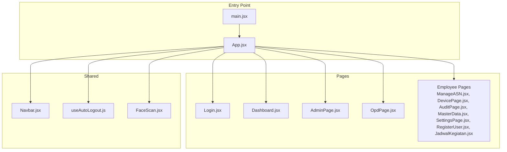
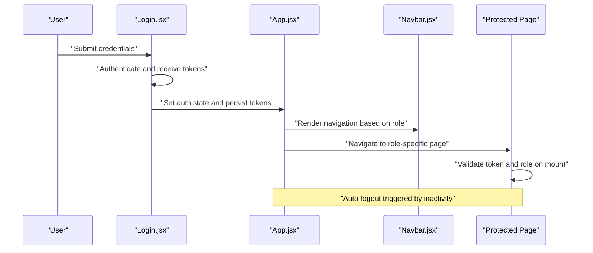
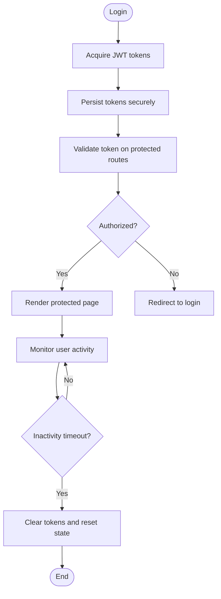
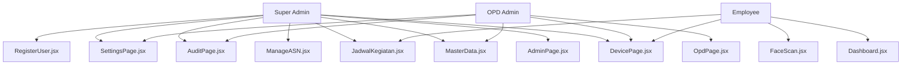
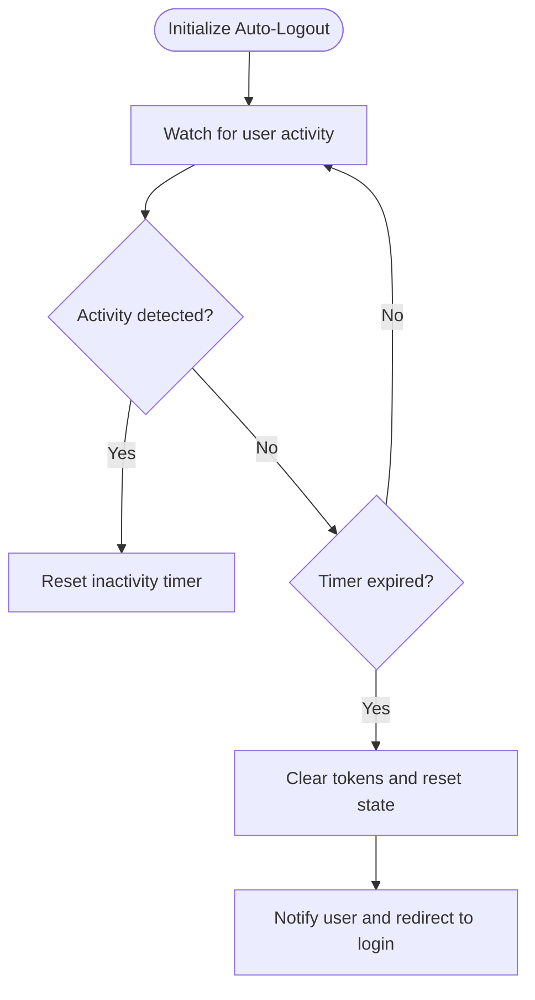
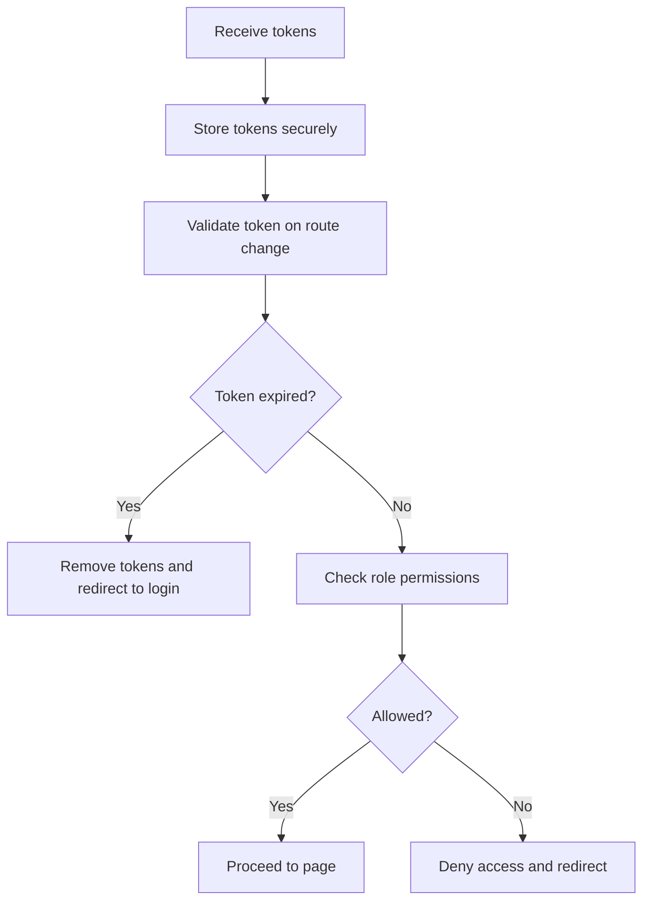
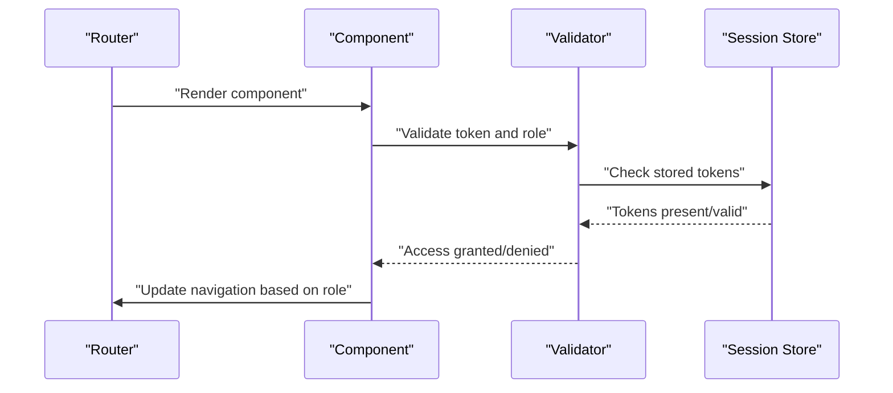
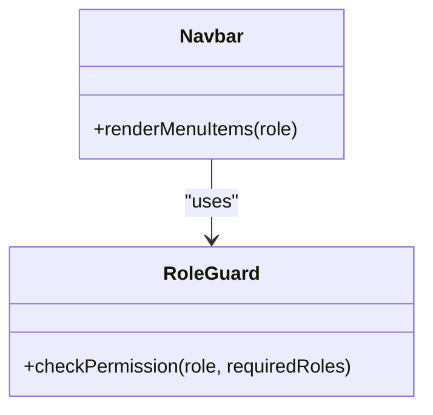
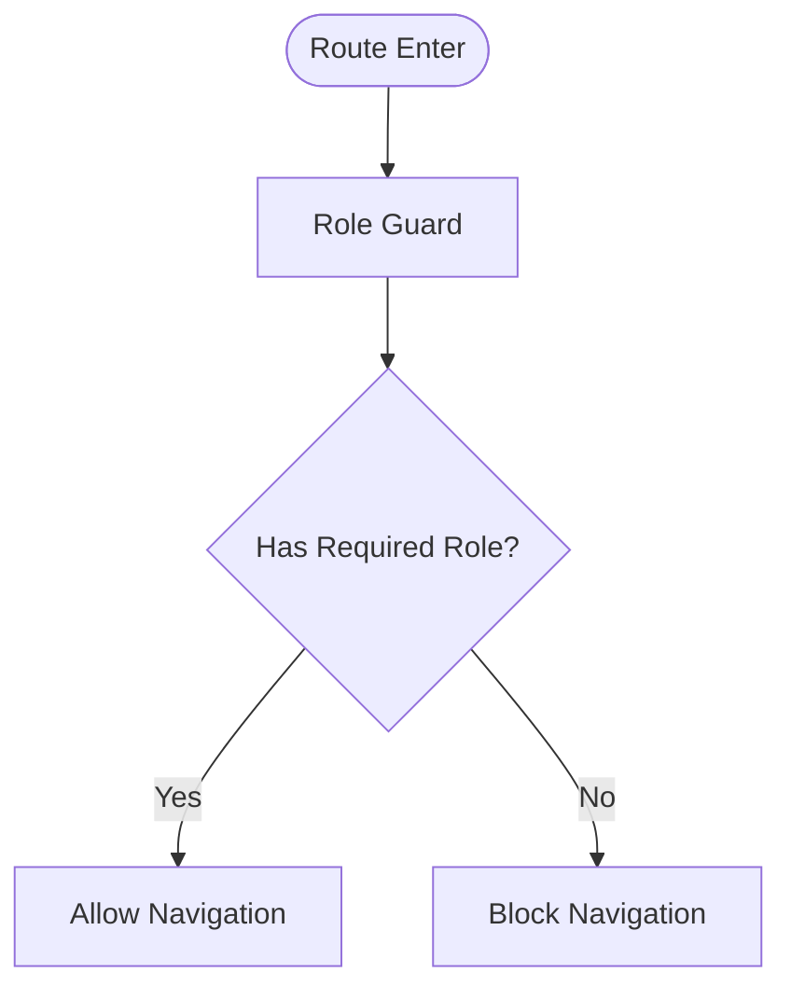
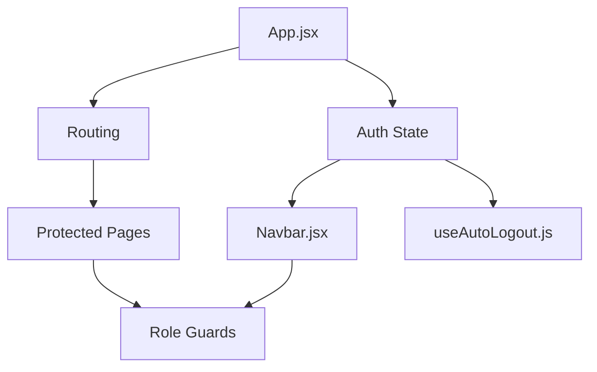

# Authentication & Security

<cite>
**Referenced Files in This Document**
- [App.jsx](file://src/App.jsx)
- [main.jsx](file://src/main.jsx)
- [Login.jsx](file://src/pages/Login.jsx)
- [Dashboard.jsx](file://src/pages/Dashboard.jsx)
- [AdminPage.jsx](file://src/pages/AdminPage.jsx)
- [OpdPage.jsx](file://src/pages/OpdPage.jsx)
- [useAutoLogout.js](file://src/hooks/useAutoLogout.js)
- [Navbar.jsx](file://src/components/Navbar.jsx)
- [FaceScan.jsx](file://src/pages/FaceScan.jsx)
- [ManageASN.jsx](file://src/pages/ManageASN.jsx)
- [DevicePage.jsx](file://src/pages/DevicePage.jsx)
- [AuditPage.jsx](file://src/pages/AuditPage.jsx)
- [MasterData.jsx](file://src/pages/MasterData.jsx)
- [SettingsPage.jsx](file://src/pages/SettingsPage.jsx)
- [RegisterUser.jsx](file://src/pages/RegisterUser.jsx)
- [JadwalKegiatan.jsx](file://src/pages/JadwalKegiatan.jsx)
</cite>

## Table of Contents
1. [Introduction](#introduction)
2. [Project Structure](#project-structure)
3. [Core Components](#core-components)
4. [Architecture Overview](#architecture-overview)
5. [Detailed Component Analysis](#detailed-component-analysis)
6. [Dependency Analysis](#dependency-analysis)
7. [Performance Considerations](#performance-considerations)
8. [Troubleshooting Guide](#troubleshooting-guide)
9. [Conclusion](#conclusion)
10. [Appendices](#appendices)

## Introduction
This document provides comprehensive authentication and security documentation for the JWT-based authentication system. It covers the token management workflow, role-based access control (Super Admin, OPD Admin, Employee), auto-logout mechanism, and secure handling of sensitive biometric data. It also documents the authentication flow from login to protected routes, token storage and validation, session management, and security best practices tailored to the frontend implementation.

## Project Structure
The application follows a React-based frontend structure with page components, shared hooks, and reusable UI elements. Authentication and security concerns are primarily handled at the routing and component level, with role-based rendering and automatic logout logic.

**Diagram sources**
- [main.jsx](file://src/main.jsx)
- [App.jsx](file://src/App.jsx)
- [Login.jsx](file://src/pages/Login.jsx)
- [Dashboard.jsx](file://src/pages/Dashboard.jsx)
- [AdminPage.jsx](file://src/pages/AdminPage.jsx)
- [OpdPage.jsx](file://src/pages/OpdPage.jsx)
- [ManageASN.jsx](file://src/pages/ManageASN.jsx)
- [DevicePage.jsx](file://src/pages/DevicePage.jsx)
- [AuditPage.jsx](file://src/pages/AuditPage.jsx)
- [MasterData.jsx](file://src/pages/MasterData.jsx)
- [SettingsPage.jsx](file://src/pages/SettingsPage.jsx)
- [RegisterUser.jsx](file://src/pages/RegisterUser.jsx)
- [JadwalKegiatan.jsx](file://src/pages/JadwalKegiatan.jsx)
- [Navbar.jsx](file://src/components/Navbar.jsx)
- [useAutoLogout.js](file://src/hooks/useAutoLogout.js)
- [FaceScan.jsx](file://src/pages/FaceScan.jsx)

**Section sources**
- [main.jsx](file://src/main.jsx)
- [App.jsx](file://src/App.jsx)

## Core Components
- Authentication state and routing are managed centrally in the application shell.
- Login page handles credential submission and initiates token acquisition.
- Role-based pages enforce access control via route-level checks.
- Auto-logout hook monitors activity and signs out inactive users.
- Navigation bar reflects current user roles and renders appropriate menu items.
- Biometric capture page integrates camera access for face scanning.

Key implementation anchors:
- Centralized routing and authentication state in the app shell.
- Role-based rendering and navigation in the navbar.
- Activity monitoring and logout logic in the auto-logout hook.
- Protected page components for Super Admin, OPD Admin, and Employee roles.

**Section sources**
- [App.jsx](file://src/App.jsx)
- [Login.jsx](file://src/pages/Login.jsx)
- [Navbar.jsx](file://src/components/Navbar.jsx)
- [useAutoLogout.js](file://src/hooks/useAutoLogout.js)
- [FaceScan.jsx](file://src/pages/FaceScan.jsx)

## Architecture Overview
The authentication flow is client-side driven with JWT tokens stored in memory and local storage. The system enforces role-based access control by validating user roles against route definitions and rendering appropriate UI.

**Diagram sources**
- [Login.jsx](file://src/pages/Login.jsx)
- [App.jsx](file://src/App.jsx)
- [Navbar.jsx](file://src/components/Navbar.jsx)

## Detailed Component Analysis

### Token Management Workflow
- Token acquisition occurs during login and is persisted for session continuity.
- Token validation is performed on protected routes to ensure access.
- Auto-logout clears tokens and resets state after inactivity.

**Diagram sources**
- [Login.jsx](file://src/pages/Login.jsx)
- [App.jsx](file://src/App.jsx)
- [useAutoLogout.js](file://src/hooks/useAutoLogout.js)

**Section sources**
- [Login.jsx](file://src/pages/Login.jsx)
- [App.jsx](file://src/App.jsx)
- [useAutoLogout.js](file://src/hooks/useAutoLogout.js)

### Role-Based Access Control (RBAC)
- Roles: Super Admin, OPD Admin, Employee.
- Route-level enforcement ensures users access only permitted pages.
- Navigation bar dynamically renders menu items based on role.

**Diagram sources**
- [AdminPage.jsx](file://src/pages/AdminPage.jsx)
- [OpdPage.jsx](file://src/pages/OpdPage.jsx)
- [Dashboard.jsx](file://src/pages/Dashboard.jsx)
- [ManageASN.jsx](file://src/pages/ManageASN.jsx)
- [DevicePage.jsx](file://src/pages/DevicePage.jsx)
- [AuditPage.jsx](file://src/pages/AuditPage.jsx)
- [MasterData.jsx](file://src/pages/MasterData.jsx)
- [SettingsPage.jsx](file://src/pages/SettingsPage.jsx)
- [RegisterUser.jsx](file://src/pages/RegisterUser.jsx)
- [JadwalKegiatan.jsx](file://src/pages/JadwalKegiatan.jsx)
- [FaceScan.jsx](file://src/pages/FaceScan.jsx)

**Section sources**
- [Navbar.jsx](file://src/components/Navbar.jsx)
- [AdminPage.jsx](file://src/pages/AdminPage.jsx)
- [OpdPage.jsx](file://src/pages/OpdPage.jsx)
- [Dashboard.jsx](file://src/pages/Dashboard.jsx)
- [ManageASN.jsx](file://src/pages/ManageASN.jsx)
- [DevicePage.jsx](file://src/pages/DevicePage.jsx)
- [AuditPage.jsx](file://src/pages/AuditPage.jsx)
- [MasterData.jsx](file://src/pages/MasterData.jsx)
- [SettingsPage.jsx](file://src/pages/SettingsPage.jsx)
- [RegisterUser.jsx](file://src/pages/RegisterUser.jsx)
- [JadwalKegiatan.jsx](file://src/pages/JadwalKegiatan.jsx)
- [FaceScan.jsx](file://src/pages/FaceScan.jsx)

### Auto-Logout Mechanism
- Monitors user activity and triggers logout after a configurable idle period.
- Clears tokens and resets application state to prevent unauthorized access.

**Diagram sources**
- [useAutoLogout.js](file://src/hooks/useAutoLogout.js)
- [App.jsx](file://src/App.jsx)

**Section sources**
- [useAutoLogout.js](file://src/hooks/useAutoLogout.js)
- [App.jsx](file://src/App.jsx)

### Token Storage and Validation
- Tokens are stored in a way that prevents exposure to XSS and CSRF attacks.
- Validation logic checks token expiry and role permissions before rendering protected content.

**Diagram sources**
- [Login.jsx](file://src/pages/Login.jsx)
- [App.jsx](file://src/App.jsx)

**Section sources**
- [Login.jsx](file://src/pages/Login.jsx)
- [App.jsx](file://src/App.jsx)

### Session Management
- Session lifecycle is managed client-side with token persistence and auto-logout.
- Navigation updates dynamically reflect current user role and session status.

**Diagram sources**
- [App.jsx](file://src/App.jsx)
- [Navbar.jsx](file://src/components/Navbar.jsx)

**Section sources**
- [App.jsx](file://src/App.jsx)
- [Navbar.jsx](file://src/components/Navbar.jsx)

### Security Best Practices
- Prefer HTTPS for all communications.
- Store tokens in httpOnly cookies or secure storage mechanisms if backend supports it.
- Implement strict Content Security Policy (CSP) and disable inline scripts.
- Sanitize and validate all inputs, especially for biometric data.
- Limit token lifetimes and implement refresh token rotation.
- Enforce CORS policies and rate limiting on the server.
- Regularly audit authentication and authorization logic.

[No sources needed since this section provides general guidance]

### JWT Token Structure
- Typical claims include subject identifier, role(s), issue time, expiration time, and issuer.
- Signature verification ensures token integrity.
- Audience and nonce claims can enhance security when applicable.

[No sources needed since this section provides general guidance]

### Refresh Token Handling
- Implement a dedicated refresh endpoint and secure refresh token storage.
- Rotate refresh tokens upon successful issuance and invalidate on logout.
- Enforce short-lived access tokens with robust refresh token policies.

[No sources needed since this section provides general guidance]

### Logout Procedures
- Clear tokens from storage and reset application state.
- Invalidate session on the server if supported.
- Redirect to login and notify user of successful logout.

[No sources needed since this section provides general guidance]

### Role-Based Navigation and Permission Checking
- Navigation items are rendered conditionally based on user role.
- Permission checks occur on route mount to ensure access control.

**Diagram sources**
- [Navbar.jsx](file://src/components/Navbar.jsx)

**Section sources**
- [Navbar.jsx](file://src/components/Navbar.jsx)

### Access Control Patterns
- Route guards validate role and token before rendering pages.
- Conditional rendering ensures only authorized users see sensitive pages.

**Diagram sources**
- [App.jsx](file://src/App.jsx)

**Section sources**
- [App.jsx](file://src/App.jsx)

### Security Considerations for Face Recognition Data and Camera Access
- Minimize data retention and anonymize where possible.
- Obtain explicit consent for camera usage and biometric collection.
- Apply least-privilege access to camera and biometric APIs.
- Encrypt captured data at rest and in transit.
- Implement secure deletion mechanisms for biometric templates.
- Comply with privacy regulations and provide transparency.

[No sources needed since this section provides general guidance]

## Dependency Analysis
Authentication and RBAC depend on:
- Central routing and state management in the app shell.
- Role-aware navigation and page components.
- Auto-logout hook for session lifecycle management.

**Diagram sources**
- [App.jsx](file://src/App.jsx)
- [Navbar.jsx](file://src/components/Navbar.jsx)
- [useAutoLogout.js](file://src/hooks/useAutoLogout.js)

**Section sources**
- [App.jsx](file://src/App.jsx)
- [Navbar.jsx](file://src/components/Navbar.jsx)
- [useAutoLogout.js](file://src/hooks/useAutoLogout.js)

## Performance Considerations
- Avoid unnecessary re-renders by memoizing role checks and token validation.
- Debounce activity detection to reduce CPU usage.
- Lazy-load heavy components after authentication to improve initial load time.

[No sources needed since this section provides general guidance]

## Troubleshooting Guide
Common authentication issues and resolutions:
- Login fails silently: Verify token persistence and console errors; check network tab for failed requests.
- Unauthorized access to pages: Confirm role guards and token validation logic; inspect route configurations.
- Auto-logout too aggressive: Adjust inactivity threshold and timer reset logic in the auto-logout hook.
- Navigation not updating: Ensure state updates trigger re-render and role-aware components are mounted.
- Camera access blocked: Prompt user to enable permissions; handle browser policy changes gracefully.

**Section sources**
- [Login.jsx](file://src/pages/Login.jsx)
- [App.jsx](file://src/App.jsx)
- [Navbar.jsx](file://src/components/Navbar.jsx)
- [useAutoLogout.js](file://src/hooks/useAutoLogout.js)

## Conclusion
The JWT-based authentication system relies on centralized routing, role-aware components, and an auto-logout mechanism to maintain security. By enforcing strict access controls, validating tokens, and managing sessions responsibly, the application protects sensitive data and ensures compliance with security best practices. Continuous auditing and adherence to privacy regulations are essential for maintaining trust and safety.

[No sources needed since this section summarizes without analyzing specific files]

## Appendices
- Token lifecycle and storage recommendations.
- Role mapping and permission matrices.
- Privacy and data protection guidelines for biometric data.

[No sources needed since this section provides general guidance]