# Component Architecture

<cite>
**Referenced Files in This Document**
- [App.jsx](file://src/App.jsx)
- [main.jsx](file://src/main.jsx)
- [Navbar.jsx](file://src/components/Navbar.jsx)
- [useAutoLogout.js](file://src/hooks/useAutoLogout.js)
- [Dashboard.jsx](file://src/pages/Dashboard.jsx)
- [Login.jsx](file://src/pages/Login.jsx)
- [FaceScan.jsx](file://src/pages/FaceScan.jsx)
- [AdminPage.jsx](file://src/pages/AdminPage.jsx)
- [RegisterUser.jsx](file://src/pages/RegisterUser.jsx)
- [index.css](file://src/index.css)
- [tailwind.config.js](file://tailwind.config.js)
- [package.json](file://package.json)
- [vite.config.js](file://vite.config.js)
</cite>

## Table of Contents
1. [Introduction](#introduction)
2. [Project Structure](#project-structure)
3. [Core Components](#core-components)
4. [Architecture Overview](#architecture-overview)
5. [Detailed Component Analysis](#detailed-component-analysis)
6. [Dependency Analysis](#dependency-analysis)
7. [Performance Considerations](#performance-considerations)
8. [Troubleshooting Guide](#troubleshooting-guide)
9. [Conclusion](#conclusion)
10. [Appendices](#appendices)

## Introduction
This document describes the React component architecture of a face recognition attendance system. It covers the component hierarchy, routing with protected routes, state management patterns, layout composition, navigation, and responsive design. It also outlines performance optimization, code splitting considerations, and strategies for extending and maintaining consistency across the application.

## Project Structure
The application follows a feature-based organization:
- Entry point renders the app inside a strict mode container.
- Routing is centralized in the main App component with route guards and a shared admin layout.
- Reusable UI components live under a dedicated components directory.
- Page components are grouped under pages.
- Hooks encapsulate cross-cutting concerns like auto-logout.
- Styling is configured via Tailwind CSS with global styles.

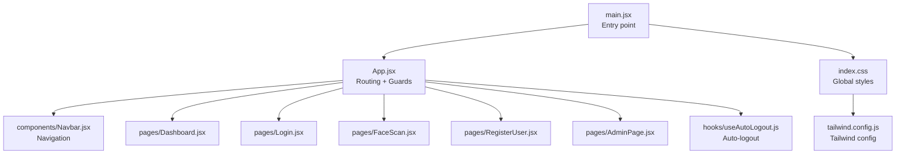

**Diagram sources**
- [main.jsx:1-11](file://src/main.jsx#L1-L11)
- [App.jsx:1-102](file://src/App.jsx#L1-L102)
- [Navbar.jsx:1-158](file://src/components/Navbar.jsx#L1-L158)
- [Dashboard.jsx:1-314](file://src/pages/Dashboard.jsx#L1-L314)
- [Login.jsx:1-553](file://src/pages/Login.jsx#L1-L553)
- [FaceScan.jsx:1-204](file://src/pages/FaceScan.jsx#L1-L204)
- [RegisterUser.jsx:1-274](file://src/pages/RegisterUser.jsx#L1-L274)
- [AdminPage.jsx:1-258](file://src/pages/AdminPage.jsx#L1-L258)
- [useAutoLogout.js:1-68](file://src/hooks/useAutoLogout.js#L1-L68)
- [index.css:1-12](file://src/index.css#L1-L12)
- [tailwind.config.js:1-17](file://tailwind.config.js#L1-L17)

**Section sources**
- [main.jsx:1-11](file://src/main.jsx#L1-L11)
- [App.jsx:1-102](file://src/App.jsx#L1-L102)
- [index.css:1-12](file://src/index.css#L1-L12)
- [tailwind.config.js:1-17](file://tailwind.config.js#L1-L17)

## Core Components
- App: Central router with protected routes, super admin guards, and an admin layout wrapper.
- Navbar: Shared navigation sidebar with role-aware menu items and dropdowns.
- useAutoLogout: Hook that monitors JWT expiration and triggers logout prompts.
- Dashboard: Data-heavy page with filters, pagination, and CSV export.
- Login: Authentication form with local state and server-side validation.
- FaceScan: Real-time camera scanning with local AI face detection and server prediction.
- RegisterUser: Multi-step registration with pose capture and batch upload.
- AdminPage: CRUD operations for admin accounts with modal dialogs.

Key patterns:
- Route guards: ProtectedRoute and SuperAdminRoute enforce authentication and roles.
- AdminLayout: Wraps admin pages with Navbar and shared container.
- Local state management: useState/useEffect for UI state; localStorage for tokens and user metadata.
- Axios interceptors: Centralized 401 handling for session invalidation.
- Composition: Navbar is composed into AdminLayout; AdminLayout is composed into protected routes.

**Section sources**
- [App.jsx:18-44](file://src/App.jsx#L18-L44)
- [Navbar.jsx:1-158](file://src/components/Navbar.jsx#L1-L158)
- [useAutoLogout.js:19-68](file://src/hooks/useAutoLogout.js#L19-L68)
- [Dashboard.jsx:1-314](file://src/pages/Dashboard.jsx#L1-L314)
- [Login.jsx:61-100](file://src/pages/Login.jsx#L61-L100)
- [FaceScan.jsx:7-28](file://src/pages/FaceScan.jsx#L7-L28)
- [RegisterUser.jsx:7-56](file://src/pages/RegisterUser.jsx#L7-L56)
- [AdminPage.jsx:7-42](file://src/pages/AdminPage.jsx#L7-L42)

## Architecture Overview
The system uses a layered architecture:
- Presentation layer: React components (pages, Navbar, hooks).
- Routing layer: React Router with guards and layouts.
- Data layer: Axios HTTP client with interceptors.
- Local AI layer: @vladmandic/face-api for client-side face detection.
- Persistence layer: localStorage for tokens and user metadata.

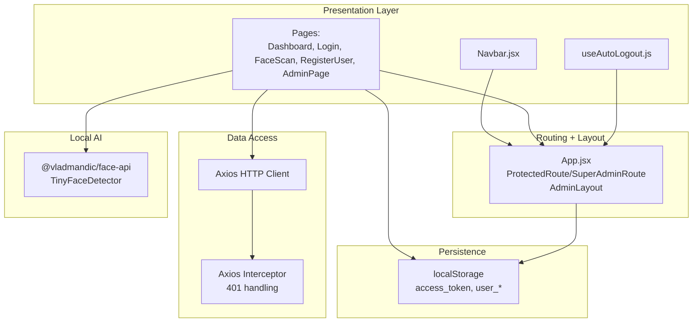

**Diagram sources**
- [App.jsx:18-44](file://src/App.jsx#L18-L44)
- [Navbar.jsx:1-158](file://src/components/Navbar.jsx#L1-L158)
- [useAutoLogout.js:19-68](file://src/hooks/useAutoLogout.js#L19-L68)
- [Dashboard.jsx:1-314](file://src/pages/Dashboard.jsx#L1-L314)
- [Login.jsx:61-100](file://src/pages/Login.jsx#L61-L100)
- [FaceScan.jsx:7-28](file://src/pages/FaceScan.jsx#L7-L28)
- [RegisterUser.jsx:7-56](file://src/pages/RegisterUser.jsx#L7-L56)
- [AdminPage.jsx:7-42](file://src/pages/AdminPage.jsx#L7-L42)

## Detailed Component Analysis

### Routing and Guards
- ProtectedRoute: Redirects unauthenticated users to login.
- SuperAdminRoute: Enforces super admin role; otherwise redirects to dashboard.
- AdminLayout: Provides a shared layout with Navbar and scrollable content area.

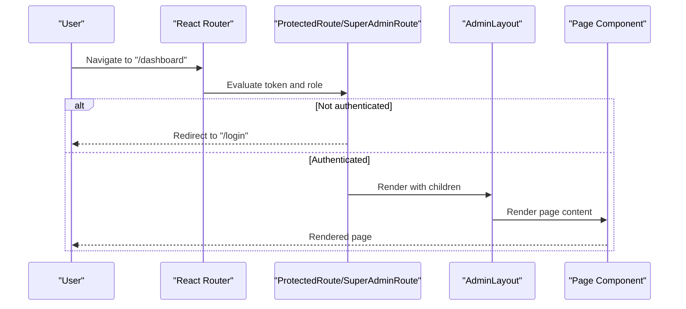

**Diagram sources**
- [App.jsx:18-44](file://src/App.jsx#L18-L44)

**Section sources**
- [App.jsx:18-44](file://src/App.jsx#L18-L44)

### Navigation and Layout
- Navbar displays role-aware menus, handles logout, and toggles master data dropdown.
- Uses Lucide icons and Tailwind classes for styling.
- Reads user metadata from localStorage to render dynamic header and menu items.

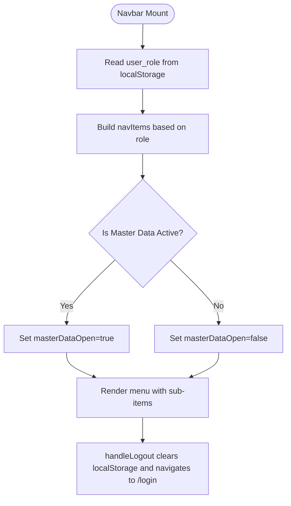

**Diagram sources**
- [Navbar.jsx:12-43](file://src/components/Navbar.jsx#L12-L43)

**Section sources**
- [Navbar.jsx:1-158](file://src/components/Navbar.jsx#L1-L158)

### Auto-Logout Hook
- Decodes JWT to compute remaining time.
- Sets a timeout to prompt logout when token expires.
- Clears localStorage and navigates to login upon confirmation.

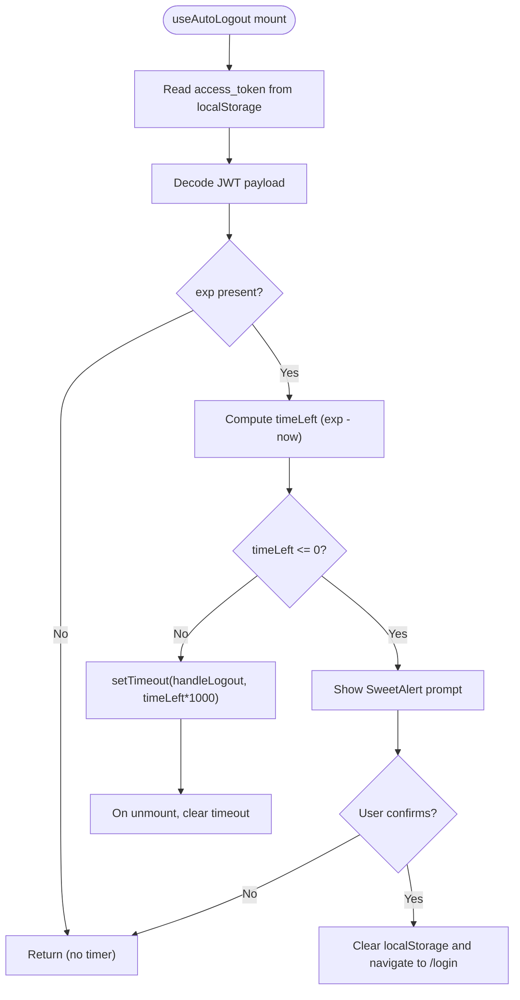

**Diagram sources**
- [useAutoLogout.js:19-68](file://src/hooks/useAutoLogout.js#L19-L68)

**Section sources**
- [useAutoLogout.js:1-68](file://src/hooks/useAutoLogout.js#L1-L68)

### Dashboard Page
- Manages report data with pagination, filtering, and CSV export.
- Uses useCallback to memoize fetch function and avoid unnecessary re-renders.
- Implements periodic polling via useEffect and cleanup intervals.
- Renders a responsive table with status badges and location indicators.

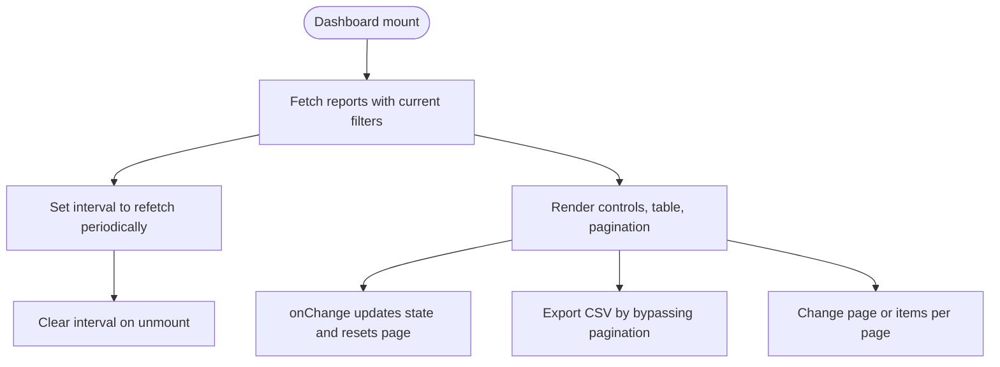

**Diagram sources**
- [Dashboard.jsx:18-48](file://src/pages/Dashboard.jsx#L18-L48)

**Section sources**
- [Dashboard.jsx:1-314](file://src/pages/Dashboard.jsx#L1-L314)

### Login Page
- Handles username/password submission with loading and error states.
- Stores access_token and user metadata in localStorage.
- Navigates to dashboard on successful login.

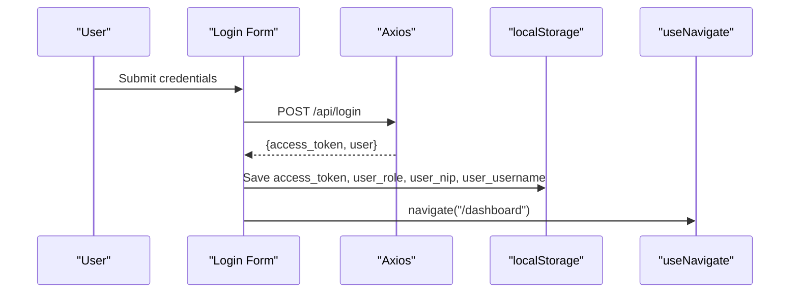

**Diagram sources**
- [Login.jsx:69-100](file://src/pages/Login.jsx#L69-L100)

**Section sources**
- [Login.jsx:1-553](file://src/pages/Login.jsx#L1-L553)

### FaceScan Page
- Loads TinyFaceDetector model from public models directory.
- Periodically detects faces via webcam and crops to square for consistent AI input.
- Sends cropped image to Flask backend for prediction and displays result.

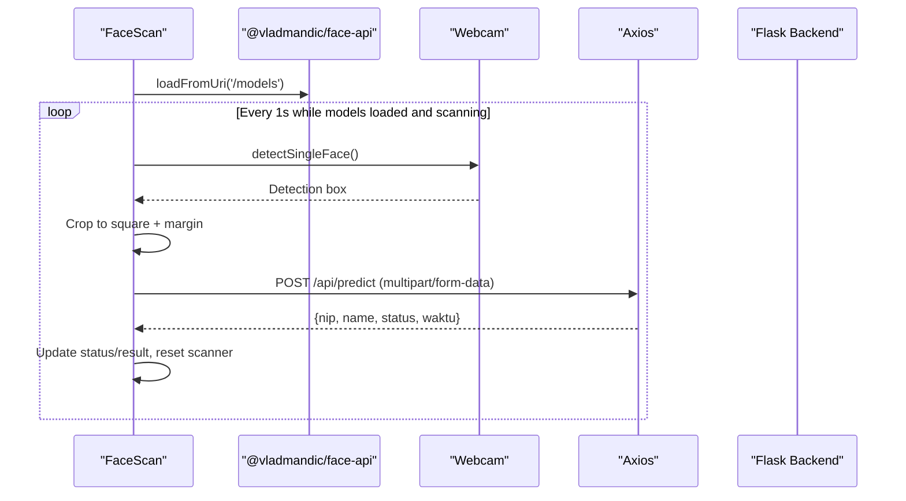

**Diagram sources**
- [FaceScan.jsx:14-28](file://src/pages/FaceScan.jsx#L14-L28)
- [FaceScan.jsx:87-141](file://src/pages/FaceScan.jsx#L87-L141)
- [FaceScan.jsx:38-85](file://src/pages/FaceScan.jsx#L38-L85)

**Section sources**
- [FaceScan.jsx:1-204](file://src/pages/FaceScan.jsx#L1-L204)

### RegisterUser Page
- Loads face detection models and captures 5 photos in different poses.
- Validates form fields and uploads photos with metadata to backend.

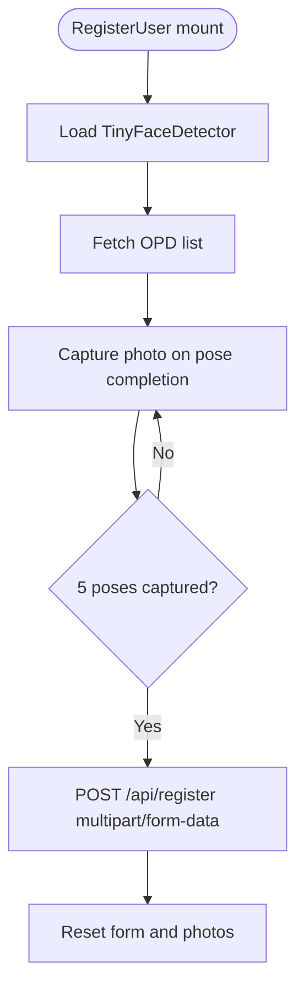

**Diagram sources**
- [RegisterUser.jsx:24-56](file://src/pages/RegisterUser.jsx#L24-L56)
- [RegisterUser.jsx:58-121](file://src/pages/RegisterUser.jsx#L58-L121)

**Section sources**
- [RegisterUser.jsx:1-274](file://src/pages/RegisterUser.jsx#L1-L274)

### AdminPage
- Fetches admins and OPDs concurrently.
- Implements search, add/edit/delete actions with modal dialogs.
- Uses memoization to filter admins efficiently.

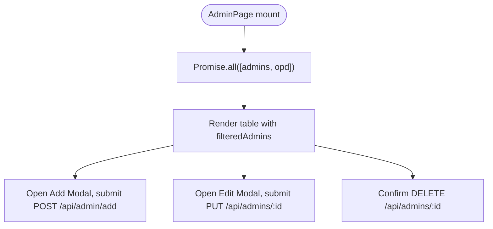

**Diagram sources**
- [AdminPage.jsx:31-42](file://src/pages/AdminPage.jsx#L31-L42)
- [AdminPage.jsx:17-25](file://src/pages/AdminPage.jsx#L17-L25)

**Section sources**
- [AdminPage.jsx:1-258](file://src/pages/AdminPage.jsx#L1-L258)

## Dependency Analysis
External dependencies and their roles:
- react, react-dom: Core framework.
- react-router-dom: Routing and navigation.
- axios: HTTP client with interceptors.
- lucide-react: UI icons.
- @vladmandic/face-api: Client-side face detection.
- react-webcam: Webcam capture.
- sweetalert2: Confirmation dialogs for logout and errors.
- tailwindcss: Utility-first CSS framework.

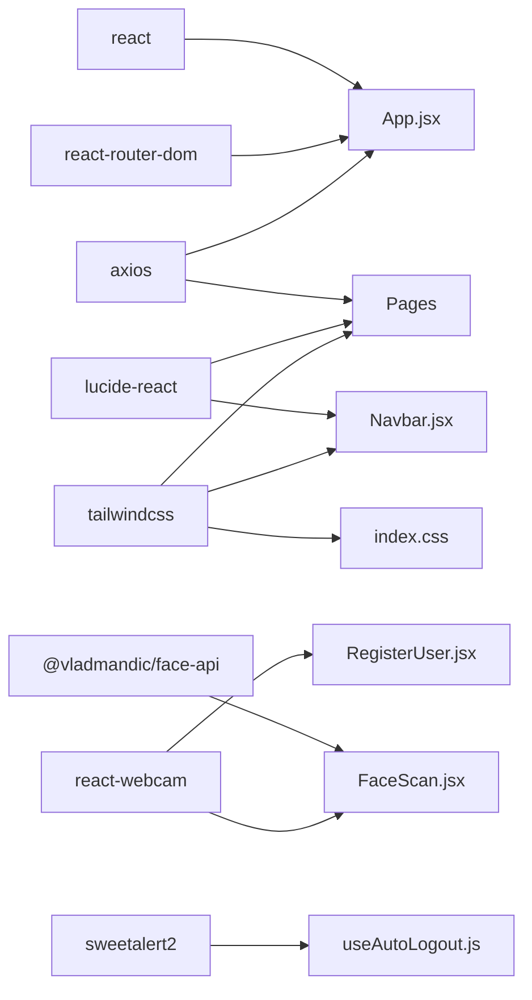

**Diagram sources**
- [package.json:12-21](file://package.json#L12-L21)
- [App.jsx:1-16](file://src/App.jsx#L1-L16)
- [Navbar.jsx:3](file://src/components/Navbar.jsx#L3)
- [FaceScan.jsx:2-5](file://src/pages/FaceScan.jsx#L2-L5)
- [RegisterUser.jsx:2-5](file://src/pages/RegisterUser.jsx#L2-L5)
- [useAutoLogout.js:3](file://src/hooks/useAutoLogout.js#L3)
- [index.css:1-3](file://src/index.css#L1-L3)

**Section sources**
- [package.json:12-21](file://package.json#L12-L21)
- [vite.config.js:1-8](file://vite.config.js#L1-L8)

## Performance Considerations
- Memoization: useCallback in Dashboard prevents unnecessary re-renders during fetch.
- Filtering: useMemo in AdminPage avoids recomputation when search query changes.
- Polling: Dashboard sets a 30-second interval; ensure throttling and cleanup on unmount.
- Image processing: FaceScan crops images to fixed size and uses high-quality JPEG to balance accuracy and bandwidth.
- Lazy loading: Consider code-splitting for heavy pages (e.g., Dashboard) using React.lazy and Suspense.
- Bundle size: Keep model assets minimal and preload only when needed.

[No sources needed since this section provides general guidance]

## Troubleshooting Guide
Common issues and resolutions:
- 401 Unauthorized: Axios interceptor triggers SweetAlert and clears localStorage; ensure token refresh logic is implemented on the backend.
- Token expiration: useAutoLogout prompts before redirect; verify JWT exp claim and network time sync.
- Webcam not working: Ensure HTTPS origin and permissions; verify model assets are served from /models.
- Dashboard not updating: Check interval cleanup and ensure filters reset page to 1.
- Login failures: Validate server response shape and error message handling.

**Section sources**
- [App.jsx:46-70](file://src/App.jsx#L46-L70)
- [useAutoLogout.js:45-64](file://src/hooks/useAutoLogout.js#L45-L64)
- [FaceScan.jsx:14-28](file://src/pages/FaceScan.jsx#L14-L28)
- [Dashboard.jsx:44-48](file://src/pages/Dashboard.jsx#L44-L48)
- [Login.jsx:91-100](file://src/pages/Login.jsx#L91-L100)

## Conclusion
The application demonstrates a clean separation of concerns with route guards, a shared layout, and reusable UI components. State management is primarily handled via React hooks and localStorage, while Axios interceptors centralize error handling. The architecture supports extension through modular pages, composable layouts, and hooks. For production readiness, consider code splitting, improved error boundaries, and robust token refresh mechanisms.

[No sources needed since this section summarizes without analyzing specific files]

## Appendices

### Component Composition Strategies
- Layout composition: AdminLayout wraps page components to share navigation and spacing.
- Conditional rendering: Role checks in Navbar and route guards ensure appropriate access.
- Event delegation: Navbar handles logout centrally; pages trigger axios requests.

**Section sources**
- [App.jsx:33-44](file://src/App.jsx#L33-L44)
- [Navbar.jsx:16-23](file://src/components/Navbar.jsx#L16-L23)

### Dependency Injection Patterns
- No explicit DI container; dependencies are imported directly.
- Hooks encapsulate cross-cutting concerns (auto-logout) and can be reused across components.
- Axios instances could be abstracted into a service module for easier testing and mocking.

**Section sources**
- [useAutoLogout.js:19-68](file://src/hooks/useAutoLogout.js#L19-L68)

### Testing Approaches
- Unit tests: Mock axios interceptors and localStorage for route guards and hooks.
- Integration tests: Snapshot tests for pages with realistic props; simulate user interactions (filters, modal open/close).
- E2E tests: Cypress or Playwright to automate login, navigation, and critical flows (scanning, registration).

[No sources needed since this section provides general guidance]

### Extending the Architecture
- Add a service layer for HTTP calls to centralize headers and error handling.
- Introduce a Redux/Zustand store for shared UI state (e.g., active tab, filters).
- Split large pages into smaller, focused components and use composition patterns.
- Implement lazy loading for heavy pages and preloading critical resources.

[No sources needed since this section provides general guidance]