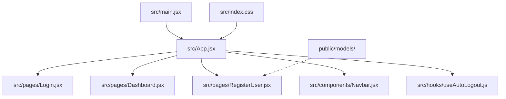
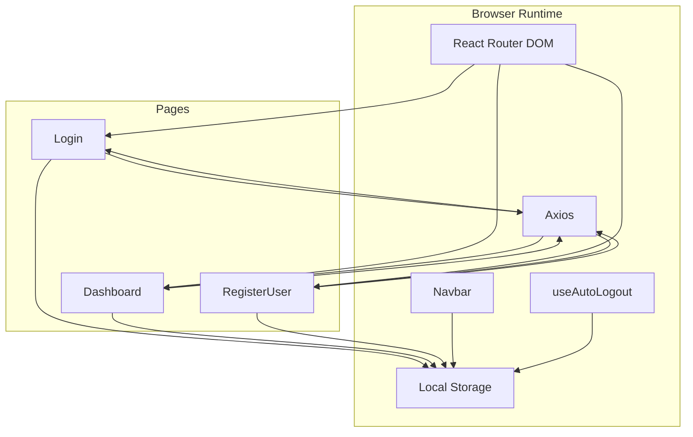
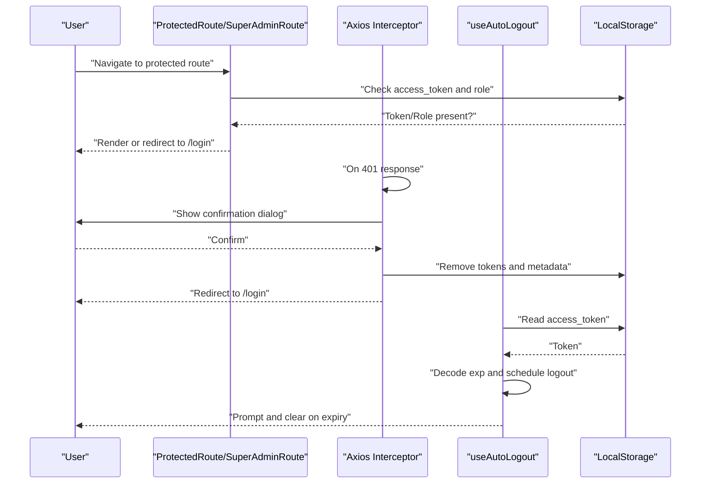
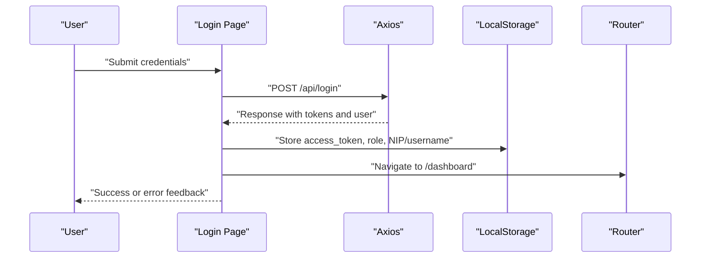
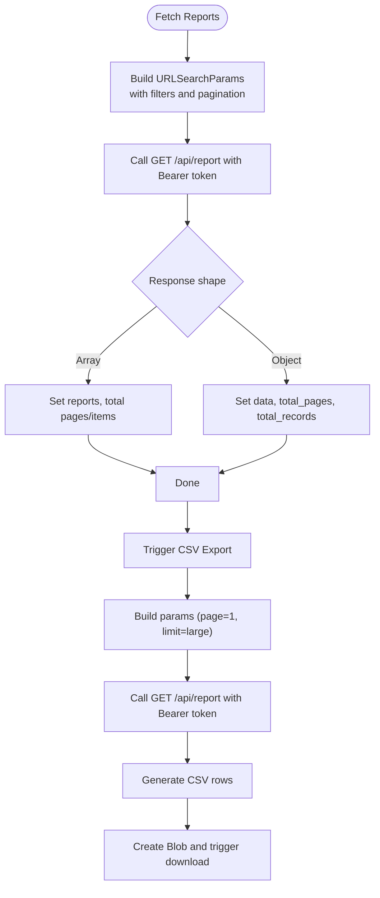
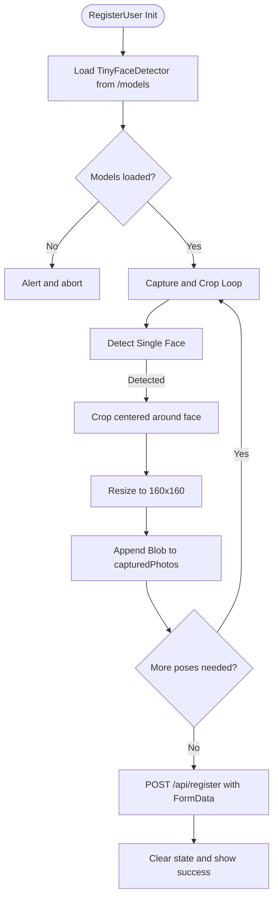
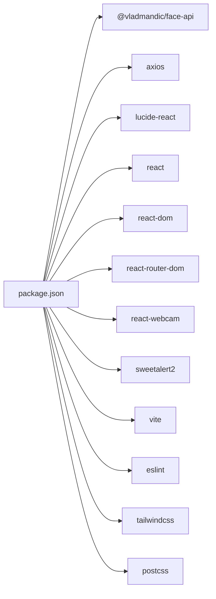

# Development Guidelines

<cite>
**Referenced Files in This Document**
- [package.json](file://package.json)
- [eslint.config.js](file://eslint.config.js)
- [vite.config.js](file://vite.config.js)
- [tailwind.config.js](file://tailwind.config.js)
- [postcss.config.js](file://postcss.config.js)
- [README.md](file://README.md)
- [.gitignore](file://.gitignore)
- [src/main.jsx](file://src/main.jsx)
- [src/App.jsx](file://src/App.jsx)
- [src/index.css](file://src/index.css)
- [src/components/Navbar.jsx](file://src/components/Navbar.jsx)
- [src/hooks/useAutoLogout.js](file://src/hooks/useAutoLogout.js)
- [src/pages/Login.jsx](file://src/pages/Login.jsx)
- [src/pages/Dashboard.jsx](file://src/pages/Dashboard.jsx)
- [src/pages/RegisterUser.jsx](file://src/pages/RegisterUser.jsx)
</cite>

## Table of Contents
1. [Introduction](#introduction)
2. [Project Structure](#project-structure)
3. [Core Components](#core-components)
4. [Architecture Overview](#architecture-overview)
5. [Detailed Component Analysis](#detailed-component-analysis)
6. [Dependency Analysis](#dependency-analysis)
7. [Performance Considerations](#performance-considerations)
8. [Troubleshooting Guide](#troubleshooting-guide)
9. [Code Review and Contribution Guidelines](#code-review-and-contribution-guidelines)
10. [Build and Deployment](#build-and-deployment)
11. [Extending Functionality](#extending-functionality)
12. [Conclusion](#conclusion)

## Introduction
This document provides comprehensive development guidelines for the React/Vite-based frontend of the Smart Presence facial recognition system. It covers code organization, best practices, linting and formatting standards, component development patterns, testing and debugging strategies, performance optimization, the Vite build pipeline, development server configuration, production deployment preparation, code review processes, contribution guidelines, maintenance procedures, and practical guidance for extending functionality while maintaining quality.

## Project Structure
The project follows a feature-based layout under src/, with clear separation of concerns:
- src/main.jsx: Application entry point mounting the root React element.
- src/App.jsx: Central routing and protected route logic, including interceptors and layouts.
- src/pages/: Feature pages implementing domain logic and UI.
- src/components/: Reusable UI components (e.g., Navbar).
- src/hooks/: Custom React hooks (e.g., useAutoLogout).
- Public assets and models are served from public/.
- Styling is configured via Tailwind CSS with PostCSS autoprefixing.

**Diagram sources**
- [src/main.jsx:1-11](file://src/main.jsx#L1-L11)
- [src/App.jsx:1-102](file://src/App.jsx#L1-L102)
- [src/pages/Login.jsx:1-553](file://src/pages/Login.jsx#L1-L553)
- [src/pages/Dashboard.jsx:1-200](file://src/pages/Dashboard.jsx#L1-L200)
- [src/pages/RegisterUser.jsx:1-200](file://src/pages/RegisterUser.jsx#L1-L200)
- [src/components/Navbar.jsx:1-158](file://src/components/Navbar.jsx#L1-L158)
- [src/hooks/useAutoLogout.js:1-68](file://src/hooks/useAutoLogout.js#L1-L68)
- [src/index.css:1-12](file://src/index.css#L1-L12)

**Section sources**
- [src/main.jsx:1-11](file://src/main.jsx#L1-L11)
- [src/App.jsx:1-102](file://src/App.jsx#L1-L102)
- [src/index.css:1-12](file://src/index.css#L1-L12)
- [README.md:24-33](file://README.md#L24-L33)

## Core Components
- Routing and Guards: ProtectedRoute and SuperAdminRoute enforce authentication and role-based access control using local storage tokens and user roles.
- Global Interceptor: Axios interceptor centralizes unauthorized session handling and redirects to login.
- Layout Wrapper: AdminLayout composes the sidebar and page content area with auto-logout integration.
- Navbar: Dynamic navigation with role-aware visibility, dropdown menus, and logout handling.
- Auto Logout Hook: JWT decoding and scheduled logout to enforce session timeouts.
- Pages:
  - Login: Handles credentials submission, stores tokens and user metadata, navigates on success.
  - Dashboard: Fetches paginated reports, supports filtering and CSV export, refreshes periodically.
  - RegisterUser: Client-side face detection using @vladmandic/face-api with guided pose capture and multi-part upload.

Key implementation references:
- [src/App.jsx:18-31](file://src/App.jsx#L18-L31)
- [src/App.jsx:46-70](file://src/App.jsx#L46-L70)
- [src/App.jsx:33-44](file://src/App.jsx#L33-L44)
- [src/components/Navbar.jsx:16-23](file://src/components/Navbar.jsx#L16-L23)
- [src/hooks/useAutoLogout.js:19-65](file://src/hooks/useAutoLogout.js#L19-L65)
- [src/pages/Login.jsx:69-100](file://src/pages/Login.jsx#L69-L100)
- [src/pages/Dashboard.jsx:18-48](file://src/pages/Dashboard.jsx#L18-L48)
- [src/pages/RegisterUser.jsx:59-88](file://src/pages/RegisterUser.jsx#L59-L88)

**Section sources**
- [src/App.jsx:18-70](file://src/App.jsx#L18-L70)
- [src/components/Navbar.jsx:16-158](file://src/components/Navbar.jsx#L16-L158)
- [src/hooks/useAutoLogout.js:19-65](file://src/hooks/useAutoLogout.js#L19-L65)
- [src/pages/Login.jsx:69-100](file://src/pages/Login.jsx#L69-L100)
- [src/pages/Dashboard.jsx:18-87](file://src/pages/Dashboard.jsx#L18-L87)
- [src/pages/RegisterUser.jsx:59-121](file://src/pages/RegisterUser.jsx#L59-L121)

## Architecture Overview
The frontend integrates React Router for navigation, Axios for API communication, and Tailwind CSS for styling. Authentication state is managed client-side with local storage, and session lifecycle is enforced via a custom hook and an Axios interceptor.

**Diagram sources**
- [src/App.jsx:1-102](file://src/App.jsx#L1-L102)
- [src/pages/Login.jsx:1-553](file://src/pages/Login.jsx#L1-L553)
- [src/pages/Dashboard.jsx:1-200](file://src/pages/Dashboard.jsx#L1-L200)
- [src/pages/RegisterUser.jsx:1-200](file://src/pages/RegisterUser.jsx#L1-L200)
- [src/components/Navbar.jsx:1-158](file://src/components/Navbar.jsx#L1-L158)
- [src/hooks/useAutoLogout.js:1-68](file://src/hooks/useAutoLogout.js#L1-L68)

## Detailed Component Analysis

### Authentication and Session Management
- ProtectedRoute and SuperAdminRoute guard routes based on presence of access_token and user role.
- Axios interceptor handles 401 responses globally, prompting a confirmation dialog and clearing local storage before redirecting to login.
- useAutoLogout decodes JWT expiration and schedules logout to enforce session timeouts.

**Diagram sources**
- [src/App.jsx:18-31](file://src/App.jsx#L18-L31)
- [src/App.jsx:46-70](file://src/App.jsx#L46-L70)
- [src/hooks/useAutoLogout.js:5-43](file://src/hooks/useAutoLogout.js#L5-L43)

**Section sources**
- [src/App.jsx:18-70](file://src/App.jsx#L18-L70)
- [src/hooks/useAutoLogout.js:5-65](file://src/hooks/useAutoLogout.js#L5-L65)

### Login Page Workflow
- Collects username/password, posts to backend, persists tokens and user metadata, then navigates to dashboard.
- Displays server-side error messages and network connectivity warnings.

**Diagram sources**
- [src/pages/Login.jsx:69-100](file://src/pages/Login.jsx#L69-L100)

**Section sources**
- [src/pages/Login.jsx:69-100](file://src/pages/Login.jsx#L69-L100)

### Dashboard Data Fetching and Export
- Periodic polling keeps data fresh; filters are applied via URL parameters.
- CSV export bypasses pagination to fetch all filtered records and downloads a CSV file.

**Diagram sources**
- [src/pages/Dashboard.jsx:18-48](file://src/pages/Dashboard.jsx#L18-L48)
- [src/pages/Dashboard.jsx:54-87](file://src/pages/Dashboard.jsx#L54-L87)

**Section sources**
- [src/pages/Dashboard.jsx:18-87](file://src/pages/Dashboard.jsx#L18-L87)

### Face Registration and Client-Side Detection
- Loads TinyFaceDetector models from public/models/.
- Guides the user through required poses, captures cropped images, and uploads them as multipart form data.

**Diagram sources**
- [src/pages/RegisterUser.jsx:43-56](file://src/pages/RegisterUser.jsx#L43-L56)
- [src/pages/RegisterUser.jsx:59-88](file://src/pages/RegisterUser.jsx#L59-L88)
- [src/pages/RegisterUser.jsx:90-121](file://src/pages/RegisterUser.jsx#L90-L121)

**Section sources**
- [src/pages/RegisterUser.jsx:43-121](file://src/pages/RegisterUser.jsx#L43-L121)

## Dependency Analysis
- Core runtime dependencies include React, React Router DOM, Axios, SweetAlert2, react-webcam, and @vladmandic/face-api.
- Dev tooling includes Vite, React plugin, ESLint, Tailwind CSS, PostCSS, and related TypeScript typings.

**Diagram sources**
- [package.json:12-21](file://package.json#L12-L21)
- [package.json:22-34](file://package.json#L22-L34)

**Section sources**
- [package.json:12-34](file://package.json#L12-L34)

## Performance Considerations
- Minimize re-renders by extracting callbacks with useCallback where appropriate (e.g., fetchReports in Dashboard).
- Debounce or throttle frequent UI updates (e.g., search input) to reduce unnecessary requests.
- Use lazy loading for heavy assets and defer non-critical model loads until needed.
- Prefer efficient state updates and avoid large object cloning in reducers or state setters.
- Leverage CSS containment and isolation for heavy pages to improve layout and paint performance.
- Keep model assets optimized and cacheable; ensure public models are served with proper caching headers.

[No sources needed since this section provides general guidance]

## Troubleshooting Guide
Common issues and resolutions:
- ESLint errors: Run the lint script to identify and fix violations; ensure editor integration is configured.
- Vite dev server not starting: Verify port availability and plugin configurations; check for missing environment variables.
- Tailwind styles not applying: Confirm content paths in Tailwind config and rebuild after changes.
- Axios 401 errors: Investigate token validity and interceptor behavior; ensure local storage cleanup on logout.
- Face detection failures: Verify model files are present in public/models and accessible; check camera permissions and lighting conditions.
- Navigation issues: Validate route guards and local storage keys; ensure correct role propagation.

**Section sources**
- [package.json:9](file://package.json#L9)
- [vite.config.js:1-8](file://vite.config.js#L1-L8)
- [tailwind.config.js:3-6](file://tailwind.config.js#L3-L6)
- [src/App.jsx:46-70](file://src/App.jsx#L46-L70)
- [src/pages/RegisterUser.jsx:43-56](file://src/pages/RegisterUser.jsx#L43-L56)

## Code Review and Contribution Guidelines
- Naming Conventions:
  - Components: PascalCase (e.g., Navbar, Login).
  - Hooks: useXxx pattern (e.g., useAutoLogout).
  - Files: Feature-specific names (e.g., Dashboard.jsx, RegisterUser.jsx).
- Code Organization:
  - Group related components and hooks under src/components and src/hooks respectively.
  - Place page-level logic under src/pages with minimal presentation concerns.
  - Keep shared UI in components; keep page logic in pages.
- Linting and Formatting:
  - Run the lint script regularly; resolve all reported issues before submitting PRs.
  - Maintain consistent import order and grouping.
- Testing:
  - Add unit tests for hooks and pure functions.
  - Add integration tests for page flows (e.g., login, registration).
  - Mock external APIs and timers appropriately.
- Security:
  - Never commit secrets; use environment variables for endpoints.
  - Sanitize inputs and validate payloads before sending to the backend.
- Documentation:
  - Add JSDoc comments for complex functions and hooks.
  - Keep component READMEs concise and focused on usage.

**Section sources**
- [eslint.config.js:1-30](file://eslint.config.js#L1-L30)
- [package.json:9](file://package.json#L9)

## Build and Deployment
- Scripts:
  - Development: npm run dev starts the Vite dev server.
  - Production build: npm run build generates optimized static assets.
  - Preview: npm run preview serves the built assets locally.
- Vite Configuration:
  - React plugin enabled; no additional overrides required for basic usage.
- Tailwind and PostCSS:
  - Tailwind content globs cover src/**/*.{js,ts,jsx,tsx}.
  - PostCSS pipeline includes Tailwind and Autoprefixer.
- Environment Variables:
  - Define API endpoints via environment variables for different environments.
- Deployment Preparation:
  - Serve dist/ via a static host or CDN.
  - Configure base path if deploying under a subpath.
  - Ensure public models are deployed and accessible at runtime.

**Section sources**
- [package.json:6-11](file://package.json#L6-L11)
- [vite.config.js:1-8](file://vite.config.js#L1-L8)
- [tailwind.config.js:3-15](file://tailwind.config.js#L3-L15)
- [postcss.config.js:1-7](file://postcss.config.js#L1-L7)

## Extending Functionality
- Adding a New Page:
  - Create a new file under src/pages/ with a descriptive name.
  - Implement route protection using existing guards (ProtectedRoute/SuperAdminRoute).
  - Integrate into App.jsx routes with appropriate layout wrappers.
- Adding a New Component:
  - Place reusable components under src/components/.
  - Keep props minimal and well-typed; favor composition over deep nesting.
- Integrating a New Feature:
  - Identify dependencies and add them to package.json.
  - Configure tooling (e.g., Tailwind plugins) if needed.
  - Write tests and update documentation.
- Maintaining Quality:
  - Follow established patterns (guards, interceptors, hooks).
  - Keep state management predictable; prefer centralized logic in hooks or pages.
  - Optimize rendering and minimize side effects in effects.

**Section sources**
- [src/App.jsx:72-99](file://src/App.jsx#L72-L99)
- [src/components/Navbar.jsx:1-158](file://src/components/Navbar.jsx#L1-L158)
- [package.json:12-34](file://package.json#L12-L34)

## Conclusion
These guidelines establish a consistent, maintainable, and secure development workflow for the Smart Presence frontend. By adhering to the outlined patterns—component organization, naming conventions, linting, testing, performance practices, and deployment preparation—you can efficiently extend functionality while preserving code quality and user experience.