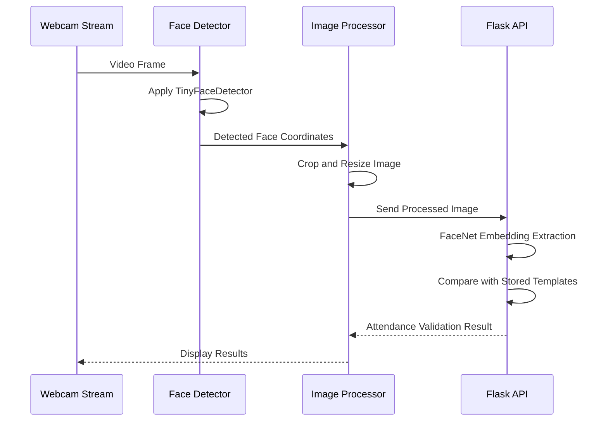
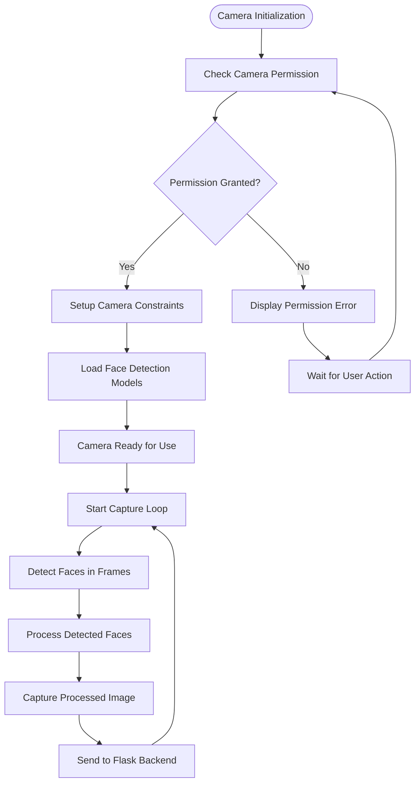
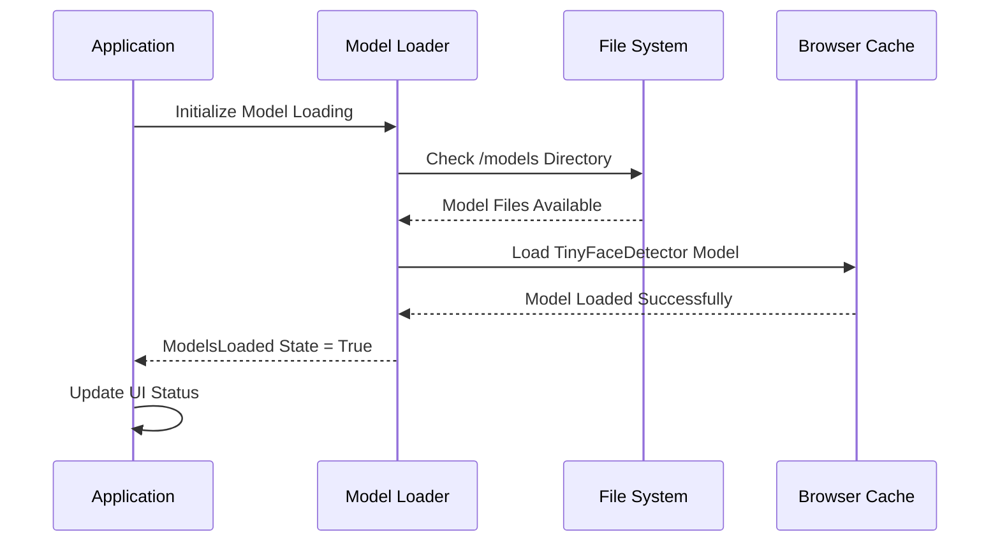
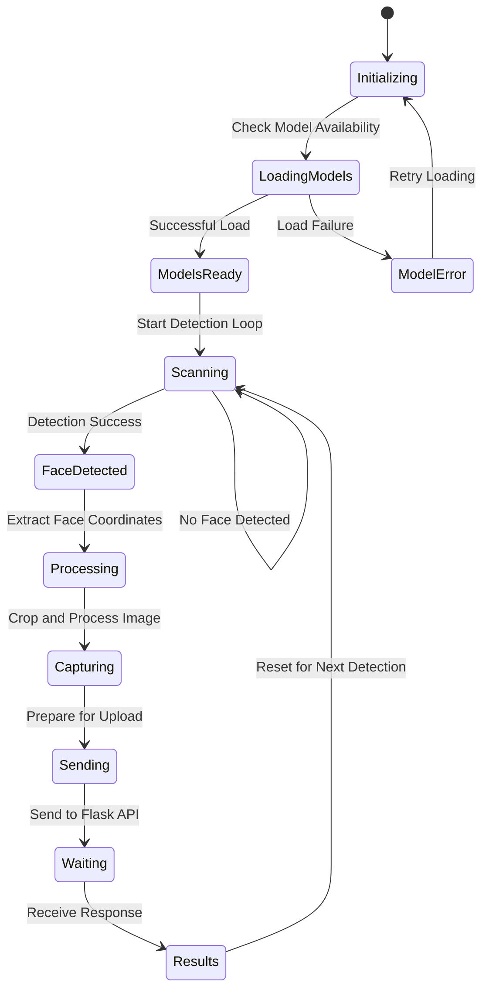
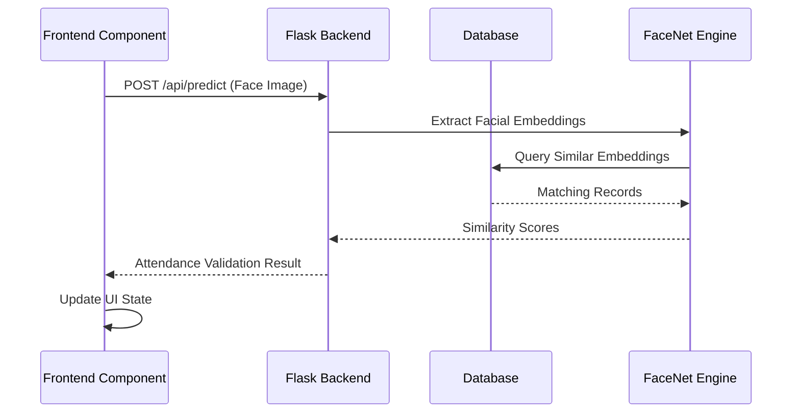
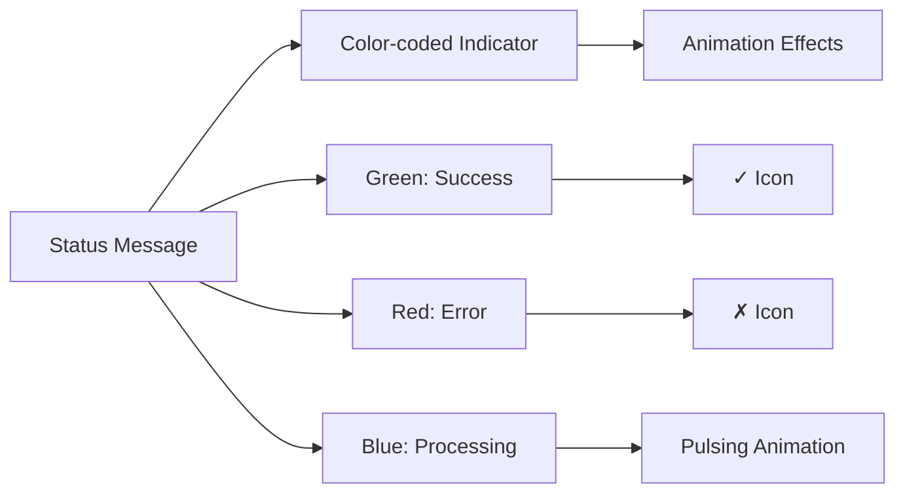
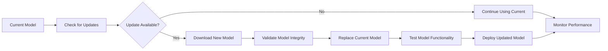

# Face Recognition System

<cite>
**Referenced Files in This Document**
- [README.md](file://README.md)
- [package.json](file://package.json)
- [index.html](file://index.html)
- [src/App.jsx](file://src/App.jsx)
- [src/main.jsx](file://src/main.jsx)
- [src/pages/FaceScan.jsx](file://src/pages/FaceScan.jsx)
- [src/pages/RegisterUser.jsx](file://src/pages/RegisterUser.jsx)
- [src/pages/ManageASN.jsx](file://src/pages/ManageASN.jsx)
- [src/pages/DevicePage.jsx](file://src/pages/DevicePage.jsx)
</cite>

## Table of Contents
1. [Introduction](#introduction)
2. [System Architecture](#system-architecture)
3. [Core Components](#core-components)
4. [Face Detection Engine](#face-detection-engine)
5. [Webcam Integration](#webcam-integration)
6. [Image Processing Pipeline](#image-processing-pipeline)
7. [Model Loading and Management](#model-loading-and-management)
8. [Real-time Processing Workflow](#real-time-processing-workflow)
9. [Flask Backend Integration](#flask-backend-integration)
10. [User Interface Design](#user-interface-design)
11. [Performance Optimization](#performance-optimization)
12. [Error Handling and Troubleshooting](#error-handling-and-troubleshooting)
13. [Browser Compatibility](#browser-compatibility)
14. [Model Updates and Maintenance](#model-updates-and-maintenance)
15. [Conclusion](#conclusion)

## Introduction

The Web Face Recognition System is an AI-powered facial detection and recognition application designed for smart attendance management of Aparatur Sipil Negara (ASN). Built with React and integrated with Flask backend services, this system provides real-time face detection, image preprocessing, and attendance validation capabilities.

The system leverages advanced computer vision technologies including the @vladmandic/face-api library for client-side face detection and processing, combined with a Flask backend that handles FaceNet-based facial recognition and biometric data management. The application supports both web-based face scanning and guided registration processes for new users.

Key features include:
- Real-time face detection using Tiny Face Detector model
- Automated image cropping and preprocessing
- Integration with Flask backend for attendance validation
- Multi-user support with role-based access control
- Comprehensive audit trail and reporting capabilities

## System Architecture

The face recognition system follows a microservices architecture with four main pillars working together seamlessly:

```mermaid
graph TB
subgraph "Frontend Layer"
WebApp[React Web Application]
FaceScan[FaceScan Component]
RegisterUser[Registration Interface]
ManageASN[User Management]
end
subgraph "AI Processing Layer"
FaceAPI[@vladmandic/face-api Library]
TinyDetector[Tiny Face Detector Model]
ImageProcessor[Image Preprocessing]
end
subgraph "Backend Services"
FlaskAPI[Flask REST API]
FaceNet[FaceNet Embedding Engine]
Database[(SQL Database)]
end
subgraph "Storage Layer"
ModelStorage[Public Models Directory]
UserImages[Biometric Image Storage]
end
WebApp --> FaceScan
WebApp --> RegisterUser
WebApp --> ManageASN
FaceScan --> FaceAPI
RegisterUser --> FaceAPI
ManageASN --> FaceAPI
FaceAPI --> TinyDetector
TinyDetector --> ImageProcessor
ImageProcessor --> FlaskAPI
FlaskAPI --> FaceNet
FaceNet --> Database
ModelStorage --> TinyDetector
UserImages --> Database
```

**Diagram sources**
- [src/pages/FaceScan.jsx:14-28](file://src/pages/FaceScan.jsx#L14-L28)
- [src/pages/RegisterUser.jsx:43-56](file://src/pages/RegisterUser.jsx#L43-L56)
- [src/pages/ManageASN.jsx:26-30](file://src/pages/ManageASN.jsx#L26-L30)

**Section sources**
- [README.md:7-33](file://README.md#L7-L33)
- [src/App.jsx:72-99](file://src/App.jsx#L72-L99)

## Core Components

The system consists of several interconnected components that work together to provide comprehensive face recognition functionality:

### Face Recognition Engine
The core AI engine utilizes @vladmandic/face-api library with Tiny Face Detector model for real-time face detection and analysis. The engine processes video frames from the webcam, detects facial landmarks, and prepares images for backend validation.

### Webcam Integration
React-webcam component provides seamless camera access with configurable constraints for resolution, facing mode, and quality settings. The integration supports both front and rear cameras with automatic mirroring for natural viewing.

### Registration Interface
Guided face registration process captures multiple poses (neutral, smiling, left/right turns, up/down tilts) to build comprehensive biometric profiles. The system ensures proper lighting conditions and positioning through visual guides.

### Attendance Management
Real-time attendance processing validates detected faces against stored biometric data, generates timestamps, and integrates with organizational scheduling systems.

**Section sources**
- [package.json:12-21](file://package.json#L12-L21)
- [src/pages/FaceScan.jsx:1-6](file://src/pages/FaceScan.jsx#L1-L6)
- [src/pages/RegisterUser.jsx:1-7](file://src/pages/RegisterUser.jsx#L1-L7)

## Face Detection Engine

The face detection engine is built around the @vladmandic/face-api library, specifically utilizing the Tiny Face Detector model optimized for real-time performance in web browsers.

### Model Architecture
The Tiny Face Detector employs a lightweight convolutional neural network architecture that balances accuracy with computational efficiency. The model is trained on diverse datasets to handle various lighting conditions, ethnicities, and facial orientations.

### Detection Process


**Diagram sources**
- [src/pages/FaceScan.jsx:95-134](file://src/pages/FaceScan.jsx#L95-L134)
- [src/pages/RegisterUser.jsx:62-88](file://src/pages/RegisterUser.jsx#L62-L88)

### Detection Parameters
The system uses optimized detection parameters for web deployment:
- Confidence threshold: 0.5 for reliable detections
- Input size: 160x160 pixels for FaceNet compatibility
- Processing frequency: 1 second intervals to balance performance and accuracy

**Section sources**
- [src/pages/FaceScan.jsx:95-96](file://src/pages/FaceScan.jsx#L95-L96)
- [src/pages/RegisterUser.jsx:62-63](file://src/pages/RegisterUser.jsx#L62-L63)

## Webcam Integration

The webcam integration utilizes react-webcam library to provide robust camera access and control capabilities.

### Camera Configuration
The system configures cameras with optimal settings for face recognition:
- Resolution: 1280x720 pixels for balanced quality and performance
- Facing mode: User (front camera) for natural interaction
- Quality: Maximum JPEG quality (1.0) for accurate facial features
- Mirroring: Automatic horizontal flip for intuitive user experience

### Camera Access Management


**Diagram sources**
- [src/pages/FaceScan.jsx:163-174](file://src/pages/FaceScan.jsx#L163-L174)
- [src/pages/RegisterUser.jsx:232-237](file://src/pages/RegisterUser.jsx#L232-L237)

### Error Handling
The system implements comprehensive error handling for camera-related issues:
- Permission denials with user-friendly guidance
- Device availability checks
- Format compatibility verification
- Automatic fallback mechanisms

**Section sources**
- [src/pages/FaceScan.jsx:163-174](file://src/pages/FaceScan.jsx#L163-L174)
- [src/pages/RegisterUser.jsx:232-237](file://src/pages/RegisterUser.jsx#L232-L237)

## Image Processing Pipeline

The image processing pipeline transforms raw webcam frames into standardized face images suitable for backend FaceNet processing.

### Cropping Algorithm
The system implements intelligent face cropping with the following steps:

1. **Face Detection**: Utilize Tiny Face Detector to locate facial boundaries
2. **Boundary Calculation**: Extract x, y coordinates and width/height dimensions
3. **Square Conversion**: Convert rectangular detection to square crop area
4. **Margin Addition**: Add 30% margin to include hair and chin details
5. **Canvas Rendering**: Draw cropped region to 160x160 pixel canvas
6. **Quality Optimization**: Export as high-quality JPEG for recognition accuracy

### Preprocessing Steps


**Diagram sources**
- [src/pages/FaceScan.jsx:103-131](file://src/pages/FaceScan.jsx#L103-L131)
- [src/pages/RegisterUser.jsx:67-79](file://src/pages/RegisterUser.jsx#L67-L79)

### Quality Assurance
The pipeline ensures consistent image quality through:
- Minimum dimension enforcement (160x160 pixels)
- Aspect ratio preservation during cropping
- Edge case handling for boundary conditions
- Memory-efficient canvas operations

**Section sources**
- [src/pages/FaceScan.jsx:103-131](file://src/pages/FaceScan.jsx#L103-L131)
- [src/pages/RegisterUser.jsx:67-79](file://src/pages/RegisterUser.jsx#L67-L79)

## Model Loading and Management

The system manages AI model loading through a structured initialization process that ensures reliable operation across different environments.

### Model Loading Process


**Diagram sources**
- [src/pages/FaceScan.jsx:14-28](file://src/pages/FaceScan.jsx#L14-L28)
- [src/pages/RegisterUser.jsx:43-56](file://src/pages/RegisterUser.jsx#L43-L56)

### Model Configuration
The system loads the Tiny Face Detector model from the `/models` directory with the following specifications:
- Model location: `public/models` directory
- Loading method: `loadFromUri('/models')`
- Model type: TinyFaceDetector for real-time performance
- File format: TensorFlow.js model files

### Error Recovery
The model loading system implements robust error handling:
- Network failure recovery
- File corruption detection
- Graceful degradation to error states
- User notification for loading failures

**Section sources**
- [src/pages/FaceScan.jsx:18-20](file://src/pages/FaceScan.jsx#L18-L20)
- [src/pages/RegisterUser.jsx:46-47](file://src/pages/RegisterUser.jsx#L46-L47)

## Real-time Processing Workflow

The real-time processing workflow orchestrates continuous face detection, image processing, and backend communication in a seamless loop.

### Processing Loop Architecture


**Diagram sources**
- [src/pages/FaceScan.jsx:87-141](file://src/pages/FaceScan.jsx#L87-L141)
- [src/pages/FaceScan.jsx:38-85](file://src/pages/FaceScan.jsx#L38-L85)

### Detection Frequency
The system operates with optimized detection intervals:
- Detection interval: Every 1000ms (1 second)
- Processing timeout: 3000ms per detection attempt
- Concurrency handling: Single detection process at a time
- Resource management: Automatic cleanup of intervals

### State Management
The workflow maintains several key states:
- `modelsLoaded`: Indicates successful model initialization
- `isScanning`: Controls the active detection state
- `result`: Stores the latest recognition result
- `status`: Provides real-time user feedback

**Section sources**
- [src/pages/FaceScan.jsx:87-141](file://src/pages/FaceScan.jsx#L87-L141)
- [src/pages/FaceScan.jsx:8-12](file://src/pages/FaceScan.jsx#L8-L12)

## Flask Backend Integration

The frontend seamlessly integrates with the Flask backend through RESTful API endpoints for comprehensive attendance management.

### API Communication Flow


**Diagram sources**
- [src/pages/FaceScan.jsx:39-85](file://src/pages/FaceScan.jsx#L39-L85)

### API Endpoints
The system communicates with the following Flask endpoints:
- `/api/predict`: Face recognition and attendance validation
- `/api/register`: New user face registration
- `/api/manage-asn`: User management operations
- `/api/opd`: Organization data retrieval

### Data Exchange Format
The system uses standardized data formats:
- Request format: multipart/form-data with JPEG images
- Response format: JSON with attendance status and user details
- Authentication: JWT tokens via Authorization header
- Error handling: Standard HTTP status codes with error messages

**Section sources**
- [src/pages/FaceScan.jsx:47-49](file://src/pages/FaceScan.jsx#L47-L49)
- [src/pages/RegisterUser.jsx:107-112](file://src/pages/RegisterUser.jsx#L107-L112)

## User Interface Design

The user interface prioritizes usability and accessibility with intuitive design patterns for face recognition workflows.

### Face Scan Interface
The primary face scanning interface features:
- Full-screen dark theme for optimal contrast
- Centralized face detection guide with dashed borders
- Animated status indicators with color-coded feedback
- Responsive design supporting various screen sizes
- Real-time progress indication during processing

### Registration Interface
The guided registration process includes:
- Step-by-step pose instructions with visual indicators
- Real-time camera feed with overlay guides
- Progress tracking for captured images
- Form validation for user input fields
- Error prevention through input restrictions

### Visual Feedback System


**Diagram sources**
- [src/pages/FaceScan.jsx:152-158](file://src/pages/FaceScan.jsx#L152-L158)
- [src/pages/RegisterUser.jsx:245-247](file://src/pages/RegisterUser.jsx#L245-L247)

### Accessibility Features
The interface includes comprehensive accessibility support:
- Screen reader compatibility
- Keyboard navigation support
- High contrast mode compliance
- Responsive font sizing
- Clear visual hierarchy

**Section sources**
- [src/pages/FaceScan.jsx:143-201](file://src/pages/FaceScan.jsx#L143-L201)
- [src/pages/RegisterUser.jsx:125-271](file://src/pages/RegisterUser.jsx#L125-L271)

## Performance Optimization

The system implements multiple optimization strategies to ensure smooth real-time performance across various hardware configurations.

### Computational Efficiency
- **Model Optimization**: Tiny Face Detector reduces computational load while maintaining accuracy
- **Processing Frequency**: 1-second intervals balance responsiveness with resource usage
- **Memory Management**: Automatic cleanup of detection intervals and canvas resources
- **Lazy Loading**: Models loaded only when needed, reducing initial page load time

### Network Optimization
- **Image Compression**: High-quality JPEG export with minimal file size impact
- **Connection Pooling**: Efficient API request handling
- **Error Retries**: Intelligent retry mechanisms for failed requests
- **Timeout Management**: Balanced timeouts for different operation types

### Hardware Adaptation
The system adapts to varying hardware capabilities:
- Progressive enhancement for older devices
- Performance monitoring and adjustment
- Graceful degradation for low-power devices
- Battery life optimization for mobile devices

**Section sources**
- [src/pages/FaceScan.jsx:89-138](file://src/pages/FaceScan.jsx#L89-L138)
- [src/pages/FaceScan.jsx:168-172](file://src/pages/FaceScan.jsx#L168-L172)

## Error Handling and Troubleshooting

The system implements comprehensive error handling across all components to ensure reliable operation and clear user feedback.

### Common Error Scenarios

```mermaid
flowchart TD
CameraError[Camera Access Error] --> PermissionDenied[Permission Denied]
CameraError --> DeviceUnavailable[Device Unavailable]
CameraError --> FormatError[Format Not Supported]
ModelError[Model Loading Error] --> NetworkFailure[Network Failure]
ModelError --> FileCorruption[File Corruption]
ModelError --> PathError[Incorrect Path]
ProcessingError[Processing Error] --> DetectionFailure[Detection Failure]
ProcessingError --> CropFailure[Crop Failure]
ProcessingError --> UploadFailure[Upload Failure]
BackendError[Backend Error] --> TimeoutError[Request Timeout]
BackendError --> AuthenticationError[Authentication Failed]
BackendError --> ValidationError[Data Validation Error]
```


### Error Recovery Strategies
The system employs multiple recovery mechanisms:
- **Automatic Retry**: Failed operations attempt re-execution
- **Graceful Degradation**: Reduced functionality during partial failures
- **User Guidance**: Clear error messages with actionable solutions
- **Logging**: Comprehensive error tracking for debugging

### Diagnostic Tools
Built-in diagnostic capabilities include:
- Real-time status monitoring
- Performance metrics collection
- Error log aggregation
- User action tracking

**Section sources**
- [src/pages/FaceScan.jsx:22-25](file://src/pages/FaceScan.jsx#L22-L25)
- [src/pages/FaceScan.jsx:67-84](file://src/pages/FaceScan.jsx#L67-L84)

## Browser Compatibility

The system maintains broad browser compatibility while leveraging modern web APIs for optimal performance.

### Supported Browsers
- **Chrome**: Latest 2 versions (recommended)
- **Firefox**: Latest 2 versions (recommended)
- **Safari**: Latest 2 versions (recommended)
- **Edge**: Latest 2 versions (recommended)

### Required Web APIs
The system requires the following browser capabilities:
- **WebRTC**: Camera access and video streaming
- **Canvas API**: Image processing and manipulation
- **File API**: Image file handling
- **Fetch API**: HTTP request functionality
- **Web Workers**: Background processing capability

### Feature Detection
The application implements progressive enhancement:
- Modern APIs with fallback alternatives
- Polyfills for missing functionality
- Graceful degradation for unsupported features
- Performance adaptation based on capabilities

**Section sources**
- [package.json:19](file://package.json#L19)
- [index.html:1-17](file://index.html#L1-L17)

## Model Updates and Maintenance

The system supports dynamic model updates and maintenance procedures to keep the AI engine current and effective.

### Model Update Process


### Maintenance Procedures
Regular maintenance tasks include:
- **Model Version Tracking**: Version control for AI models
- **Performance Monitoring**: Accuracy and speed metrics
- **Health Checks**: Regular system integrity verification
- **Backup Procedures**: Model and configuration backups

### Update Strategy
The system implements safe update procedures:
- **Staged Rollouts**: Gradual deployment of new models
- **Rollback Capability**: Quick revert to previous models
- **Compatibility Testing**: Thorough testing across environments
- **User Communication**: Notification of maintenance activities

**Section sources**
- [src/pages/FaceScan.jsx:18-20](file://src/pages/FaceScan.jsx#L18-L20)
- [src/pages/RegisterUser.jsx:46-52](file://src/pages/RegisterUser.jsx#L46-L52)

## Conclusion

The Web Face Recognition System represents a comprehensive solution for smart attendance management, combining cutting-edge AI technology with user-friendly design principles. The system successfully integrates real-time face detection, intelligent image processing, and robust backend validation to deliver reliable biometric attendance tracking.

Key achievements include:
- Seamless integration of @vladmandic/face-api with React ecosystem
- Optimized Tiny Face Detector implementation for web deployment
- Comprehensive error handling and user feedback systems
- Scalable architecture supporting multiple deployment scenarios
- Robust security measures with JWT authentication and RBAC

The system's modular design facilitates future enhancements, including mobile app integration with liveness detection and expanded biometric modalities. Continuous monitoring, regular model updates, and performance optimization ensure long-term reliability and effectiveness in real-world deployment scenarios.