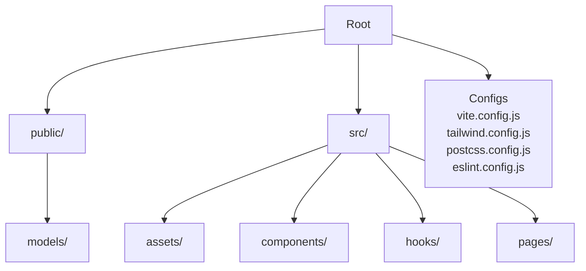
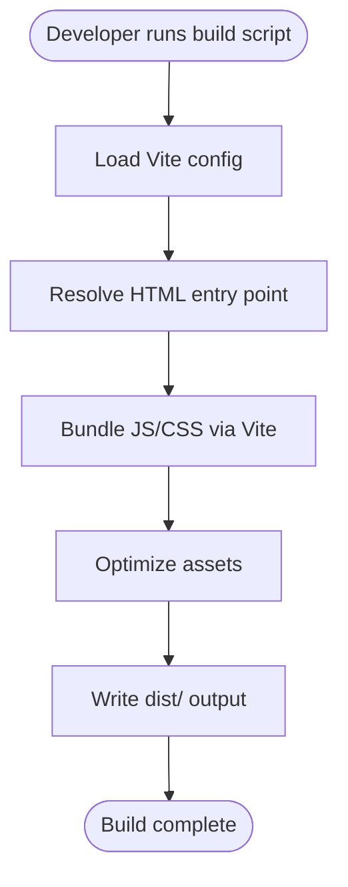
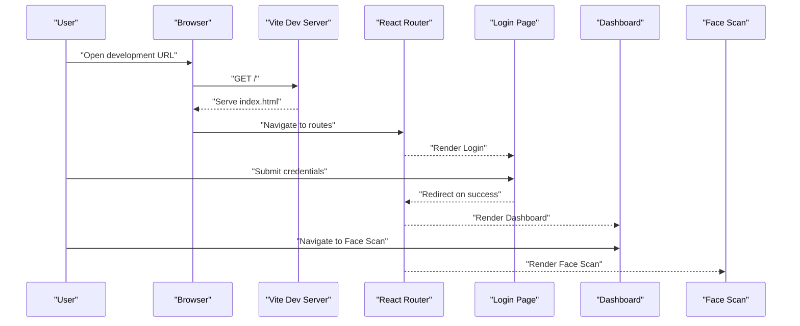

# Getting Started

<cite>
**Referenced Files in This Document**
- [README.md](file://README.md)
- [package.json](file://package.json)
- [vite.config.js](file://vite.config.js)
- [index.html](file://index.html)
- [src/main.jsx](file://src/main.jsx)
- [src/App.jsx](file://src/App.jsx)
- [src/pages/Login.jsx](file://src/pages/Login.jsx)
- [src/pages/Dashboard.jsx](file://src/pages/Dashboard.jsx)
- [src/pages/FaceScan.jsx](file://src/pages/FaceScan.jsx)
- [tailwind.config.js](file://tailwind.config.js)
- [postcss.config.js](file://postcss.config.js)
- [eslint.config.js](file://eslint.config.js)
</cite>

## Table of Contents
1. [Introduction](#introduction)
2. [Prerequisites](#prerequisites)
3. [Installation](#installation)
4. [Environment Setup](#environment-setup)
5. [Development Workflow](#development-workflow)
6. [Project Structure Overview](#project-structure-overview)
7. [Key Dependencies](#key-dependencies)
8. [Build Process with Vite](#build-process-with-vite)
9. [Running the Application](#running-the-application)
10. [Accessing Main Interfaces](#accessing-main-interfaces)
11. [Troubleshooting](#troubleshooting)
12. [IDE Recommendations](#ide-recommendations)
13. [Windows vs Cross-Platform Notes](#windows-vs-cross-platform-notes)
14. [Quick Start Examples](#quick-start-examples)
15. [Conclusion](#conclusion)

## Introduction
This guide helps you set up and run the React face recognition application locally. It covers prerequisites, installation, environment configuration, development server startup, project structure, key dependencies, build process using Vite, and how to access the main interfaces (Login, Dashboard, Face Scan). It also includes troubleshooting tips and development workflow recommendations.

## Prerequisites
- Node.js: Ensure you have a compatible version installed. Check the project's package configuration for the required Node.js version range.
- Package manager: Either npm or yarn. The project uses npm scripts, so either works.
- Git: Recommended for cloning the repository and managing updates.
- Modern web browser: Chrome, Firefox, Edge, or Safari for local development and testing.

**Section sources**
- [package.json](file://package.json)

## Installation
Follow these steps to install the project locally:

1. Clone the repository to your machine.
2. Open a terminal in the project root directory.
3. Install dependencies using your preferred package manager:
   - npm: Run the install script defined in the project configuration.
   - yarn: Run the equivalent yarn command.
4. Verify installation by checking that node_modules is populated and dependencies are resolved.

Notes:
- The project uses npm scripts for development and build commands.
- Ensure your network allows access to public registries if behind a corporate firewall.

**Section sources**
- [package.json](file://package.json)

## Environment Setup
Configure your development environment:

- Text editor or IDE: Choose a modern editor with React and JavaScript support.
- Browser: Use a recent version for debugging and testing.
- Optional: Configure ESLint and Prettier if your editor supports them.
- Optional: Set up Tailwind CSS IntelliSense for better DX.

**Section sources**
- [eslint.config.js](file://eslint.config.js)
- [tailwind.config.js](file://tailwind.config.js)

## Development Workflow
Recommended workflow for local development:

1. Start the development server using the configured npm script.
2. Make changes to components under src/.
3. Use hot module replacement to see updates instantly.
4. Test the application in your browser.
5. Commit changes using meaningful messages and push to your remote branch.

Tips:
- Keep dependencies updated periodically.
- Use feature branches for new features.
- Run lint checks before committing.

**Section sources**
- [package.json](file://package.json)

## Project Structure Overview
High-level layout of the project:

- public/: Static assets and pre-trained model files for face recognition.
- src/: Source code organized by feature:
  - assets/: Shared assets.
  - components/: Reusable UI components (e.g., Navbar).
  - hooks/: Custom React hooks (e.g., useAutoLogout).
  - pages/: Page-level components (Login, Dashboard, FaceScan, etc.).
- Root configs: Vite, Tailwind, PostCSS, ESLint, and HTML entry point.

**Diagram sources**
- [vite.config.js](file://vite.config.js)
- [tailwind.config.js](file://tailwind.config.js)
- [postcss.config.js](file://postcss.config.js)
- [eslint.config.js](file://eslint.config.js)
- [index.html](file://index.html)

**Section sources**
- [index.html](file://index.html)
- [src/main.jsx](file://src/main.jsx)
- [src/App.jsx](file://src/App.jsx)

## Key Dependencies
Core dependencies and their roles:

- React and React DOM: UI framework and renderer.
- Vite: Fast build tool and dev server.
- Tailwind CSS: Utility-first CSS framework.
- PostCSS: Transformations for CSS.
- ESLint: Linting for JavaScript/JSX.
- @vladmandic/face-api: Face detection and recognition models.
- Other supporting libraries for UI and utilities.

Notes:
- Review the package manifest for exact versions and optional dependencies.
- Some packages may require native dependencies; ensure your platform is supported.

**Section sources**
- [package.json](file://package.json)

## Build Process with Vite
How Vite builds the project:

- Entry point: The HTML file defines the app container and loads built assets.
- Dev server: Serves the app locally with hot reload.
- Build output: Produces optimized static assets for production deployment.
- Configurations: Vite, Tailwind, and PostCSS configs control bundling and styling.

**Diagram sources**
- [vite.config.js](file://vite.config.js)
- [index.html](file://index.html)
- [tailwind.config.js](file://tailwind.config.js)
- [postcss.config.js](file://postcss.config.js)

**Section sources**
- [vite.config.js](file://vite.config.js)
- [index.html](file://index.html)

## Running the Application
Start the development server:

1. From the project root, run the development script defined in the package manifest.
2. The dev server starts and prints the local URL and port.
3. Open the printed URL in your browser to access the app.

Port configuration:
- The dev server listens on a configurable port. If the default port is in use, the server typically selects another available port automatically.

Notes:
- Ensure no conflicting applications are using the same port.
- On Windows, antivirus or firewall might block ports; temporarily disable or configure exceptions if needed.

**Section sources**
- [package.json](file://package.json)
- [vite.config.js](file://vite.config.js)

## Accessing Main Interfaces
Once the development server is running, navigate to the following locations in your browser:

- Login page: Entry point for authentication.
- Dashboard: Main application interface after login.
- Face Scan: Dedicated page for face recognition scanning.

**Diagram sources**
- [src/pages/Login.jsx](file://src/pages/Login.jsx)
- [src/pages/Dashboard.jsx](file://src/pages/Dashboard.jsx)
- [src/pages/FaceScan.jsx](file://src/pages/FaceScan.jsx)
- [src/App.jsx](file://src/App.jsx)

**Section sources**
- [src/pages/Login.jsx](file://src/pages/Login.jsx)
- [src/pages/Dashboard.jsx](file://src/pages/Dashboard.jsx)
- [src/pages/FaceScan.jsx](file://src/pages/FaceScan.jsx)
- [src/App.jsx](file://src/App.jsx)

## Troubleshooting
Common setup and runtime issues:

- Port conflicts:
  - Symptom: Server fails to start or exits immediately.
  - Resolution: Change the dev server port in the Vite configuration or kill the process using the conflicting port.
- Network or proxy issues:
  - Symptom: Dependency downloads fail.
  - Resolution: Configure npm/yarn proxy or retry in a stable network environment.
- Model loading errors:
  - Symptom: Face recognition models fail to load.
  - Resolution: Ensure model files exist in the public/models directory and are accessible at runtime.
- Browser compatibility:
  - Symptom: Features not working in older browsers.
  - Resolution: Use a modern browser or add polyfills if necessary.
- ESLint or formatting errors:
  - Symptom: Lint warnings or errors during development.
  - Resolution: Fix reported issues or configure your editor to auto-format/save.

**Section sources**
- [vite.config.js](file://vite.config.js)
- [public/models](file://public/models)
- [eslint.config.js](file://eslint.config.js)

## IDE Recommendations
Recommended IDEs and extensions for React development:

- VS Code:
  - Extensions: ES7+ React/Redux/React-Native snippets, Tailwind CSS IntelliSense, ESLint.
  - Debugger: Use the built-in debugger with Vite.
- WebStorm:
  - Built-in support for React, Vite, and Tailwind CSS.
- Sublime Text or Atom:
  - With React and JSX plugins.

Tips:
- Enable ESLint and Prettier integrations.
- Configure the editor to show trailing whitespace and unused imports.

**Section sources**
- [eslint.config.js](file://eslint.config.js)
- [tailwind.config.js](file://tailwind.config.js)

## Windows vs Cross-Platform Notes
Platform-specific considerations:

- Windows:
  - Antivirus/firewall may block the dev server port; adjust settings if needed.
  - Use PowerShell or Command Prompt; WSL2 is recommended for Unix-like commands.
  - Ensure Node.js and Git are added to PATH.
- macOS/Linux:
  - Use terminal and shell of choice.
  - Ensure proper permissions for executable scripts.
- Cross-platform:
  - Prefer npm scripts for portability.
  - Avoid OS-specific absolute paths in configurations.

**Section sources**
- [package.json](file://package.json)
- [vite.config.js](file://vite.config.js)

## Quick Start Examples
Local setup and first run:

- Install dependencies:
  - npm: Run the install script defined in the package manifest.
  - yarn: Run the equivalent yarn command.
- Start the dev server:
  - Run the development script defined in the package manifest.
  - Open the printed URL in your browser.
- Access interfaces:
  - Login: Navigate to the login route.
  - Dashboard: View after successful login.
  - Face Scan: Navigate to the face scan route.

**Section sources**
- [package.json](file://package.json)
- [vite.config.js](file://vite.config.js)
- [src/pages/Login.jsx](file://src/pages/Login.jsx)
- [src/pages/Dashboard.jsx](file://src/pages/Dashboard.jsx)
- [src/pages/FaceScan.jsx](file://src/pages/FaceScan.jsx)

## Conclusion
You now have the essentials to set up, run, and develop the React face recognition application locally. Use the development server for rapid iteration, follow the project structure to locate components, and leverage Vite for fast builds. Refer to the troubleshooting section for common issues and consult the project’s configuration files for advanced customization.