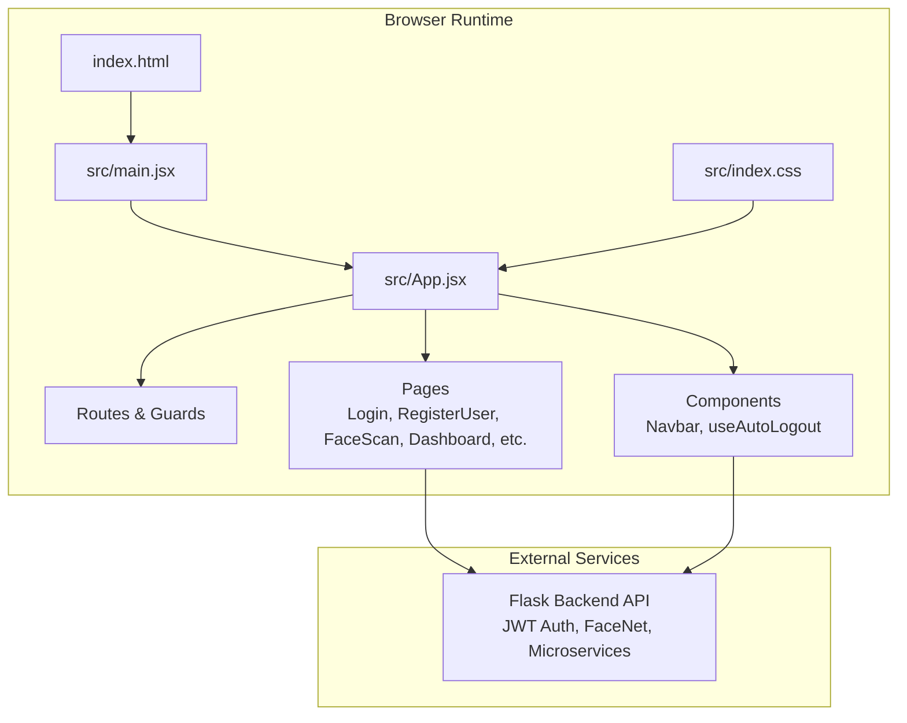
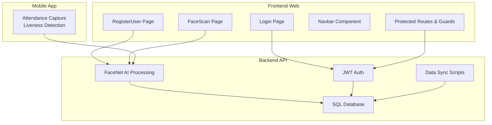
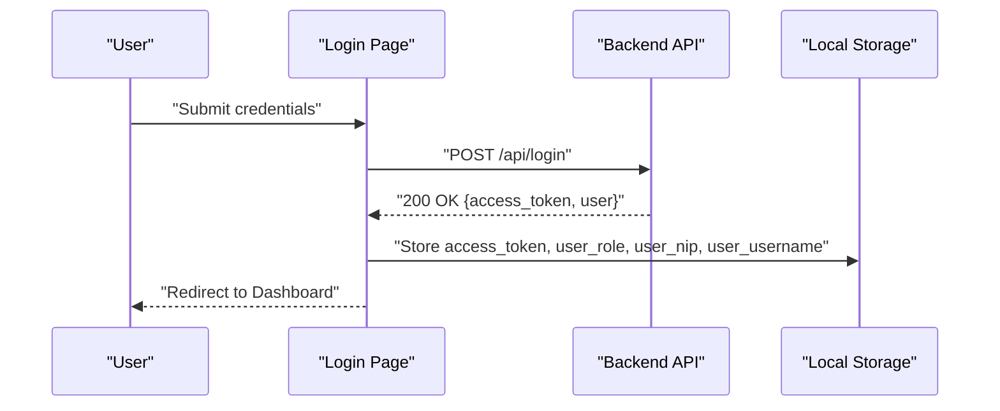
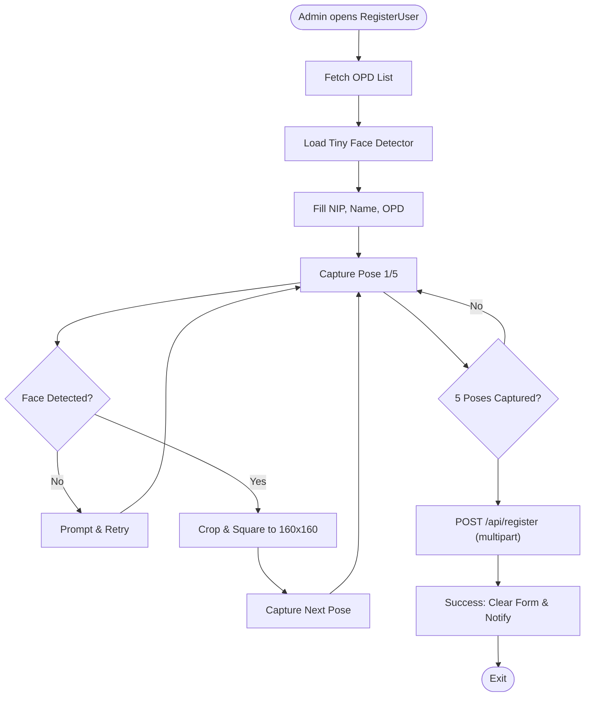
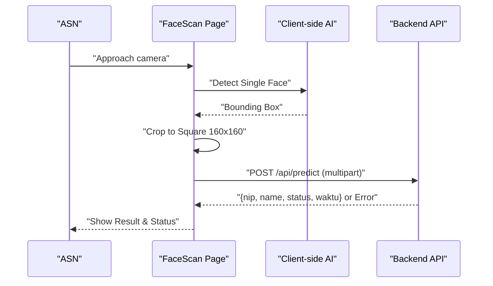
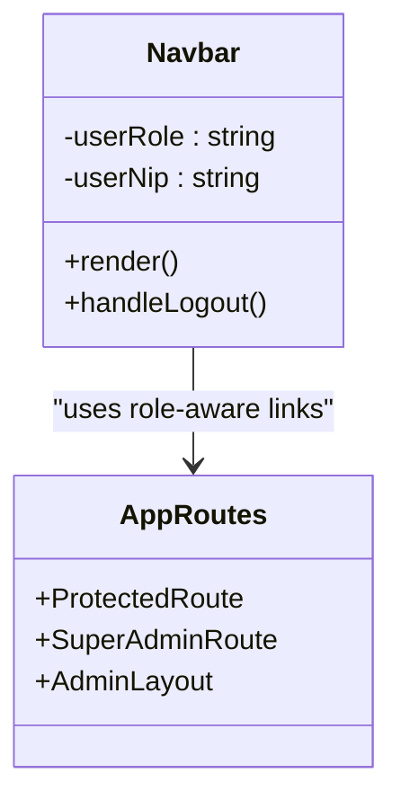
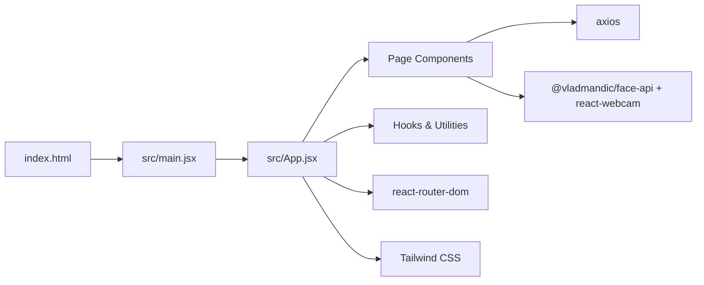

# Project Overview

<cite>
**Referenced Files in This Document**
- [README.md](file://README.md)
- [package.json](file://package.json)
- [index.html](file://index.html)
- [src/index.css](file://src/index.css)
- [src/App.jsx](file://src/App.jsx)
- [src/main.jsx](file://src/main.jsx)
- [src/pages/Login.jsx](file://src/pages/Login.jsx)
- [src/pages/RegisterUser.jsx](file://src/pages/RegisterUser.jsx)
- [src/pages/FaceScan.jsx](file://src/pages/FaceScan.jsx)
- [src/components/Navbar.jsx](file://src/components/Navbar.jsx)
- [src/hooks/useAutoLogout.js](file://src/hooks/useAutoLogout.js)
</cite>

## Table of Contents
1. [Introduction](#introduction)
2. [Project Structure](#project-structure)
3. [Core Components](#core-components)
4. [Architecture Overview](#architecture-overview)
5. [Detailed Component Analysis](#detailed-component-analysis)
6. [Dependency Analysis](#dependency-analysis)
7. [Performance Considerations](#performance-considerations)
8. [Troubleshooting Guide](#troubleshooting-guide)
9. [Conclusion](#conclusion)

## Introduction
Smart Presensi is a biometric attendance management solution designed for government institutions, focusing on Aparatur Sipil Negara (ASN). It integrates FaceNet AI for facial recognition, JWT-based authentication with role-based access control, and a microservices-oriented architecture. The system supports multi-instance data isolation and provides both a responsive web interface and a companion mobile application under development.

Key goals:
- Digitally transform government operations by automating accurate, tamper-resistant attendance.
- Enable administrators to manage ASN biometric profiles and OPD (Organisasi Perangkat Daerah) data.
- Deliver secure, scalable, and auditable attendance workflows with real-time feedback.

Target users:
- Super Admin: Full system administration, master data management, audit trail oversight, and device configuration.
- OPD Admin: ASN management, schedule creation, and dashboard reporting within their OPD.
- ASN (Employees): Self-service profile management and attendance via web or mobile.

## Project Structure
The frontend is a React application built with Vite, styled using Tailwind CSS, and routed with react-router-dom. It communicates with a backend service over RESTful APIs and leverages client-side AI for guided biometric enrollment and live scanning.

**Diagram sources**
- [index.html:1-18](file://index.html#L1-L18)
- [src/main.jsx:1-11](file://src/main.jsx#L1-L11)
- [src/App.jsx:1-102](file://src/App.jsx#L1-L102)
- [src/index.css:1-12](file://src/index.css#L1-L12)

**Section sources**
- [README.md:1-42](file://README.md#L1-L42)
- [package.json:1-40](file://package.json#L1-L40)
- [index.html:1-18](file://index.html#L1-L18)
- [src/index.css:1-12](file://src/index.css#L1-L12)

## Core Components
- Authentication and Routing
  - JWT-based login stores tokens and user roles in local storage and enforces route guards for protected and super-admin-only routes.
  - Automatic session expiration handling with SweetAlert prompts and forced logout.
- Biometric Enrollment (Web)
  - Guided multi-pose capture using client-side AI to collect 5 face samples per ASN.
  - Submission of multipart form data to the backend for FaceNet embedding generation and storage.
- Live Attendance Scanning (Web)
  - Real-time webcam scanning with client-side cropping and upload to backend prediction endpoint.
  - Immediate feedback for successful matches, mismatches, and policy violations.
- Administrative Interface
  - Dashboard, ASN management, OPD administration, audit trail, and system settings accessible via role-aware navigation.

**Section sources**
- [src/App.jsx:18-71](file://src/App.jsx#L18-L71)
- [src/pages/Login.jsx:69-100](file://src/pages/Login.jsx#L69-L100)
- [src/hooks/useAutoLogout.js:19-67](file://src/hooks/useAutoLogout.js#L19-L67)
- [src/pages/RegisterUser.jsx:59-121](file://src/pages/RegisterUser.jsx#L59-L121)
- [src/pages/FaceScan.jsx:39-85](file://src/pages/FaceScan.jsx#L39-L85)
- [src/components/Navbar.jsx:25-43](file://src/components/Navbar.jsx#L25-L43)

## Architecture Overview
Smart Presensi follows a four-pillar architecture:
- Backend (Python / Flask): Central computation and security gateway, implementing JWT authentication, RBAC, FaceNet AI processing, and data synchronization scripts.
- Database (Relational SQL): Stores master data (OPD, ASN, devices) and partitioned transactional presence logs, with strict audit trails.
- Frontend Web (React / Vite): Administrative portal with guided biometric enrollment and live scanning, Tailwind-styled UI, and responsive layout.
- Mobile App (Flutter) – Under development: Native liveness detection and camera integration for field attendance.

**Diagram sources**
- [README.md:7-34](file://README.md#L7-L34)
- [src/pages/Login.jsx:75-89](file://src/pages/Login.jsx#L75-L89)
- [src/pages/RegisterUser.jsx:107-112](file://src/pages/RegisterUser.jsx#L107-L112)
- [src/pages/FaceScan.jsx:47-49](file://src/pages/FaceScan.jsx#L47-L49)

## Detailed Component Analysis

### Authentication and Session Management
- Login flow posts credentials to the backend, receives a JWT access token, and persists user role, NIP, and username in local storage.
- Global Axios interceptor handles unauthorized responses by prompting auto-logout.
- Route guards enforce access based on role: standard protected routes and super-admin-only routes.

**Diagram sources**
- [src/pages/Login.jsx:75-89](file://src/pages/Login.jsx#L75-L89)
- [src/App.jsx:47-70](file://src/App.jsx#L47-L70)

**Section sources**
- [src/pages/Login.jsx:69-100](file://src/pages/Login.jsx#L69-L100)
- [src/App.jsx:18-31](file://src/App.jsx#L18-L31)
- [src/App.jsx:47-70](file://src/App.jsx#L47-L70)
- [src/hooks/useAutoLogout.js:19-67](file://src/hooks/useAutoLogout.js#L19-L67)

### Biometric Registration Workflow (Web)
- Admin selects OPD, enters NIP and name, then captures 5 pose samples using client-side AI.
- Photos are cropped to a square format and sent as multipart form data to the backend for embedding generation and storage.

**Diagram sources**
- [src/pages/RegisterUser.jsx:24-41](file://src/pages/RegisterUser.jsx#L24-L41)
- [src/pages/RegisterUser.jsx:44-56](file://src/pages/RegisterUser.jsx#L44-L56)
- [src/pages/RegisterUser.jsx:59-88](file://src/pages/RegisterUser.jsx#L59-L88)
- [src/pages/RegisterUser.jsx:107-121](file://src/pages/RegisterUser.jsx#L107-L121)

**Section sources**
- [src/pages/RegisterUser.jsx:1-274](file://src/pages/RegisterUser.jsx#L1-L274)

### Live Attendance Scanning Workflow (Web)
- The scanner loads a lightweight face detector, continuously checks for a single face, crops it to a square, and sends it to the prediction endpoint.
- Results include matched ASN identity and status message; errors surface policy or connectivity issues.

**Diagram sources**
- [src/pages/FaceScan.jsx:14-28](file://src/pages/FaceScan.jsx#L14-L28)
- [src/pages/FaceScan.jsx:88-141](file://src/pages/FaceScan.jsx#L88-L141)
- [src/pages/FaceScan.jsx:39-85](file://src/pages/FaceScan.jsx#L39-L85)

**Section sources**
- [src/pages/FaceScan.jsx:1-204](file://src/pages/FaceScan.jsx#L1-L204)

### Navigation and Role-Aware Access
- The Navbar displays role-specific menus and toggles master data submenus for Super Admin.
- Route guards ensure only authorized users can access sensitive areas.

**Diagram sources**
- [src/components/Navbar.jsx:1-158](file://src/components/Navbar.jsx#L1-L158)
- [src/App.jsx:18-44](file://src/App.jsx#L18-L44)

**Section sources**
- [src/components/Navbar.jsx:25-43](file://src/components/Navbar.jsx#L25-L43)
- [src/App.jsx:72-99](file://src/App.jsx#L72-L99)

## Dependency Analysis
- Frontend dependencies include React, react-router-dom, axios, @vladmandic/face-api for client-side AI, react-webcam for camera access, and Tailwind CSS for styling.
- The app bootstraps via index.html and mounts the React root in main.jsx, applying global styles from index.css.

**Diagram sources**
- [index.html:1-18](file://index.html#L1-L18)
- [src/main.jsx:1-11](file://src/main.jsx#L1-L11)
- [src/App.jsx:1-17](file://src/App.jsx#L1-L17)
- [package.json:12-21](file://package.json#L12-L21)

**Section sources**
- [package.json:12-39](file://package.json#L12-L39)
- [index.html:1-18](file://index.html#L1-L18)
- [src/main.jsx:1-11](file://src/main.jsx#L1-L11)
- [src/index.css:1-12](file://src/index.css#L1-L12)

## Performance Considerations
- Client-side AI reduces server load during enrollment and scanning by performing detection and cropping locally.
- Image cropping to a fixed square size ensures consistent input for FaceNet processing.
- Partitioned transactional tables and targeted queries support scalability for large datasets.
- JWT expiry enforcement prevents stale sessions and improves security.

## Troubleshooting Guide
- Login failures: Verify network connectivity and backend availability; check error messages returned by the login endpoint.
- Auto-logout prompts: Occur when the JWT expires; re-authentication is required.
- Webcam or AI model loading issues: Confirm model assets are present and accessible; ensure HTTPS or localhost usage for media permissions.
- Registration errors: Ensure all required fields are filled, OPD selection is valid, and 5 poses were captured successfully.

**Section sources**
- [src/pages/Login.jsx:91-100](file://src/pages/Login.jsx#L91-L100)
- [src/hooks/useAutoLogout.js:45-67](file://src/hooks/useAutoLogout.js#L45-L67)
- [src/pages/RegisterUser.jsx:44-56](file://src/pages/RegisterUser.jsx#L44-L56)
- [src/pages/FaceScan.jsx:22-28](file://src/pages/FaceScan.jsx#L22-L28)

## Conclusion
Smart Presensi delivers a secure, scalable, and user-friendly biometric attendance platform tailored for government institutions. Its four-pillar architecture—backend, database, web frontend, and mobile app—ensures robust digital transformation of ASN attendance operations. With FaceNet AI, JWT authentication, and role-based access control, the system supports accurate, auditable, and tamper-resistant presence tracking while offering intuitive administrative tools for Super Admins and OPD Admins alike.