# Styling & UI/UX

<cite>
**Referenced Files in This Document**
- [tailwind.config.js](file://tailwind.config.js)
- [postcss.config.js](file://postcss.config.js)
- [package.json](file://package.json)
- [src/index.css](file://src/index.css)
- [src/App.jsx](file://src/App.jsx)
- [src/components/Navbar.jsx](file://src/components/Navbar.jsx)
- [src/pages/Login.jsx](file://src/pages/Login.jsx)
- [src/pages/Dashboard.jsx](file://src/pages/Dashboard.jsx)
- [src/pages/AdminPage.jsx](file://src/pages/AdminPage.jsx)
- [src/pages/ManageASN.jsx](file://src/pages/ManageASN.jsx)
- [src/pages/MasterData.jsx](file://src/pages/MasterData.jsx)
</cite>

## Table of Contents
1. [Introduction](#introduction)
2. [Project Structure](#project-structure)
3. [Core Components](#core-components)
4. [Architecture Overview](#architecture-overview)
5. [Detailed Component Analysis](#detailed-component-analysis)
6. [Dependency Analysis](#dependency-analysis)
7. [Performance Considerations](#performance-considerations)
8. [Accessibility and Cross-Browser Compatibility](#accessibility-and-cross-browser-compatibility)
9. [Troubleshooting Guide](#troubleshooting-guide)
10. [Conclusion](#conclusion)
11. [Appendices](#appendices)

## Introduction
This document describes the visual design system and user experience patterns implemented in the project. It covers Tailwind CSS configuration, custom font integration, responsive design principles, component styling approaches, color schemes, typography hierarchy, spacing systems, and interactive states. It also documents the navigation bar design, form styling patterns, and data display components, along with accessibility considerations, cross-browser compatibility, performance optimization, theme customization, dark mode readiness, and mobile-first design principles. Finally, it provides guidelines for maintaining design consistency and extending the styling system for new components.

## Project Structure
The styling pipeline is built around Tailwind CSS with PostCSS autoprefixing and Vite for development and build. Global styles and layout scaffolding are centralized, while individual pages and components apply utility-first classes. A custom font is integrated via Tailwind’s theme extension, and page-specific styles are embedded for complex animations and glass-like effects.

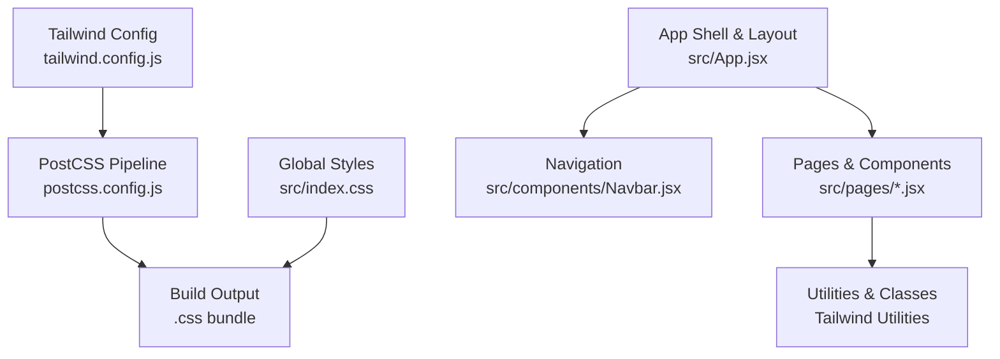

**Diagram sources**
- [tailwind.config.js:1-17](file://tailwind.config.js#L1-L17)
- [postcss.config.js:1-7](file://postcss.config.js#L1-L7)
- [src/index.css:1-12](file://src/index.css#L1-L12)
- [src/App.jsx:33-44](file://src/App.jsx#L33-L44)

**Section sources**
- [tailwind.config.js:1-17](file://tailwind.config.js#L1-L17)
- [postcss.config.js:1-7](file://postcss.config.js#L1-L7)
- [src/index.css:1-12](file://src/index.css#L1-L12)
- [src/App.jsx:33-44](file://src/App.jsx#L33-L44)

## Core Components
- Tailwind CSS configuration extends the default theme to use a custom sans-serif font stack and enables scanning of templates for purging unused styles.
- PostCSS pipeline applies Tailwind directives and autoprefixing for vendor compatibility.
- Global baseline styles enforce full viewport sizing and establish a neutral background color.
- App shell composes the layout with a fixed-width sidebar navigation and a scrollable content area.
- Navigation bar implements role-aware menus, dropdowns, and active-state highlighting.
- Pages demonstrate consistent spacing, typography, and interactive states using utility classes and minimal custom CSS.

Key implementation references:
- Tailwind theme extension for fonts: [tailwind.config.js:7-12](file://tailwind.config.js#L7-L12)
- PostCSS plugins: [postcss.config.js:2-4](file://postcss.config.js#L2-L4)
- Global base styles: [src/index.css:1-12](file://src/index.css#L1-L12)
- App layout composition: [src/App.jsx:33-44](file://src/App.jsx#L33-L44)
- Navigation bar styling and interactivity: [src/components/Navbar.jsx:46-154](file://src/components/Navbar.jsx#L46-L154)

**Section sources**
- [tailwind.config.js:7-12](file://tailwind.config.js#L7-L12)
- [postcss.config.js:2-4](file://postcss.config.js#L2-L4)
- [src/index.css:1-12](file://src/index.css#L1-L12)
- [src/App.jsx:33-44](file://src/App.jsx#L33-L44)
- [src/components/Navbar.jsx:46-154](file://src/components/Navbar.jsx#L46-L154)

## Architecture Overview
The styling architecture follows a layered approach:
- Base layer: Tailwind preflight and utilities.
- Theme layer: Font family extension and spacing tokens.
- Component layer: Utility-first classes applied in JSX.
- Page layer: Minimal custom CSS for complex animations and glass effects.
- Global layout: App shell with sidebar and content area.

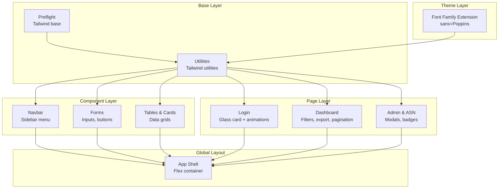

**Diagram sources**
- [tailwind.config.js:7-12](file://tailwind.config.js#L7-L12)
- [src/components/Navbar.jsx:46-154](file://src/components/Navbar.jsx#L46-L154)
- [src/pages/Login.jsx:102-550](file://src/pages/Login.jsx#L102-L550)
- [src/pages/Dashboard.jsx:113-310](file://src/pages/Dashboard.jsx#L113-L310)
- [src/pages/AdminPage.jsx:86-254](file://src/pages/AdminPage.jsx#L86-L254)
- [src/App.jsx:33-44](file://src/App.jsx#L33-L44)

## Detailed Component Analysis

### Tailwind CSS Configuration and Build Pipeline
- Content scanning includes HTML and all JSX/TSX files to purge unused styles.
- Theme extends font family for the sans stack.
- PostCSS pipeline applies Tailwind and autoprefixer.

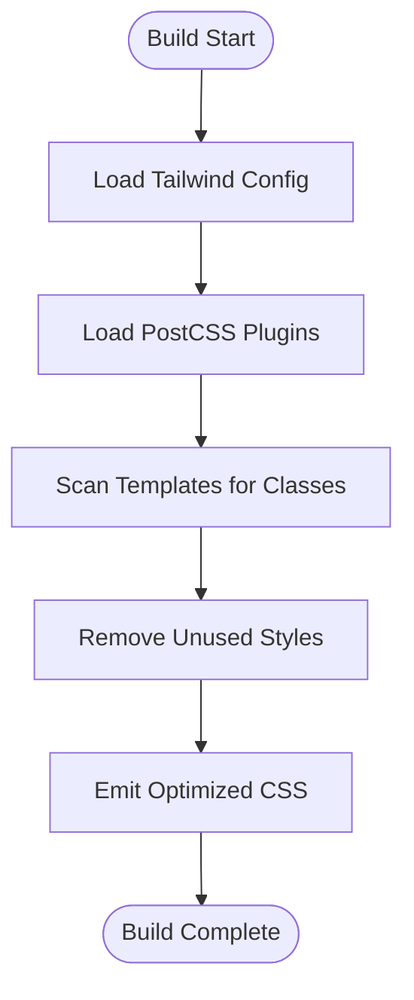

**Diagram sources**
- [tailwind.config.js:3-6](file://tailwind.config.js#L3-L6)
- [postcss.config.js:2-4](file://postcss.config.js#L2-L4)

**Section sources**
- [tailwind.config.js:3-12](file://tailwind.config.js#L3-L12)
- [postcss.config.js:1-7](file://postcss.config.js#L1-L7)
- [package.json:32-34](file://package.json#L32-L34)

### Global Styles and Layout
- Full-viewport baseline ensures consistent layout across pages.
- App shell uses a flex container with a fixed-width sidebar and scrollable content area.

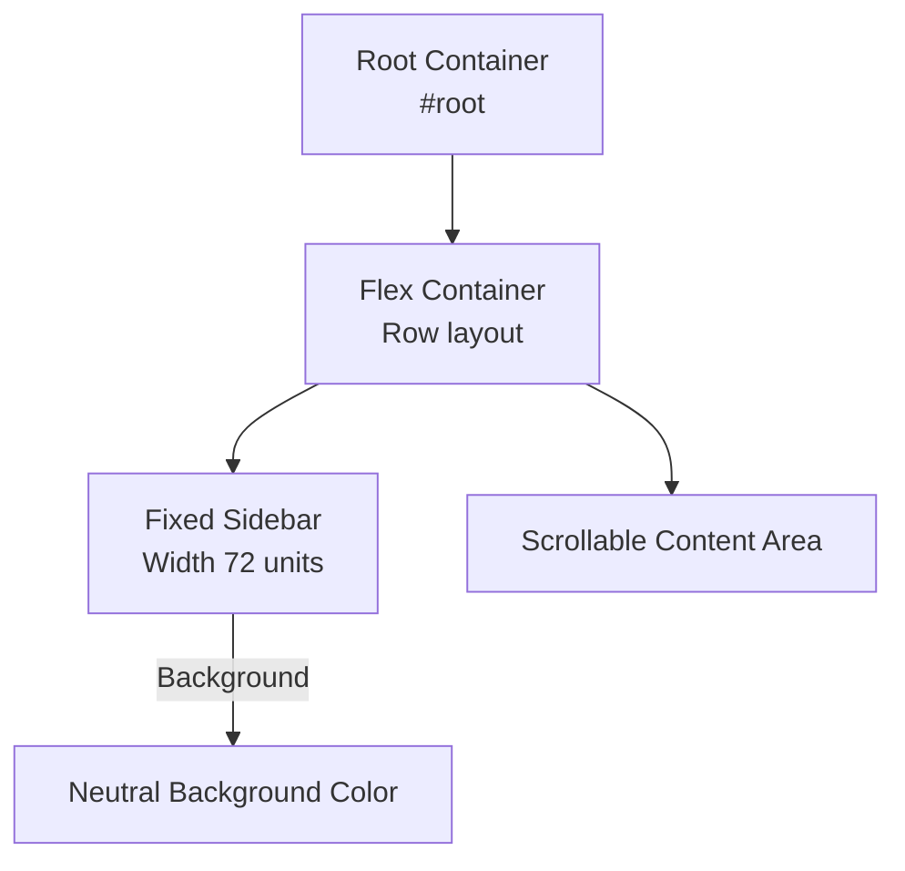

**Diagram sources**
- [src/index.css:5-12](file://src/index.css#L5-L12)
- [src/App.jsx:37-42](file://src/App.jsx#L37-L42)

**Section sources**
- [src/index.css:5-12](file://src/index.css#L5-L12)
- [src/App.jsx:33-44](file://src/App.jsx#L33-L44)

### Navigation Bar Design
- Fixed sidebar with brand header, profile section, and menu links.
- Role-aware visibility: Super Admin gets Master Data and Settings; Admin OPD sees standard routes.
- Active state highlighting and hover transitions; dropdown with smooth open/close animation.

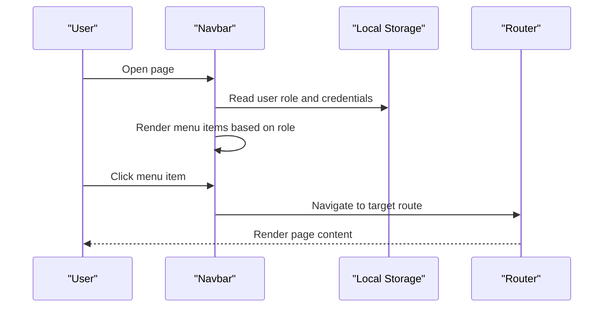

**Diagram sources**
- [src/components/Navbar.jsx:5-158](file://src/components/Navbar.jsx#L5-L158)

**Section sources**
- [src/components/Navbar.jsx:46-154](file://src/components/Navbar.jsx#L46-L154)

### Login Page Styling Patterns
- Uses embedded CSS for complex animations and glass-like card effect.
- Implements floating particle background, gradient accents, and animated transitions.
- Form elements use consistent spacing, focus states, and icon overlays.

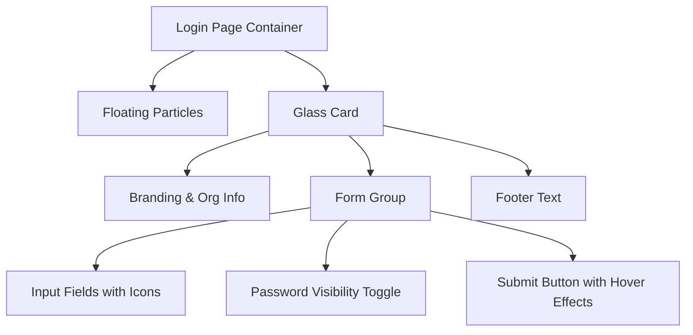

**Diagram sources**
- [src/pages/Login.jsx:102-550](file://src/pages/Login.jsx#L102-L550)

**Section sources**
- [src/pages/Login.jsx:102-550](file://src/pages/Login.jsx#L102-L550)

### Dashboard Data Display
- Filters with icons and focus states; export button with loading state.
- Data table with status badges, timestamps, and location chips.
- Pagination controls with ellipsis and keyboard-friendly interactions.

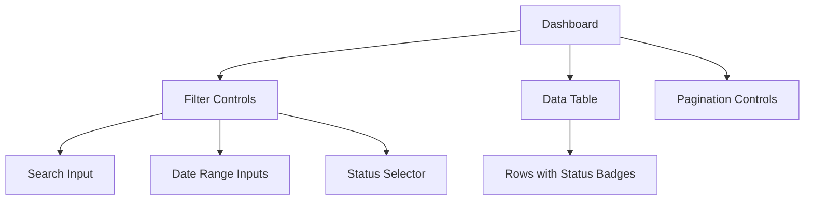

**Diagram sources**
- [src/pages/Dashboard.jsx:113-310](file://src/pages/Dashboard.jsx#L113-L310)

**Section sources**
- [src/pages/Dashboard.jsx:113-310](file://src/pages/Dashboard.jsx#L113-L310)

### Admin Management Forms and Modals
- Search bar with icon overlay and live filtering.
- Data table with action chips and device binding indicators.
- Modal forms for adding/editing admins with password visibility toggles.

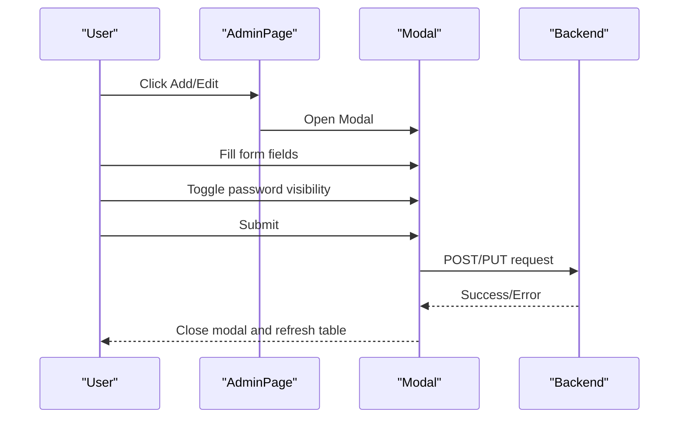

**Diagram sources**
- [src/pages/AdminPage.jsx:86-254](file://src/pages/AdminPage.jsx#L86-L254)

**Section sources**
- [src/pages/AdminPage.jsx:86-254](file://src/pages/AdminPage.jsx#L86-L254)

### Manage ASN Page (Face Registration)
- Edit modal with webcam capture and pose instructions.
- Conditional rendering for re-registration flow and photo capture steps.
- Optimistic UI updates after revoking access.

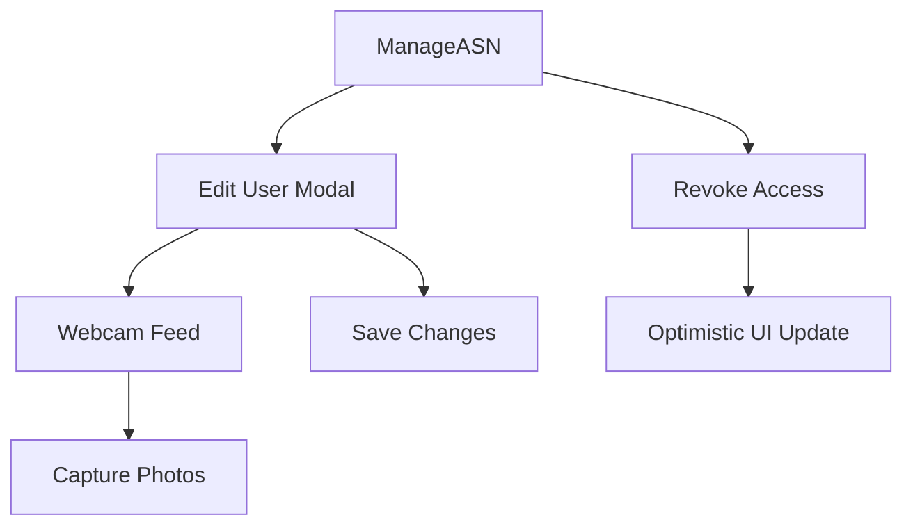

**Diagram sources**
- [src/pages/ManageASN.jsx:16-106](file://src/pages/ManageASN.jsx#L16-L106)

**Section sources**
- [src/pages/ManageASN.jsx:16-106](file://src/pages/ManageASN.jsx#L16-L106)

### Master Data Center
- Tabbed interface for managing OPDs, Admins, Devices, and Audit Logs.
- Form layouts with validation and submit states.
- Edit modals per entity type with conditional fields.

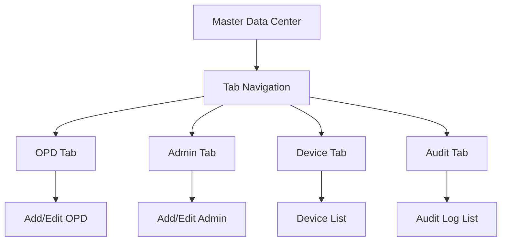

**Diagram sources**
- [src/pages/MasterData.jsx:131-200](file://src/pages/MasterData.jsx#L131-L200)

**Section sources**
- [src/pages/MasterData.jsx:131-200](file://src/pages/MasterData.jsx#L131-L200)

## Dependency Analysis
- Tailwind CSS and PostCSS are dev dependencies; Vite manages the build process.
- The project relies on Lucide React for icons and SweetAlert2 for notifications.
- Global styles depend on Tailwind directives; page-specific styles rely on scoped CSS-in-JS.

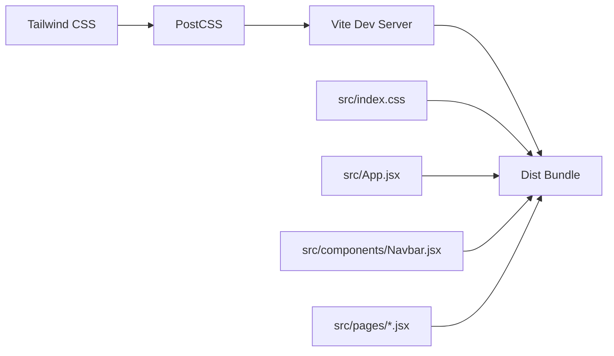

**Diagram sources**
- [package.json:12-21](file://package.json#L12-L21)
- [package.json:26-34](file://package.json#L26-L34)
- [src/index.css:1-3](file://src/index.css#L1-L3)
- [src/App.jsx:72-99](file://src/App.jsx#L72-L99)

**Section sources**
- [package.json:12-21](file://package.json#L12-L21)
- [package.json:26-34](file://package.json#L26-L34)
- [src/index.css:1-3](file://src/index.css#L1-L3)
- [src/App.jsx:72-99](file://src/App.jsx#L72-L99)

## Performance Considerations
- Tailwind purges unused CSS by scanning templates; keep class names consistent to avoid accidental removal.
- Prefer utility classes over custom CSS to leverage build-time optimizations.
- Minimize embedded CSS; use Tailwind utilities for animations and transitions.
- Use lazy loading for heavy components (e.g., webcam) and avoid unnecessary re-renders with memoization.
- Keep icon libraries small; current setup uses Lucide React, which is tree-shakeable.

## Accessibility and Cross-Browser Compatibility
- Focus states and keyboard navigation: Ensure interactive elements have visible focus rings and are operable via keyboard.
- Semantic markup: Use native buttons and inputs; provide labels for form controls.
- Color contrast: Maintain sufficient contrast ratios for text and interactive elements against backgrounds.
- ARIA attributes: Use roles and labels where custom components lack semantics.
- Cross-browser testing: Validate behavior across modern browsers; autoprefixer ensures vendor prefixes.

## Troubleshooting Guide
- Fonts not loading: Verify Tailwind font extension and ensure the font is available in the runtime environment.
- Styles not applied: Confirm Tailwind directives are present in global CSS and build runs successfully.
- Layout shifts: Avoid dynamic height changes; reserve space for loading states.
- Modal interactions: Ensure click-outside handlers and proper z-index stacking.

## Conclusion
The project employs a robust, utility-first styling system with Tailwind CSS and PostCSS, complemented by targeted custom CSS for advanced animations. The design system emphasizes consistency through shared components, responsive patterns, and clear interactive states. Extending the system requires adhering to established spacing and color tokens, leveraging existing components, and keeping class usage predictable for optimal purging and performance.

## Appendices

### Color Scheme and Tokens
- Primary brand blue palette is used in navigation and highlights.
- Neutral background color establishes content areas.
- Status badges use semantic colors (green for presence, red for absence, amber for warnings).

References:
- Navigation background and highlights: [src/components/Navbar.jsx:46](file://src/components/Navbar.jsx#L46)
- Neutral background: [src/index.css:11](file://src/index.css#L11)
- Status badges: [src/pages/Dashboard.jsx:223-254](file://src/pages/Dashboard.jsx#L223-L254)

**Section sources**
- [src/components/Navbar.jsx:46](file://src/components/Navbar.jsx#L46)
- [src/index.css:11](file://src/index.css#L11)
- [src/pages/Dashboard.jsx:223-254](file://src/pages/Dashboard.jsx#L223-L254)

### Typography Hierarchy
- Headings use bold weights and tight tracking.
- Body copy uses consistent font sizes and line heights.
- Monospace fonts for identifiers and device serial numbers.

References:
- Dashboard headings and labels: [src/pages/Dashboard.jsx:116-120](file://src/pages/Dashboard.jsx#L116-L120)
- Login typography: [src/pages/Login.jsx:321-340](file://src/pages/Login.jsx#L321-L340)
- Monospace identifiers: [src/pages/AdminPage.jsx:126-128](file://src/pages/AdminPage.jsx#L126-L128)

**Section sources**
- [src/pages/Dashboard.jsx:116-120](file://src/pages/Dashboard.jsx#L116-L120)
- [src/pages/Login.jsx:321-340](file://src/pages/Login.jsx#L321-L340)
- [src/pages/AdminPage.jsx:126-128](file://src/pages/AdminPage.jsx#L126-L128)

### Spacing System
- Consistent padding and margin scales across components.
- Grid-based layouts for tabular data and form sections.

References:
- Dashboard spacing: [src/pages/Dashboard.jsx:114-173](file://src/pages/Dashboard.jsx#L114-L173)
- Admin table padding: [src/pages/AdminPage.jsx:109-161](file://src/pages/AdminPage.jsx#L109-L161)

**Section sources**
- [src/pages/Dashboard.jsx:114-173](file://src/pages/Dashboard.jsx#L114-L173)
- [src/pages/AdminPage.jsx:109-161](file://src/pages/AdminPage.jsx#L109-L161)

### Interactive States
- Hover, focus, and active states are consistently applied to buttons and inputs.
- Disabled states communicate non-interactive states.

References:
- Login submit button: [src/pages/Login.jsx:448-494](file://src/pages/Login.jsx#L448-L494)
- Dashboard filters: [src/pages/Dashboard.jsx:127-173](file://src/pages/Dashboard.jsx#L127-L173)

**Section sources**
- [src/pages/Login.jsx:448-494](file://src/pages/Login.jsx#L448-L494)
- [src/pages/Dashboard.jsx:127-173](file://src/pages/Dashboard.jsx#L127-L173)

### Theme Customization and Dark Mode Readiness
- Extend Tailwind theme to introduce semantic color tokens and spacing scales.
- Use CSS variables for theme switching and maintain consistent contrast ratios.
- Test dark mode by swapping color palettes and validating readability.

[No sources needed since this section provides general guidance]

### Mobile-First Design Principles
- Use responsive utilities to adjust layouts on smaller screens.
- Ensure touch targets meet minimum size requirements.
- Preserve usability when rotating devices.

[No sources needed since this section provides general guidance]

### Guidelines for Maintaining Design Consistency
- Document reusable component patterns and their variants.
- Enforce naming conventions for class names and state keys.
- Centralize shared styles and tokens to reduce duplication.

[No sources needed since this section provides general guidance]