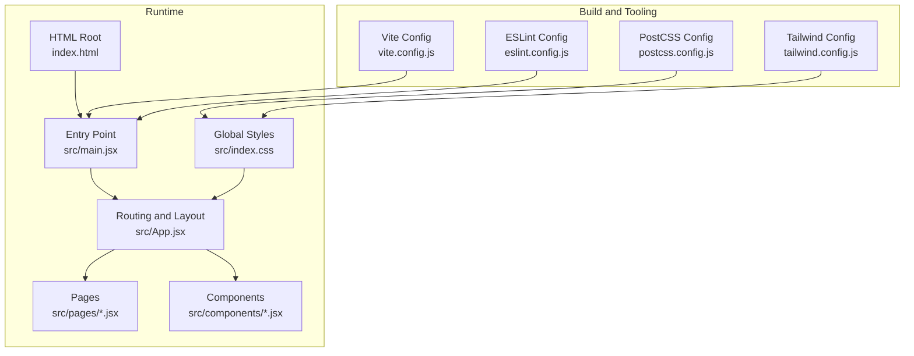
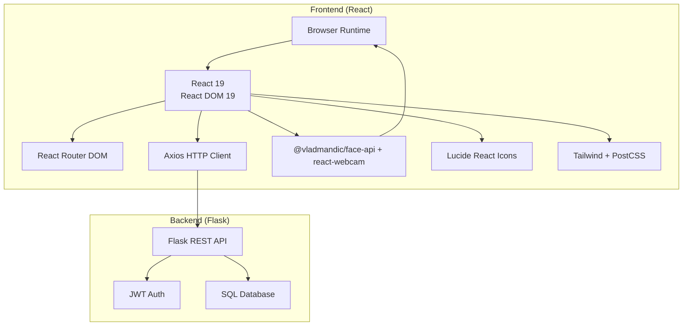
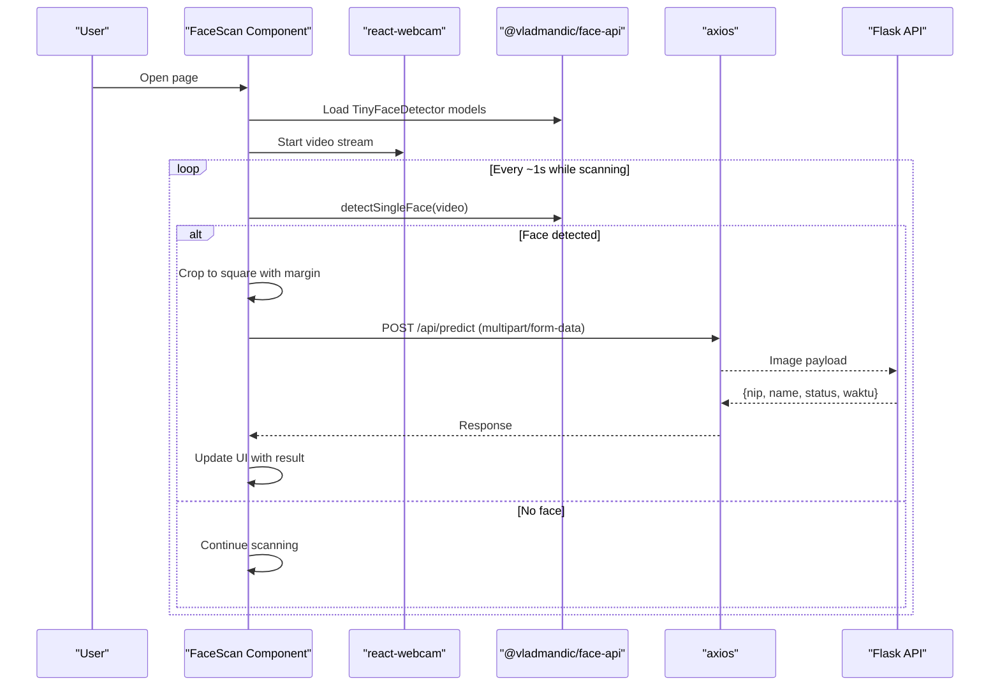
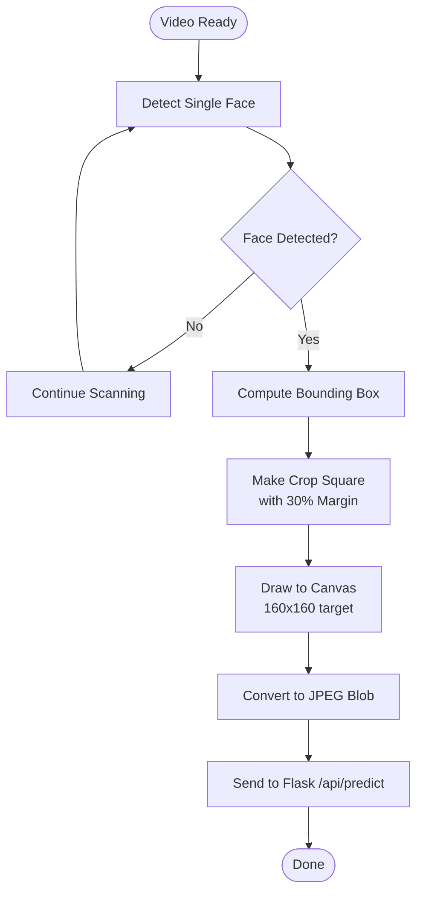
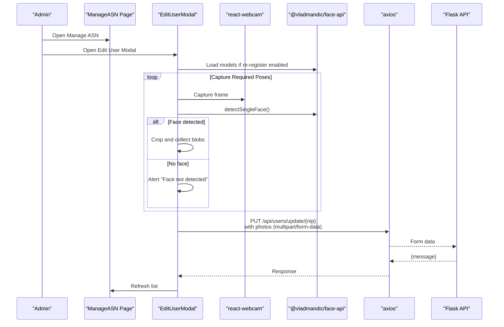
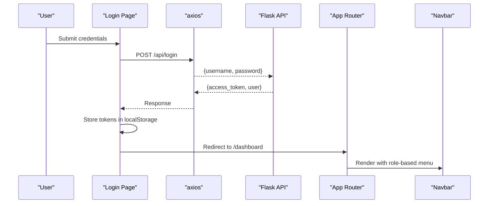
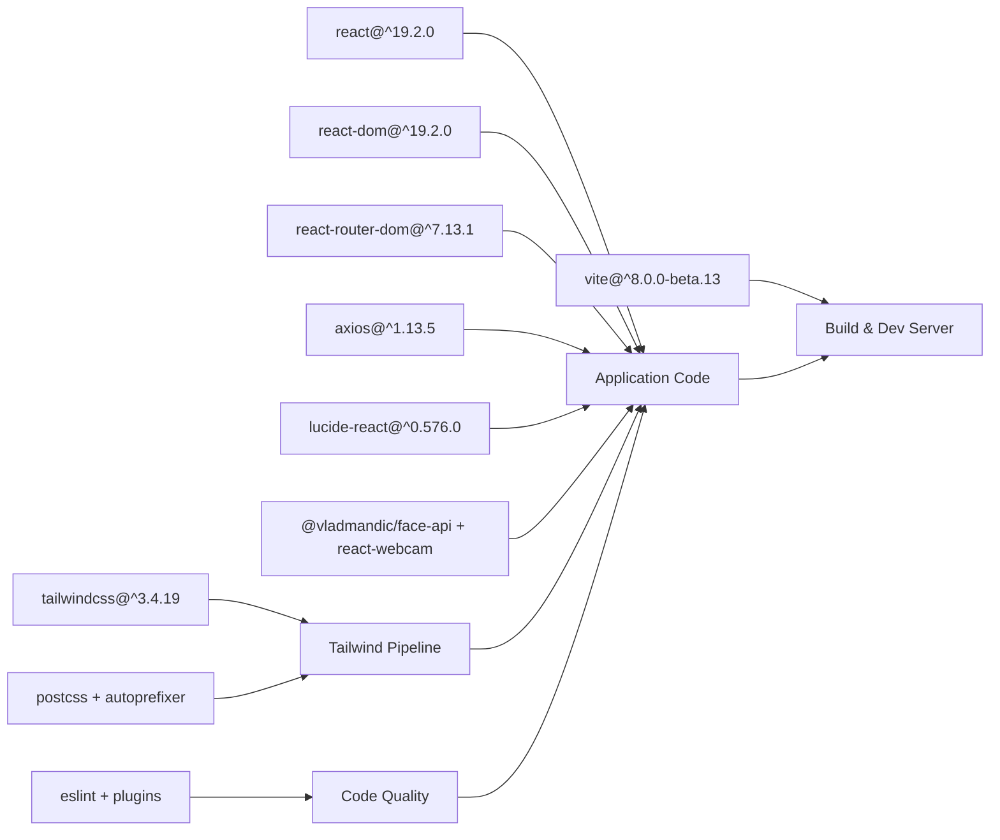

# Technology Stack

<cite>
**Referenced Files in This Document**
- [package.json](file://package.json)
- [vite.config.js](file://vite.config.js)
- [tailwind.config.js](file://tailwind.config.js)
- [postcss.config.js](file://postcss.config.js)
- [eslint.config.js](file://eslint.config.js)
- [index.html](file://index.html)
- [src/main.jsx](file://src/main.jsx)
- [src/App.jsx](file://src/App.jsx)
- [src/index.css](file://src/index.css)
- [src/pages/FaceScan.jsx](file://src/pages/FaceScan.jsx)
- [src/pages/ManageASN.jsx](file://src/pages/ManageASN.jsx)
- [src/components/Navbar.jsx](file://src/components/Navbar.jsx)
- [README.md](file://README.md)
</cite>

## Table of Contents
1. [Introduction](#introduction)
2. [Project Structure](#project-structure)
3. [Core Components](#core-components)
4. [Architecture Overview](#architecture-overview)
5. [Detailed Component Analysis](#detailed-component-analysis)
6. [Dependency Analysis](#dependency-analysis)
7. [Performance Considerations](#performance-considerations)
8. [Browser Compatibility](#browser-compatibility)
9. [Security Aspects](#security-aspects)
10. [Development Tools and Workflow](#development-tools-and-workflow)
11. [Updating Dependencies and Maintenance](#updating-dependencies-and-maintenance)
12. [Troubleshooting Guide](#troubleshooting-guide)
13. [Conclusion](#conclusion)

## Introduction
This document provides comprehensive technology stack documentation for the React-based frontend application. It covers the frontend technologies, build system, styling pipeline, linting setup, and the integration with the Flask backend API. It also addresses performance, browser compatibility, security considerations, and practical guidance for maintaining and updating the stack.

## Project Structure
The project follows a conventional React application layout with a Vite build system. Key configuration files define the build, styling, and linting behavior. The frontend integrates AI face detection via @vladmandic/face-api, camera capture with react-webcam, HTTP communication with axios, and UI icons with lucide-react. Styling is powered by Tailwind CSS with PostCSS autoprefixing.

**Diagram sources**
- [vite.config.js:1-8](file://vite.config.js#L1-L8)
- [eslint.config.js:1-30](file://eslint.config.js#L1-L30)
- [postcss.config.js:1-7](file://postcss.config.js#L1-L7)
- [tailwind.config.js:1-17](file://tailwind.config.js#L1-L17)
- [index.html:1-17](file://index.html#L1-L17)
- [src/main.jsx:1-11](file://src/main.jsx#L1-L11)
- [src/App.jsx:1-102](file://src/App.jsx#L1-L102)
- [src/index.css:1-12](file://src/index.css#L1-L12)

**Section sources**
- [package.json:1-40](file://package.json#L1-L40)
- [vite.config.js:1-8](file://vite.config.js#L1-L8)
- [eslint.config.js:1-30](file://eslint.config.js#L1-L30)
- [postcss.config.js:1-7](file://postcss.config.js#L1-L7)
- [tailwind.config.js:1-17](file://tailwind.config.js#L1-L17)
- [index.html:1-17](file://index.html#L1-L17)
- [src/main.jsx:1-11](file://src/main.jsx#L1-L11)
- [src/App.jsx:1-102](file://src/App.jsx#L1-L102)
- [src/index.css:1-12](file://src/index.css#L1-L12)

## Core Components
- React 19 with React DOM 19: Application runtime and rendering.
- Vite 8.x: Build tool and dev server.
- @vladmandic/face-api: Client-side AI face detection and cropping pipeline.
- react-webcam: Camera capture abstraction.
- axios: HTTP client for API communication.
- lucide-react: Icon library for UI.
- Tailwind CSS 3.x: Utility-first styling framework.
- PostCSS with autoprefixer: CSS processing pipeline.
- ESLint 9.x with React-specific plugins: Code quality and style enforcement.

**Section sources**
- [package.json:12-21](file://package.json#L12-L21)
- [package.json:22-35](file://package.json#L22-L35)
- [src/pages/FaceScan.jsx:1-204](file://src/pages/FaceScan.jsx#L1-L204)
- [src/pages/ManageASN.jsx:1-296](file://src/pages/ManageASN.jsx#L1-L296)
- [src/components/Navbar.jsx:1-158](file://src/components/Navbar.jsx#L1-L158)
- [src/App.jsx:1-102](file://src/App.jsx#L1-L102)

## Architecture Overview
The frontend is a single-page application built with React and Vite. It communicates with a Flask backend via RESTful endpoints. The AI face detection runs locally in the browser using @vladmandic/face-api and react-webcam. Styling is processed through Tailwind CSS and PostCSS.

**Diagram sources**
- [src/App.jsx:1-102](file://src/App.jsx#L1-L102)
- [src/pages/FaceScan.jsx:1-204](file://src/pages/FaceScan.jsx#L1-L204)
- [src/pages/ManageASN.jsx:1-296](file://src/pages/ManageASN.jsx#L1-L296)
- [src/components/Navbar.jsx:1-158](file://src/components/Navbar.jsx#L1-L158)
- [README.md:11-34](file://README.md#L11-L34)

## Detailed Component Analysis

### AI Face Detection Pipeline (@vladmandic/face-api + react-webcam)
The face detection pipeline loads TinyFaceDetector models from the public models directory, detects faces in real-time from the webcam stream, crops detected faces to a square format suitable for downstream processing, and sends the cropped image to the Flask backend for prediction.

**Diagram sources**
- [src/pages/FaceScan.jsx:14-28](file://src/pages/FaceScan.jsx#L14-L28)
- [src/pages/FaceScan.jsx:88-141](file://src/pages/FaceScan.jsx#L88-L141)
- [src/pages/FaceScan.jsx:39-85](file://src/pages/FaceScan.jsx#L39-L85)

**Section sources**
- [src/pages/FaceScan.jsx:1-204](file://src/pages/FaceScan.jsx#L1-L204)

### Camera Capture and Cropping Logic
The cropping logic ensures the detected face region is squared and includes a margin to avoid cutting hair or chin. The resulting image is converted to JPEG at maximum quality and sent to the backend.

**Diagram sources**
- [src/pages/FaceScan.jsx:96-134](file://src/pages/FaceScan.jsx#L96-L134)

**Section sources**
- [src/pages/FaceScan.jsx:96-134](file://src/pages/FaceScan.jsx#L96-L134)

### User Registration and Face Re-Registration (ManageASN)
The ManageASN page supports editing user profiles and re-registering face samples. It uses react-webcam and @vladmandic/face-api to capture multiple poses and uploads them to the backend for training.

**Diagram sources**
- [src/pages/ManageASN.jsx:16-106](file://src/pages/ManageASN.jsx#L16-L106)
- [src/pages/ManageASN.jsx:120-131](file://src/pages/ManageASN.jsx#L120-L131)

**Section sources**
- [src/pages/ManageASN.jsx:1-296](file://src/pages/ManageASN.jsx#L1-L296)

### Authentication and Navigation (Login + Navbar)
The application uses JWT-based authentication. On successful login, tokens and user metadata are stored in localStorage. The Navbar adapts menu items based on user roles and provides logout functionality.

**Diagram sources**
- [src/App.jsx:47-70](file://src/App.jsx#L47-L70)
- [src/components/Navbar.jsx:1-158](file://src/components/Navbar.jsx#L1-L158)
- [src/pages/Login.jsx:61-100](file://src/pages/Login.jsx#L61-L100)

**Section sources**
- [src/App.jsx:1-102](file://src/App.jsx#L1-L102)
- [src/components/Navbar.jsx:1-158](file://src/components/Navbar.jsx#L1-L158)
- [src/pages/Login.jsx:61-100](file://src/pages/Login.jsx#L61-L100)

## Dependency Analysis
The frontend depends on React 19, Vite, Tailwind CSS, and supporting tooling. The AI and camera features rely on @vladmandic/face-api and react-webcam. HTTP requests are handled by axios, and icons come from lucide-react. The build pipeline integrates ESLint and PostCSS.

**Diagram sources**
- [package.json:12-21](file://package.json#L12-L21)
- [package.json:22-35](file://package.json#L22-L35)
- [vite.config.js:1-8](file://vite.config.js#L1-L8)
- [tailwind.config.js:1-17](file://tailwind.config.js#L1-L17)
- [postcss.config.js:1-7](file://postcss.config.js#L1-L7)
- [eslint.config.js:1-30](file://eslint.config.js#L1-L30)

**Section sources**
- [package.json:12-35](file://package.json#L12-L35)
- [vite.config.js:1-8](file://vite.config.js#L1-L8)
- [tailwind.config.js:1-17](file://tailwind.config.js#L1-L17)
- [postcss.config.js:1-7](file://postcss.config.js#L1-L7)
- [eslint.config.js:1-30](file://eslint.config.js#L1-L30)

## Performance Considerations
- AI inference on the client: Loading and running TinyFaceDetector adds CPU overhead. Keep model loading minimal and reuse loaded models across sessions.
- Cropping and image conversion: Converting video frames to JPEG at maximum quality increases memory and CPU usage. Consider adjusting quality or resolution if needed.
- Camera constraints: The webcam uses a fixed resolution; adjust width/height to balance accuracy and performance.
- Network requests: Batch or debounce API calls where appropriate to reduce load on the backend.
- Styling: Tailwind JIT compiles utilities; keep unused classes to minimize CSS bundle size.

[No sources needed since this section provides general guidance]

## Browser Compatibility
- Modern browsers with ES2020 support are assumed. The app uses modern JavaScript features and React 19.
- For older environments, consider adding polyfills via Vite or a dedicated polyfill service.
- Camera access requires HTTPS in most modern browsers; serve the app over HTTPS during development and production.

[No sources needed since this section provides general guidance]

## Security Aspects
- Authentication: JWT tokens are stored in localStorage. While convenient, this is less secure than httpOnly cookies. Consider moving tokens to httpOnly cookies and using CSRF protection on the backend.
- CORS: Ensure the Flask backend sets appropriate CORS headers to allow only trusted origins.
- Input sanitization: Validate and sanitize all inputs on the backend; avoid XSS by not injecting raw user data into innerHTML.
- HTTPS: Enforce HTTPS in production to protect tokens and data in transit.
- Rate limiting: Implement rate limits on sensitive endpoints (login, predict) to mitigate abuse.

[No sources needed since this section provides general guidance]

## Development Tools and Workflow
- Build and dev server: Vite provides fast HMR and builds optimized bundles.
- Styling: Tailwind CSS with PostCSS autoprefixer processes utilities and vendor prefixes automatically.
- Linting: ESLint with React hooks and refresh plugins enforces best practices and catches common errors early.
- Scripts: npm scripts for dev, build, preview, and lint streamline local development.

**Section sources**
- [package.json:6-11](file://package.json#L6-L11)
- [vite.config.js:1-8](file://vite.config.js#L1-L8)
- [postcss.config.js:1-7](file://postcss.config.js#L1-L7)
- [eslint.config.js:1-30](file://eslint.config.js#L1-L30)
- [tailwind.config.js:1-17](file://tailwind.config.js#L1-L17)

## Updating Dependencies and Maintenance
- React 19: Review breaking changes and test thoroughly after updates. Keep react and react-dom in sync.
- Vite: Beta versions may introduce breaking changes; pin compatible versions and monitor release notes.
- @vladmandic/face-api: Verify compatibility with current browser APIs; check for model loading changes.
- react-webcam: Ensure compatibility with latest browser camera APIs; test across devices.
- axios: Check changelog for breaking changes; update interceptors if needed.
- lucide-react: New icon releases are generally additive; verify imports if renaming occurs.
- Tailwind CSS: Major updates may require purging unused styles; test responsive utilities.
- PostCSS and autoprefixer: Keep aligned with Tailwind’s supported PostCSS versions.
- ESLint: Update plugins alongside ESLint; preserve existing rule configurations.

**Section sources**
- [package.json:12-35](file://package.json#L12-L35)

## Troubleshooting Guide
- Model loading failures: Ensure the models directory is served and accessible at the configured URI. Check network tab for 404s.
- Camera permission denied: Verify HTTPS and correct video constraints; test on multiple browsers.
- Axios 401 Unauthorized: Global interceptor triggers a SweetAlert and clears tokens; check backend JWT validity and expiration.
- Tailwind utilities not applied: Confirm Tailwind directives are present and content paths match the project structure.
- ESLint errors: Fix recommended issues or adjust rules in the ESLint config as needed.

**Section sources**
- [src/pages/FaceScan.jsx:14-28](file://src/pages/FaceScan.jsx#L14-L28)
- [src/App.jsx:47-70](file://src/App.jsx#L47-L70)
- [src/index.css:1-12](file://src/index.css#L1-L12)
- [eslint.config.js:1-30](file://eslint.config.js#L1-L30)

## Conclusion
The frontend leverages a modern, efficient stack with React 19, Vite, Tailwind CSS, and integrated AI capabilities via @vladmandic/face-api and react-webcam. The architecture cleanly separates concerns between UI, camera processing, and API communication. By following the maintenance and security recommendations herein, teams can sustainably evolve the application while preserving performance and reliability.