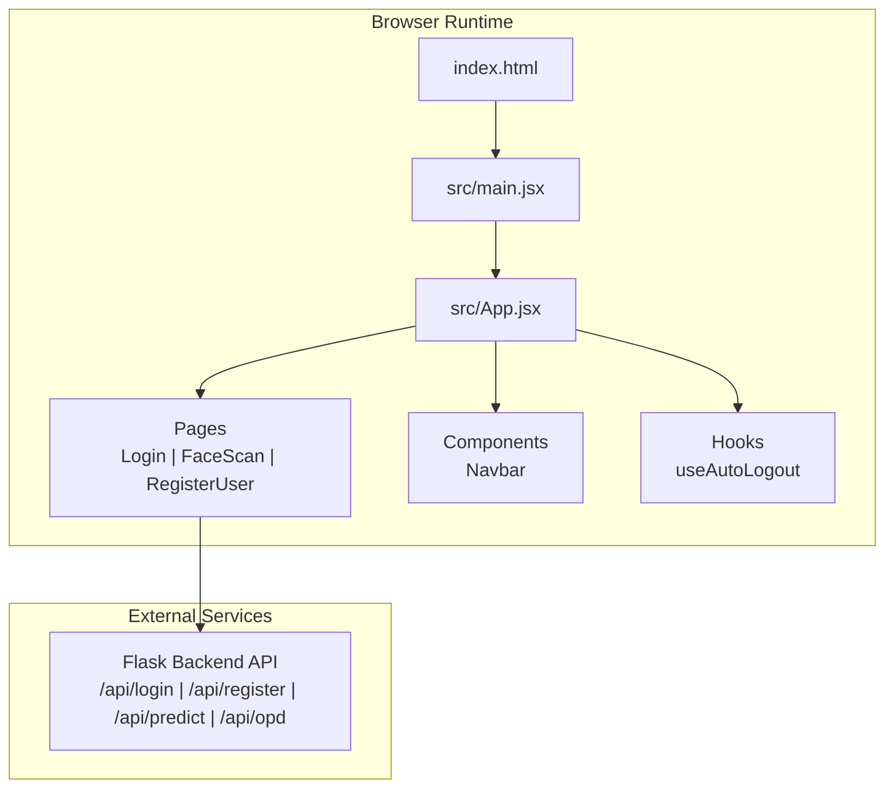
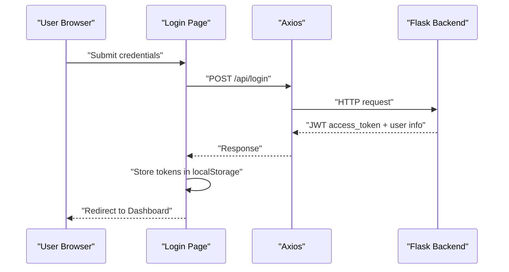
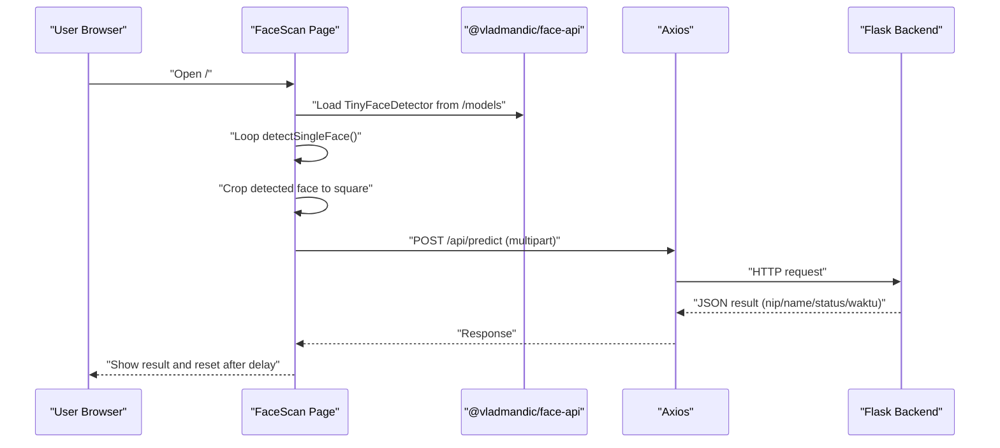
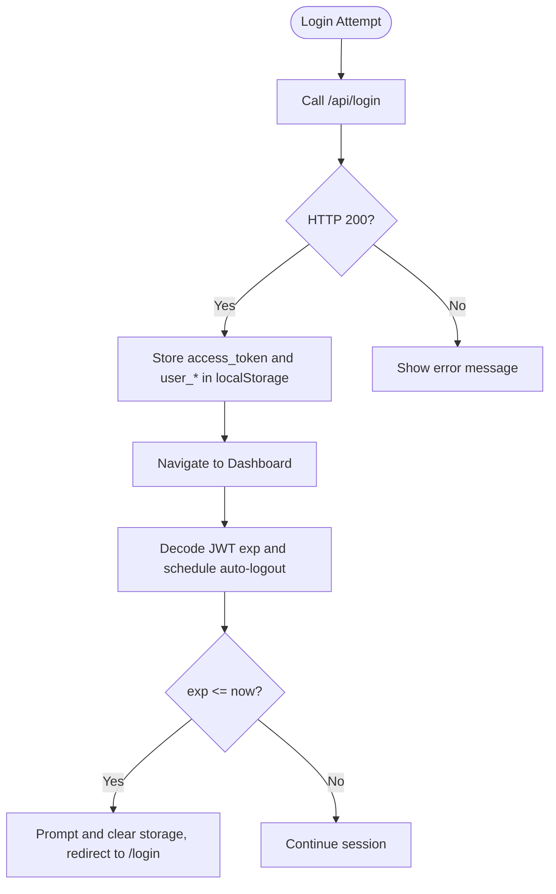
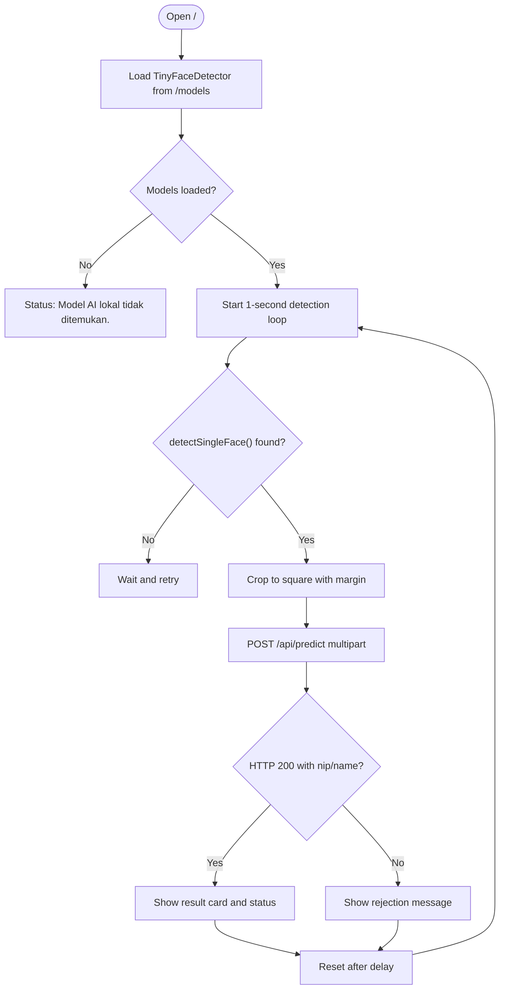
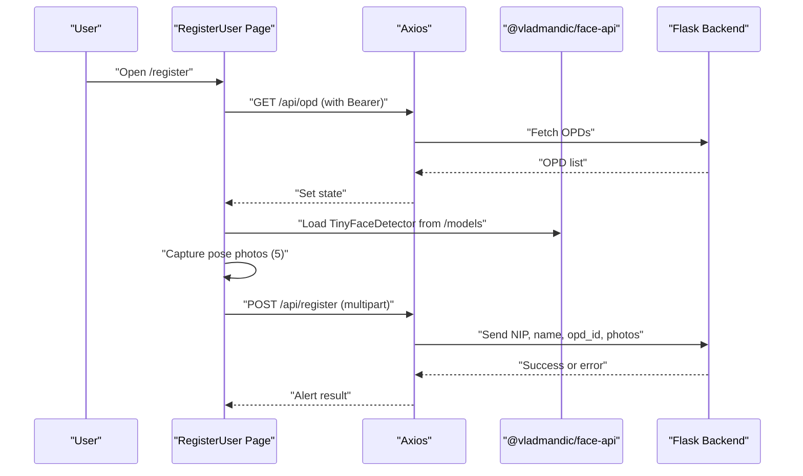
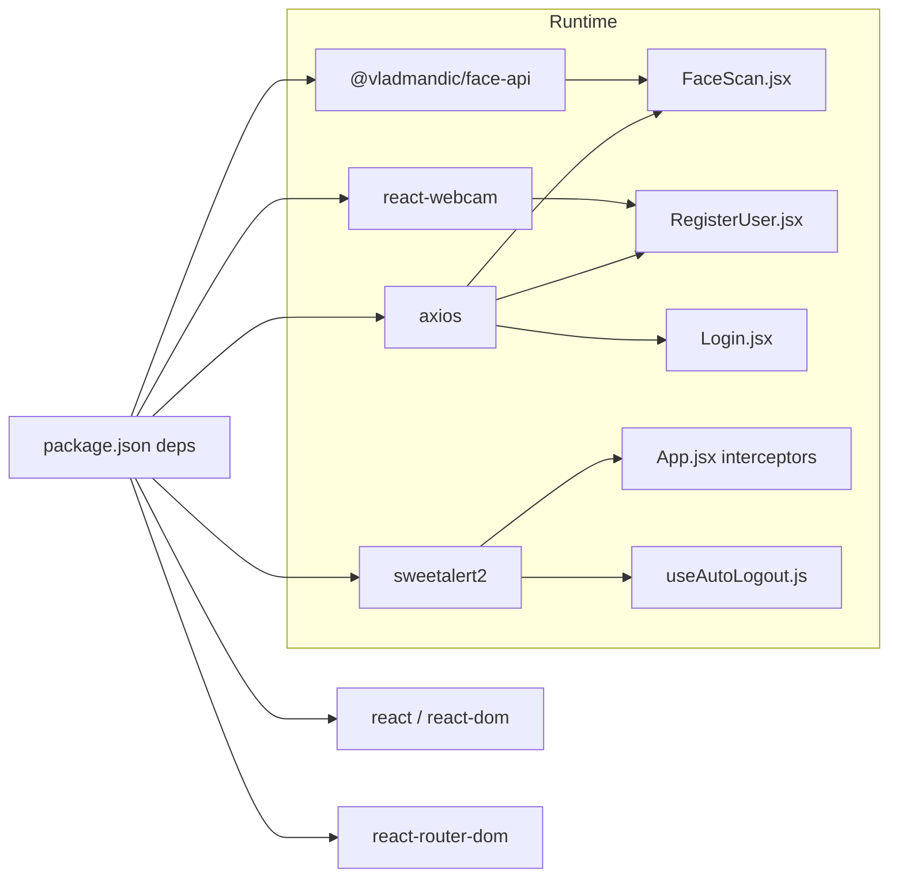

# Troubleshooting & FAQ

<cite>
**Referenced Files in This Document**
- [README.md](file://README.md)
- [package.json](file://package.json)
- [index.html](file://index.html)
- [vite.config.js](file://vite.config.js)
- [tailwind.config.js](file://tailwind.config.js)
- [src/index.css](file://src/index.css)
- [src/App.jsx](file://src/App.jsx)
- [src/main.jsx](file://src/main.jsx)
- [src/pages/Login.jsx](file://src/pages/Login.jsx)
- [src/pages/FaceScan.jsx](file://src/pages/FaceScan.jsx)
- [src/pages/RegisterUser.jsx](file://src/pages/RegisterUser.jsx)
- [src/hooks/useAutoLogout.js](file://src/hooks/useAutoLogout.js)
- [src/components/Navbar.jsx](file://src/components/Navbar.jsx)
</cite>

## Table of Contents
1. [Introduction](#introduction)
2. [Project Structure](#project-structure)
3. [Core Components](#core-components)
4. [Architecture Overview](#architecture-overview)
5. [Detailed Component Analysis](#detailed-component-analysis)
6. [Dependency Analysis](#dependency-analysis)
7. [Performance Considerations](#performance-considerations)
8. [Troubleshooting Guide](#troubleshooting-guide)
9. [Conclusion](#conclusion)
10. [Appendices](#appendices)

## Introduction
This document provides comprehensive troubleshooting and Frequently Asked Questions for the Smart Presence Face Recognition system. It focuses on:
- Face recognition issues (camera access, detection failures, model loading)
- Authentication problems (login failures, token expiration, permission errors)
- System performance and resource management
- Debugging techniques for development and runtime environments
- Step-by-step solutions for common user scenarios
- Escalation procedures and support resources

The system integrates a React/Vite frontend with client-side AI detection via @vladmandic/face-api, camera capture using react-webcam, and backend APIs served by a Python/Flask service. JWT-based authentication enforces role-based access control (RBAC) with automatic session timeouts.

## Project Structure
High-level structure relevant to troubleshooting:
- Frontend: React app bootstrapped with Vite, styled with Tailwind CSS
- Pages: Login, FaceScan, RegisterUser, Admin dashboards
- Hooks: Auto-logout based on JWT expiry
- Components: Navbar with role-aware navigation and logout
- Dependencies: axios for HTTP, @vladmandic/face-api for local AI, react-webcam for camera capture

**Diagram sources**
- [index.html:1-18](file://index.html#L1-L18)
- [src/main.jsx:1-11](file://src/main.jsx#L1-L11)
- [src/App.jsx:1-102](file://src/App.jsx#L1-L102)
- [src/pages/Login.jsx:1-553](file://src/pages/Login.jsx#L1-L553)
- [src/pages/FaceScan.jsx:1-204](file://src/pages/FaceScan.jsx#L1-L204)
- [src/pages/RegisterUser.jsx:1-274](file://src/pages/RegisterUser.jsx#L1-L274)
- [src/hooks/useAutoLogout.js:1-68](file://src/hooks/useAutoLogout.js#L1-L68)
- [src/components/Navbar.jsx:1-158](file://src/components/Navbar.jsx#L1-L158)

**Section sources**
- [README.md:1-42](file://README.md#L1-L42)
- [package.json:1-40](file://package.json#L1-L40)
- [index.html:1-18](file://index.html#L1-L18)
- [vite.config.js:1-8](file://vite.config.js#L1-L8)
- [tailwind.config.js:1-17](file://tailwind.config.js#L1-L17)
- [src/index.css:1-12](file://src/index.css#L1-L12)

## Core Components
- Authentication and routing:
  - Protected routes and RBAC enforcement
  - Axios interceptor handling 401 responses
  - Auto-logout hook decoding JWT exp claim
- Face recognition:
  - Local AI model loading from /models
  - Real-time face detection and cropping
  - Submission to Flask predict endpoint
- Registration:
  - Multi-pose photo capture and upload
  - OPD selection and form validation
- UI and UX:
  - Tailwind-styled pages with responsive layout
  - SweetAlert2 notifications for warnings and prompts

Key implementation references:
- Authentication and routing: [src/App.jsx:18-70](file://src/App.jsx#L18-L70)
- Auto-logout: [src/hooks/useAutoLogout.js:19-67](file://src/hooks/useAutoLogout.js#L19-L67)
- Login page and error handling: [src/pages/Login.jsx:69-100](file://src/pages/Login.jsx#L69-L100)
- Face scan flow: [src/pages/FaceScan.jsx:14-28](file://src/pages/FaceScan.jsx#L14-L28), [src/pages/FaceScan.jsx:87-141](file://src/pages/FaceScan.jsx#L87-L141)
- Registration flow: [src/pages/RegisterUser.jsx:43-56](file://src/pages/RegisterUser.jsx#L43-L56), [src/pages/RegisterUser.jsx:58-88](file://src/pages/RegisterUser.jsx#L58-L88), [src/pages/RegisterUser.jsx:90-121](file://src/pages/RegisterUser.jsx#L90-L121)
- Navbar and logout: [src/components/Navbar.jsx:16-23](file://src/components/Navbar.jsx#L16-L23)

**Section sources**
- [src/App.jsx:18-70](file://src/App.jsx#L18-L70)
- [src/hooks/useAutoLogout.js:19-67](file://src/hooks/useAutoLogout.js#L19-L67)
- [src/pages/Login.jsx:69-100](file://src/pages/Login.jsx#L69-L100)
- [src/pages/FaceScan.jsx:14-28](file://src/pages/FaceScan.jsx#L14-L28)
- [src/pages/FaceScan.jsx:87-141](file://src/pages/FaceScan.jsx#L87-L141)
- [src/pages/RegisterUser.jsx:43-56](file://src/pages/RegisterUser.jsx#L43-L56)
- [src/pages/RegisterUser.jsx:58-88](file://src/pages/RegisterUser.jsx#L58-L88)
- [src/pages/RegisterUser.jsx:90-121](file://src/pages/RegisterUser.jsx#L90-L121)
- [src/components/Navbar.jsx:16-23](file://src/components/Navbar.jsx#L16-L23)

## Architecture Overview
End-to-end flow for authentication and face recognition:

**Diagram sources**
- [src/pages/Login.jsx:69-100](file://src/pages/Login.jsx#L69-L100)
- [src/App.jsx:46-70](file://src/App.jsx#L46-L70)

**Diagram sources**
- [src/pages/FaceScan.jsx:14-28](file://src/pages/FaceScan.jsx#L14-L28)
- [src/pages/FaceScan.jsx:87-141](file://src/pages/FaceScan.jsx#L87-L141)
- [src/pages/FaceScan.jsx:38-85](file://src/pages/FaceScan.jsx#L38-L85)

## Detailed Component Analysis

### Authentication and Session Management
Common issues:
- Login fails with network error
- Unauthorized 401 responses trigger auto-logout
- Token expired triggers auto-logout prompt

**Diagram sources**
- [src/pages/Login.jsx:69-100](file://src/pages/Login.jsx#L69-L100)
- [src/App.jsx:46-70](file://src/App.jsx#L46-L70)
- [src/hooks/useAutoLogout.js:19-67](file://src/hooks/useAutoLogout.js#L19-L67)

**Section sources**
- [src/pages/Login.jsx:69-100](file://src/pages/Login.jsx#L69-L100)
- [src/App.jsx:46-70](file://src/App.jsx#L46-L70)
- [src/hooks/useAutoLogout.js:19-67](file://src/hooks/useAutoLogout.js#L19-L67)

### Face Recognition Pipeline
Common issues:
- Model loading fails from /models
- No face detected during scanning
- Server busy or rejection messages

**Diagram sources**
- [src/pages/FaceScan.jsx:14-28](file://src/pages/FaceScan.jsx#L14-L28)
- [src/pages/FaceScan.jsx:87-141](file://src/pages/FaceScan.jsx#L87-L141)
- [src/pages/FaceScan.jsx:38-85](file://src/pages/FaceScan.jsx#L38-L85)

**Section sources**
- [src/pages/FaceScan.jsx:14-28](file://src/pages/FaceScan.jsx#L14-L28)
- [src/pages/FaceScan.jsx:87-141](file://src/pages/FaceScan.jsx#L87-L141)
- [src/pages/FaceScan.jsx:38-85](file://src/pages/FaceScan.jsx#L38-L85)

### User Registration Workflow
Common issues:
- OPD list empty or not fetched
- Model not loaded for detection
- Photos not captured due to pose or lighting

**Diagram sources**
- [src/pages/RegisterUser.jsx:24-41](file://src/pages/RegisterUser.jsx#L24-L41)
- [src/pages/RegisterUser.jsx:43-56](file://src/pages/RegisterUser.jsx#L43-L56)
- [src/pages/RegisterUser.jsx:58-88](file://src/pages/RegisterUser.jsx#L58-L88)
- [src/pages/RegisterUser.jsx:90-121](file://src/pages/RegisterUser.jsx#L90-L121)

**Section sources**
- [src/pages/RegisterUser.jsx:24-41](file://src/pages/RegisterUser.jsx#L24-L41)
- [src/pages/RegisterUser.jsx:43-56](file://src/pages/RegisterUser.jsx#L43-L56)
- [src/pages/RegisterUser.jsx:58-88](file://src/pages/RegisterUser.jsx#L58-L88)
- [src/pages/RegisterUser.jsx:90-121](file://src/pages/RegisterUser.jsx#L90-L121)

## Dependency Analysis
External libraries and integrations:
- @vladmandic/face-api: client-side face detection and cropping
- react-webcam: camera capture for registration and scanning
- axios: HTTP requests to Flask backend
- sweetalert2: user notifications and prompts
- Tailwind CSS: responsive UI framework

**Diagram sources**
- [package.json:12-21](file://package.json#L12-L21)
- [src/pages/FaceScan.jsx:1-6](file://src/pages/FaceScan.jsx#L1-L6)
- [src/pages/RegisterUser.jsx:1-6](file://src/pages/RegisterUser.jsx#L1-L6)
- [src/pages/Login.jsx:1-4](file://src/pages/Login.jsx#L1-L4)
- [src/App.jsx:14-15](file://src/App.jsx#L14-L15)

**Section sources**
- [package.json:12-21](file://package.json#L12-L21)
- [src/pages/FaceScan.jsx:1-6](file://src/pages/FaceScan.jsx#L1-L6)
- [src/pages/RegisterUser.jsx:1-6](file://src/pages/RegisterUser.jsx#L1-L6)
- [src/pages/Login.jsx:1-4](file://src/pages/Login.jsx#L1-L4)
- [src/App.jsx:14-15](file://src/App.jsx#L14-L15)

## Performance Considerations
- Camera resolution and constraints:
  - FaceScan sets fixed width and height; adjust if needed for device capabilities
  - Mirror effect via horizontal flip is applied to webcam feed
- AI model loading:
  - Ensure /models directory is served and accessible at runtime
  - Model loading occurs once on mount; avoid repeated loads
- Network requests:
  - Predictions are sent as multipart/form-data; ensure backend accepts
  - Registration sends up to five photos; optimize image quality to reduce payload
- UI responsiveness:
  - Long-running loops and alerts can block the UI; keep intervals reasonable
  - Use loading states and disable buttons during uploads

[No sources needed since this section provides general guidance]

## Troubleshooting Guide

### Authentication Issues
Symptoms and fixes:
- Login shows “Failed to connect to server”:
  - Verify Flask backend is reachable at http://127.0.0.1:5000
  - Check CORS and network connectivity
  - Confirm endpoint /api/login exists and responds
  - Reference: [src/pages/Login.jsx:75-96](file://src/pages/Login.jsx#L75-L96)
- Unauthorized 401 responses:
  - Axios interceptor automatically clears storage and redirects to /login
  - Re-authenticate and ensure token validity
  - Reference: [src/App.jsx:46-70](file://src/App.jsx#L46-L70)
- Token expired prompts:
  - Auto-logout fires when JWT exp is reached
  - Re-login to obtain a fresh token
  - Reference: [src/hooks/useAutoLogout.js:32-43](file://src/hooks/useAutoLogout.js#L32-L43)

Step-by-step:
1. Open browser dev tools and check Network tab for /api/login
2. Confirm response includes access_token and user info
3. Verify localStorage contains access_token and user_* keys
4. If redirected to /login, re-enter credentials

**Section sources**
- [src/pages/Login.jsx:75-96](file://src/pages/Login.jsx#L75-L96)
- [src/App.jsx:46-70](file://src/App.jsx#L46-L70)
- [src/hooks/useAutoLogout.js:32-43](file://src/hooks/useAutoLogout.js#L32-L43)

### Face Recognition Failures
Symptoms and fixes:
- Status: “Model AI lokal tidak ditemukan.”:
  - Ensure public/models directory is present and served
  - Confirm /models path resolves correctly in browser
  - Reference: [src/pages/FaceScan.jsx:18-25](file://src/pages/FaceScan.jsx#L18-L25)
- No face detected:
  - Ensure adequate lighting and centered face within dashed guide
  - Try different poses or move closer/further from camera
  - Reference: [src/pages/FaceScan.jsx:96-136](file://src/pages/FaceScan.jsx#L96-L136)
- Server busy or rejection:
  - Check Flask logs for errors
  - Verify predict endpoint and threshold logic
  - Reference: [src/pages/FaceScan.jsx:67-84](file://src/pages/FaceScan.jsx#L67-L84)

Step-by-step:
1. Open DevTools → Network tab
2. Trigger a scan and observe /api/predict request/response
3. If 403/400 with message, note the returned message and resolve timing/location constraints
4. If 5xx, check backend health and model inference pipeline

**Section sources**
- [src/pages/FaceScan.jsx:18-25](file://src/pages/FaceScan.jsx#L18-L25)
- [src/pages/FaceScan.jsx:96-136](file://src/pages/FaceScan.jsx#L96-L136)
- [src/pages/FaceScan.jsx:67-84](file://src/pages/FaceScan.jsx#L67-L84)

### Registration Problems
Symptoms and fixes:
- OPD list not loading:
  - Ensure Bearer token is present in localStorage
  - Verify /api/opd endpoint availability
  - Reference: [src/pages/RegisterUser.jsx:26-39](file://src/pages/RegisterUser.jsx#L26-L39)
- Model not loaded:
  - Confirm /models path and model files presence
  - Reference: [src/pages/RegisterUser.jsx:44-53](file://src/pages/RegisterUser.jsx#L44-L53)
- Photos not captured:
  - Complete required poses in order
  - Ensure face fits within the circular guide
  - Reference: [src/pages/RegisterUser.jsx:58-88](file://src/pages/RegisterUser.jsx#L58-L88)
- Upload fails:
  - Check multipart headers and backend route /api/register
  - Reference: [src/pages/RegisterUser.jsx:106-121](file://src/pages/RegisterUser.jsx#L106-L121)

Step-by-step:
1. Fill OPD, NIP, and Name before enabling capture
2. Capture all 5 poses; ensure each is accepted
3. Click Save and wait for success alert
4. On failure, inspect Network tab for error details

**Section sources**
- [src/pages/RegisterUser.jsx:26-39](file://src/pages/RegisterUser.jsx#L26-L39)
- [src/pages/RegisterUser.jsx:44-53](file://src/pages/RegisterUser.jsx#L44-L53)
- [src/pages/RegisterUser.jsx:58-88](file://src/pages/RegisterUser.jsx#L58-L88)
- [src/pages/RegisterUser.jsx:106-121](file://src/pages/RegisterUser.jsx#L106-L121)

### Permission and Role Errors
Symptoms and fixes:
- Super Admin-only routes inaccessible:
  - Confirm user role stored in localStorage is super_admin
  - RBAC enforced via protected routes
  - Reference: [src/App.jsx:24-31](file://src/App.jsx#L24-L31), [src/components/Navbar.jsx:77-114](file://src/components/Navbar.jsx#L77-L114)
- Unexpected redirect to dashboard:
  - Non-super-admin users cannot access /master-data routes
  - Reference: [src/App.jsx:86-96](file://src/App.jsx#L86-L96)

Step-by-step:
1. Log in and verify user role in localStorage
2. Navigate to intended route; if blocked, contact administrator for correct role

**Section sources**
- [src/App.jsx:24-31](file://src/App.jsx#L24-L31)
- [src/App.jsx:86-96](file://src/App.jsx#L86-L96)
- [src/components/Navbar.jsx:77-114](file://src/components/Navbar.jsx#L77-L114)

### Browser Compatibility and Connectivity
- Supported browsers:
  - Modern desktop browsers with camera access and ES modules
  - Ensure HTTPS or localhost for camera permissions
- Connectivity:
  - Backend must be reachable at http://127.0.0.1:5000
  - CORS must permit frontend origin
- Fonts and assets:
  - External fonts loaded via CDN; ensure network access
  - References: [index.html:9-11](file://index.html#L9-L11)

Step-by-step:
1. Test camera access on https://webcamtests.com
2. Verify backend endpoints reachable from browser
3. Check console for CORS/network errors

**Section sources**
- [index.html:9-11](file://index.html#L9-L11)

### Development Debugging Techniques
- Console logging:
  - Use browser DevTools Console for model load and prediction errors
- Network inspection:
  - Observe request payloads and response bodies for /api/login, /api/predict, /api/register
- Storage inspection:
  - Verify localStorage keys: access_token, user_role, user_nip, user_username
- Auto-logout behavior:
  - Inspect decoded exp claim and timeout scheduling
  - Reference: [src/hooks/useAutoLogout.js:5-17](file://src/hooks/useAutoLogout.js#L5-L17), [src/hooks/useAutoLogout.js:29-43](file://src/hooks/useAutoLogout.js#L29-L43)

Step-by-step:
1. Open DevTools → Console and Network
2. Reproduce issue and capture screenshots/logs
3. Share request/response details with backend team

**Section sources**
- [src/hooks/useAutoLogout.js:5-17](file://src/hooks/useAutoLogout.js#L5-L17)
- [src/hooks/useAutoLogout.js:29-43](file://src/hooks/useAutoLogout.js#L29-L43)

### Performance Optimization Tips
- Reduce CPU/GPU load:
  - Lower webcam resolution or increase detection interval slightly
- Optimize image quality:
  - Keep JPEG quality balanced; too high increases latency
- Minimize DOM churn:
  - Avoid frequent re-renders during scanning/cropping
- Memory usage:
  - Dispose of offscreen canvases and revoke object URLs after use
- Resource management:
  - Close camera stream on unmount
  - Reference: [src/pages/FaceScan.jsx:140-141](file://src/pages/FaceScan.jsx#L140-L141)

**Section sources**
- [src/pages/FaceScan.jsx:140-141](file://src/pages/FaceScan.jsx#L140-L141)

### Frequently Asked Questions
Q: How do I log in?
A: Go to /login, enter username/password, and click MASUK. On success, you are redirected to the dashboard.

Q: Why does my session end unexpectedly?
A: Sessions expire after a fixed period. When the JWT expires, you will see a warning and be redirected to /login.

Q: Why can’t I register a new user?
A: Ensure OPD, NIP, and Name are filled before capturing photos. Capture all 5 poses and submit.

Q: Why does the camera not work?
A: Allow camera permissions, ensure HTTPS or localhost, and verify the browser supports getUserMedia.

Q: Why does the AI model fail to load?
A: Confirm the /models directory is served and contains the required model files.

Q: How do I reach the admin pages?
A: Only users with role super_admin can access /master-data routes.

Q: What endpoints does the frontend call?
A: /api/login, /api/register, /api/predict, /api/opd

**Section sources**
- [src/pages/Login.jsx:69-100](file://src/pages/Login.jsx#L69-L100)
- [src/pages/RegisterUser.jsx:90-121](file://src/pages/RegisterUser.jsx#L90-L121)
- [src/pages/FaceScan.jsx:47-49](file://src/pages/FaceScan.jsx#L47-L49)
- [src/App.jsx:86-96](file://src/App.jsx#L86-L96)

### Escalation Procedures and Support Resources
Escalation steps:
1. Gather logs:
   - Copy Console errors and Network request/response details
2. Verify environment:
   - Confirm backend is running and reachable
   - Validate model files are present
3. Contact support:
   - Provide exact error messages, timestamps, and reproduction steps
   - Attach screenshots and browser/device details

Support resources:
- Backend team for API issues and model inference
- DevOps for deployment and networking concerns
- QA for feature regression checks

[No sources needed since this section summarizes without analyzing specific files]

## Conclusion
This guide consolidates actionable troubleshooting steps for authentication, face recognition, and registration flows. By validating environment prerequisites, inspecting network traffic, and leveraging built-in auto-logout and notification mechanisms, most issues can be resolved quickly. For persistent problems, escalate with precise logs and reproducible steps.

[No sources needed since this section summarizes without analyzing specific files]

## Appendices

### Quick Fix Checklist
- Camera access granted and working
- Backend reachable at http://127.0.0.1:5000
- /models directory present and served
- Tokens present in localStorage
- Required poses captured for registration
- Network tab shows successful requests/responses

[No sources needed since this section provides general guidance]