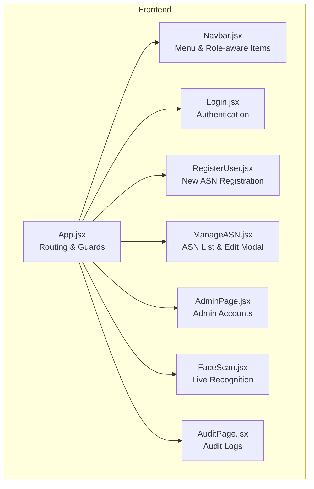
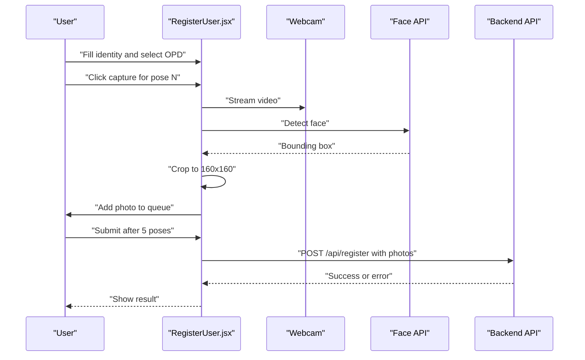
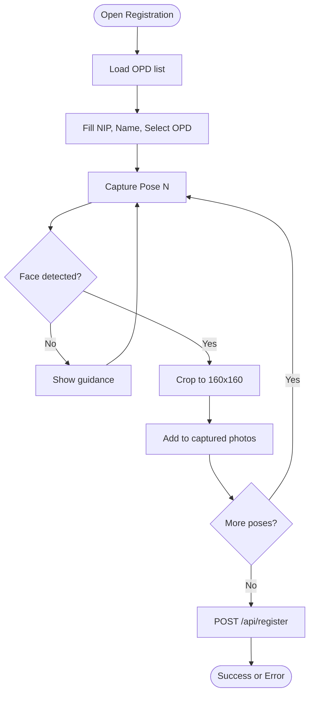
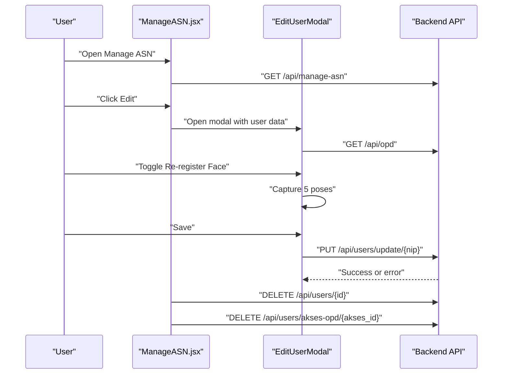
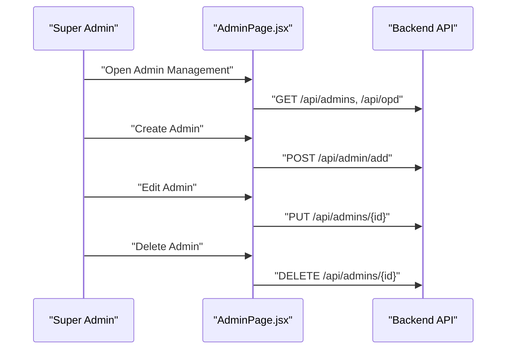
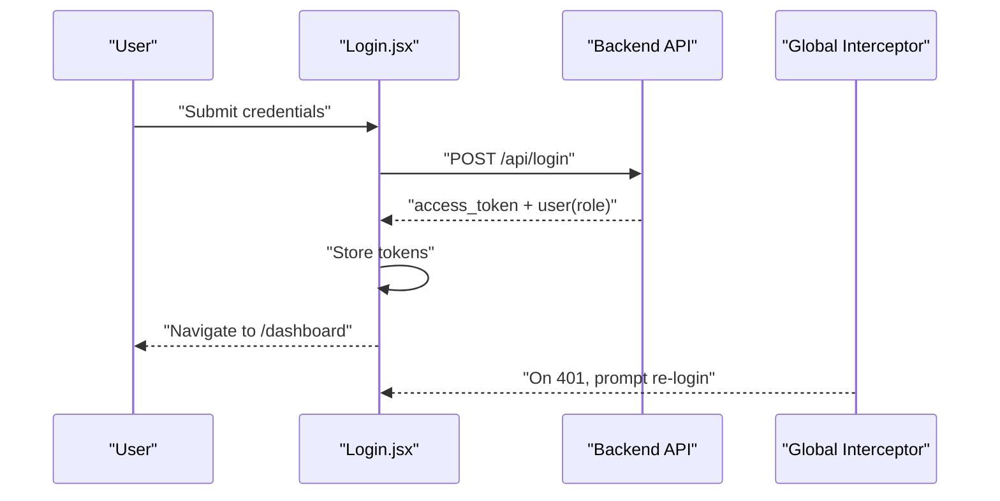
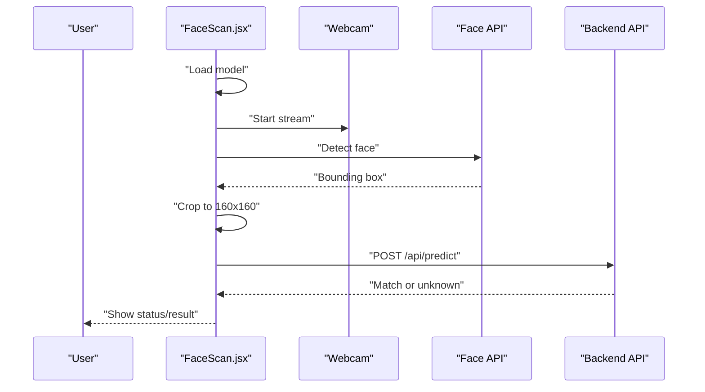
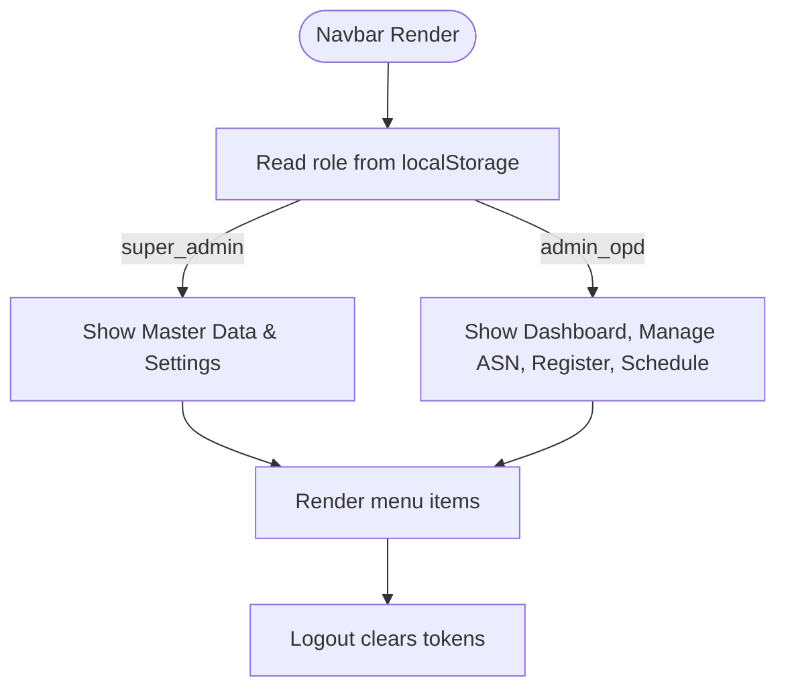
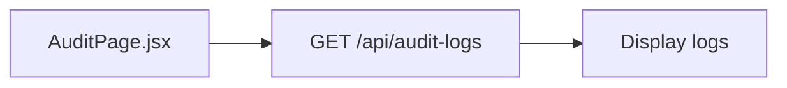
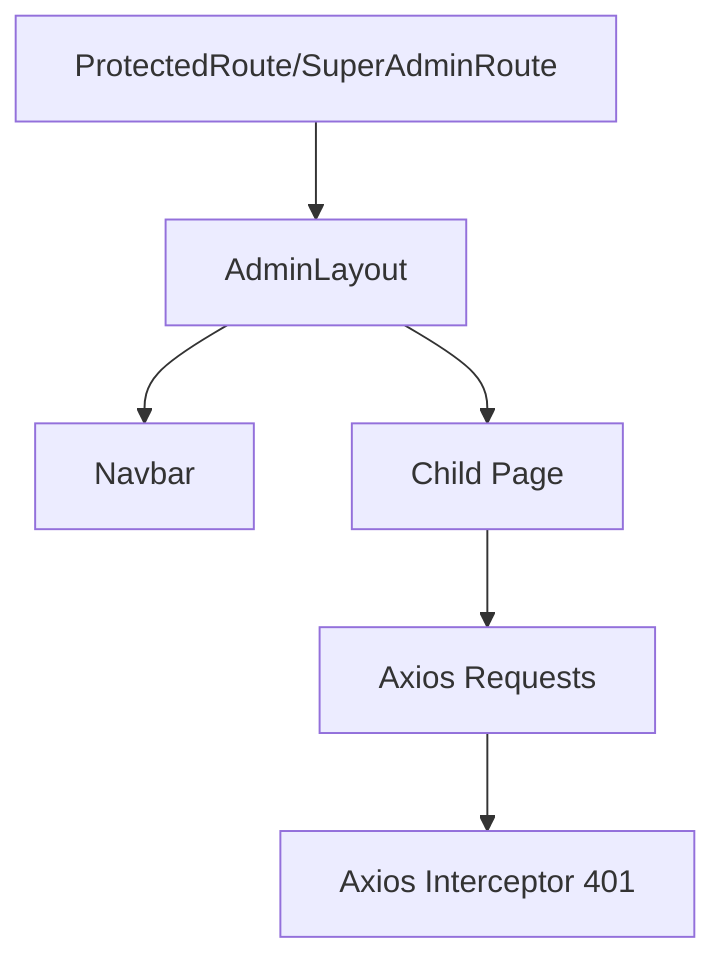

# User Management

<cite>
**Referenced Files in This Document**
- [RegisterUser.jsx](file://src/pages/RegisterUser.jsx)
- [ManageASN.jsx](file://src/pages/ManageASN.jsx)
- [AdminPage.jsx](file://src/pages/AdminPage.jsx)
- [FaceScan.jsx](file://src/pages/FaceScan.jsx)
- [Login.jsx](file://src/pages/Login.jsx)
- [App.jsx](file://src/App.jsx)
- [Navbar.jsx](file://src/components/Navbar.jsx)
- [AuditPage.jsx](file://src/pages/AuditPage.jsx)
</cite>

## Table of Contents
1. [Introduction](#introduction)
2. [Project Structure](#project-structure)
3. [Core Components](#core-components)
4. [Architecture Overview](#architecture-overview)
5. [Detailed Component Analysis](#detailed-component-analysis)
6. [Dependency Analysis](#dependency-analysis)
7. [Performance Considerations](#performance-considerations)
8. [Troubleshooting Guide](#troubleshooting-guide)
9. [Conclusion](#conclusion)

## Introduction
This document describes the complete user lifecycle within the system, focusing on user registration with multi-position photo capture, biometric data collection, profile creation, editing and management, face re-registration, and bulk operations. It also documents guided UI patterns for photo capture, visual checklists, quality assurance processes, backend API integration, validation rules, error handling, role assignment, OPD affiliation, and permissions. Guidance is provided for troubleshooting registration issues, photo quality problems, and synchronization errors.

## Project Structure
The frontend is a React application with route protection and layout wrappers. Key pages involved in user management include:
- Registration page for new ASN with pose-guided capture
- Manage ASN page for viewing, editing, deleting, and revoking OPD access
- Admin management page for creating and updating admin accounts
- Login page for authentication and session storage
- Navbar for navigation and role-aware menu visibility
- Audit trail page for read-only activity logging
- Face scan page for live recognition and feedback

**Diagram sources**
- [App.jsx:72-99](file://src/App.jsx#L72-L99)
- [Navbar.jsx:46-155](file://src/components/Navbar.jsx#L46-L155)
- [Login.jsx:61-100](file://src/pages/Login.jsx#L61-L100)
- [RegisterUser.jsx:7-274](file://src/pages/RegisterUser.jsx#L7-L274)
- [ManageASN.jsx:111-296](file://src/pages/ManageASN.jsx#L111-L296)
- [AdminPage.jsx:7-258](file://src/pages/AdminPage.jsx#L7-L258)
- [FaceScan.jsx:7-204](file://src/pages/FaceScan.jsx#L7-L204)
- [AuditPage.jsx:7-42](file://src/pages/AuditPage.jsx#L7-L42)

**Section sources**
- [App.jsx:18-44](file://src/App.jsx#L18-L44)
- [Navbar.jsx:25-43](file://src/components/Navbar.jsx#L25-L43)

## Core Components
- Registration page with pose checklist, webcam capture, cropping, and multi-photo upload
- Manage ASN page with filtering, summary cards, and per-user edit modal
- Admin management page for creating/updating admin accounts and OPD placement
- Login page with token storage and role propagation
- Navbar with role-aware visibility and logout
- Audit trail page for read-only logging
- Face scan page with local AI detection and server prediction

Key backend endpoints used:
- Authentication: POST /api/login
- OPD lists: GET /api/opd
- Registration: POST /api/register
- Predictions: POST /api/predict
- Manage ASN: GET /api/manage-asn
- Users update: PUT /api/users/update/{nip}
- Users delete: DELETE /api/users/{id}
- Access revocation: DELETE /api/users/akses-opd/{akses_id}
- Admins CRUD: GET /api/admins, POST /api/admin/add, PUT /api/admins/{id}, DELETE /api/admins/{id}
- Audit logs: GET /api/audit-logs

Validation and error handling:
- Frontend preconditions (required fields, pose completion)
- Backend validation messages returned in response data
- Axios interceptor handles unauthorized responses globally

**Section sources**
- [RegisterUser.jsx:24-41](file://src/pages/RegisterUser.jsx#L24-L41)
- [RegisterUser.jsx:90-121](file://src/pages/RegisterUser.jsx#L90-L121)
- [ManageASN.jsx:120-160](file://src/pages/ManageASN.jsx#L120-L160)
- [ManageASN.jsx:47-58](file://src/pages/ManageASN.jsx#L47-L58)
- [AdminPage.jsx:31-42](file://src/pages/AdminPage.jsx#L31-L42)
- [Login.jsx:69-100](file://src/pages/Login.jsx#L69-L100)
- [App.jsx:46-70](file://src/App.jsx#L46-L70)

## Architecture Overview
The frontend integrates with a backend service via HTTP requests. Authentication tokens are stored locally and attached to protected routes. The system supports two primary roles: Super Admin and Admin OPD, with route guards enforcing access. Live face detection runs client-side using a lightweight detector, and images are cropped to a fixed size before being sent to the backend for prediction or registration.

**Diagram sources**
- [RegisterUser.jsx:59-88](file://src/pages/RegisterUser.jsx#L59-L88)
- [RegisterUser.jsx:90-121](file://src/pages/RegisterUser.jsx#L90-L121)

**Section sources**
- [FaceScan.jsx:87-141](file://src/pages/FaceScan.jsx#L87-L141)
- [RegisterUser.jsx:43-56](file://src/pages/RegisterUser.jsx#L43-L56)

## Detailed Component Analysis

### Registration Workflow (New ASN)
- Identity capture: OPD selection, NIP, and full name
- Pose checklist: 5 positions with visual indicators
- Webcam capture: single-face detection, automatic cropping to 160x160
- Submission: multipart upload with 5 photos plus identity fields
- Backend endpoint: POST /api/register
- Validation: frontend checks required fields and pose completion; backend returns error messages

**Diagram sources**
- [RegisterUser.jsx:15-22](file://src/pages/RegisterUser.jsx#L15-L22)
- [RegisterUser.jsx:59-88](file://src/pages/RegisterUser.jsx#L59-L88)
- [RegisterUser.jsx:90-121](file://src/pages/RegisterUser.jsx#L90-L121)

**Section sources**
- [RegisterUser.jsx:8-14](file://src/pages/RegisterUser.jsx#L8-L14)
- [RegisterUser.jsx:24-41](file://src/pages/RegisterUser.jsx#L24-L41)
- [RegisterUser.jsx:59-88](file://src/pages/RegisterUser.jsx#L59-L88)
- [RegisterUser.jsx:90-121](file://src/pages/RegisterUser.jsx#L90-L121)

### Manage ASN (View, Edit, Delete, Revocation)
- Fetch ASN list and OPD list
- Filter by NIP or name
- Edit modal allows updating name, OPD, and optional face re-registration
- Re-registration requires capturing 5 new photos
- Delete individual ASN
- Revoke cross-OPD access for applicable privileges

**Diagram sources**
- [ManageASN.jsx:120-131](file://src/pages/ManageASN.jsx#L120-L131)
- [ManageASN.jsx:16-31](file://src/pages/ManageASN.jsx#L16-L31)
- [ManageASN.jsx:47-58](file://src/pages/ManageASN.jsx#L47-L58)
- [ManageASN.jsx:140-159](file://src/pages/ManageASN.jsx#L140-L159)

**Section sources**
- [ManageASN.jsx:111-296](file://src/pages/ManageASN.jsx#L111-L296)
- [ManageASN.jsx:16-31](file://src/pages/ManageASN.jsx#L16-L31)

### Admin Management (Super Admin)
- Fetch admins and OPDs
- Add new admin with NIP, username, full name, password, and OPD placement
- Edit admin (name, OPD, optional password change)
- Delete admin (with confirmation)

**Diagram sources**
- [AdminPage.jsx:31-42](file://src/pages/AdminPage.jsx#L31-L42)
- [AdminPage.jsx:44-84](file://src/pages/AdminPage.jsx#L44-L84)

**Section sources**
- [AdminPage.jsx:7-258](file://src/pages/AdminPage.jsx#L7-L258)

### Login and Session Management
- Authenticate via POST /api/login
- Store access token and user role in localStorage
- Redirect to dashboard
- Global axios interceptor handles 401 by prompting re-login

**Diagram sources**
- [Login.jsx:69-100](file://src/pages/Login.jsx#L69-L100)
- [App.jsx:46-70](file://src/App.jsx#L46-L70)

**Section sources**
- [Login.jsx:61-100](file://src/pages/Login.jsx#L61-L100)
- [App.jsx:46-70](file://src/App.jsx#L46-L70)

### Face Recognition (Live)
- Load TinyFaceDetector model from public models
- Periodically detect faces in webcam stream
- Crop to square with margin and send to backend prediction endpoint
- Display result and reset after delay

**Diagram sources**
- [FaceScan.jsx:14-28](file://src/pages/FaceScan.jsx#L14-L28)
- [FaceScan.jsx:87-141](file://src/pages/FaceScan.jsx#L87-L141)
- [FaceScan.jsx:38-85](file://src/pages/FaceScan.jsx#L38-L85)

**Section sources**
- [FaceScan.jsx:7-204](file://src/pages/FaceScan.jsx#L7-L204)

### Navigation and Permissions
- Navbar displays role and dynamic menu items
- Super Admin sees Master Data and Settings
- Admin OPD sees dashboard, manage ASN, register, schedule
- Logout clears all session data

**Diagram sources**
- [Navbar.jsx:12-23](file://src/components/Navbar.jsx#L12-L23)
- [Navbar.jsx:25-43](file://src/components/Navbar.jsx#L25-L43)
- [Navbar.jsx:76-129](file://src/components/Navbar.jsx#L76-L129)

**Section sources**
- [Navbar.jsx:5-158](file://src/components/Navbar.jsx#L5-L158)

### Audit Trail
- Read-only listing of recent system actions
- Color-coded badges by action category

**Diagram sources**
- [AuditPage.jsx:13-21](file://src/pages/AuditPage.jsx#L13-L21)

**Section sources**
- [AuditPage.jsx:7-42](file://src/pages/AuditPage.jsx#L7-L42)

## Dependency Analysis
- Route protection: ProtectedRoute and SuperAdminRoute enforce token and role checks
- Layout wrapper: AdminLayout injects Navbar and applies auto-logout hook
- Global interceptor: Centralized 401 handling with user prompt
- Local AI: TinyFaceDetector loaded from public models for real-time detection

**Diagram sources**
- [App.jsx:18-44](file://src/App.jsx#L18-L44)
- [App.jsx:33-44](file://src/App.jsx#L33-L44)
- [App.jsx:46-70](file://src/App.jsx#L46-L70)

**Section sources**
- [App.jsx:18-44](file://src/App.jsx#L18-L44)
- [App.jsx:46-70](file://src/App.jsx#L46-L70)

## Performance Considerations
- Real-time detection runs at ~1Hz interval; adjust timing to balance responsiveness and CPU usage
- Cropping to 160x160 reduces payload size for uploads
- Debounce or disable capture buttons when models are loading to avoid redundant calls
- Batch operations (bulk edits/deletes) should be implemented on the backend; frontend currently performs item-by-item updates

## Troubleshooting Guide
Common issues and resolutions:
- Registration fails with missing fields
  - Ensure NIP, name, and OPD are selected before enabling capture
  - Verify pose queue reaches 5 photos before submit
- No face detected during capture
  - Position within the guide circle, good lighting, neutral expression
  - Retry detection; ensure camera access is granted
- Photo quality problems
  - Keep face centered and fully visible; avoid extreme angles
  - Ensure adequate ambient light; avoid backlighting
- Synchronization errors
  - Confirm network connectivity to backend
  - Check that access token exists and is valid
  - On 401 responses, the app prompts re-login automatically
- Admin creation/edit failures
  - Validate required fields and OPD selection
  - Confirm backend error messages for specific validation issues

**Section sources**
- [RegisterUser.jsx:85-87](file://src/pages/RegisterUser.jsx#L85-L87)
- [RegisterUser.jsx:261-265](file://src/pages/RegisterUser.jsx#L261-L265)
- [ManageASN.jsx:47-58](file://src/pages/ManageASN.jsx#L47-L58)
- [App.jsx:46-70](file://src/App.jsx#L46-L70)
- [AdminPage.jsx:44-84](file://src/pages/AdminPage.jsx#L44-L84)

## Conclusion
The user management system provides a comprehensive lifecycle for ASN profiles, integrating guided photo capture, biometric verification, and administrative controls. Role-based routing ensures appropriate access, while robust error handling and audit logging support operational reliability. Following the validation rules and troubleshooting steps outlined here will improve registration success rates and streamline daily operations.